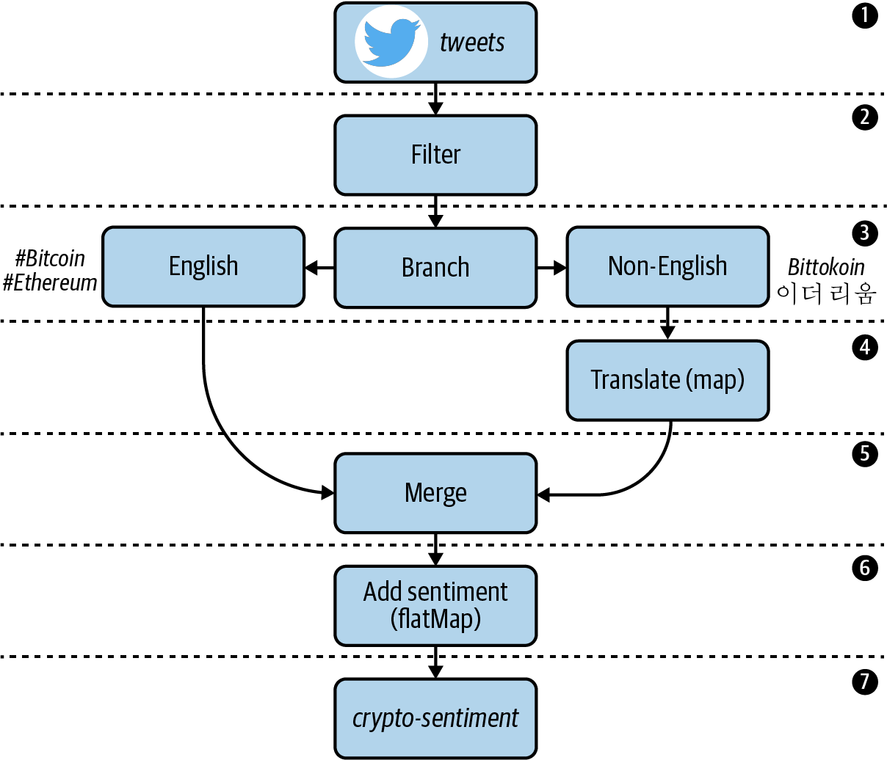

# Chapter 3. Stateless Processing
The simplest form of stream processing requires no memory of previously seen ``events``. **Each event is consumed, processed,**[1](#refernece) **and subsequently forgotten.** This paradigm is called ``stateless processing``, and Kafka Streams includes a rich set of ``operators`` for working with data in a stateless way.

## Stateless Versus Stateful Processing
One of the most important things you should consider when building a Kafka Streams application is whether or not your application requires stateful processing. The following describes the distinction between stateless and stateful stream processing:

* In ``stateless applications``, each event handled by your Kafka Streams application is processed independently of other events, and only ``stream`` views are needed by your application (see “[Streams and Tables](../chapter-02/README.md#streams-and-tables)”). In other words, your application treats each event as a self-contained insert and requires no memory of previously seen events.

* ``Stateful applications``, on the other hand, need to remember information about previously seen events in **one or more steps** of your processor topology, usually for the purpose of aggregating, windowing, or joining event streams. These applications are more complex under the hood since they need to track additional data, or state.

In the high-level DSL, the type of stream processing application you ultimately build boils down to the individual **operators** that are used in your topology.[2](#refernece) Operators are stream processing functions (e.g., ``filter``, ``map``, ``flatMap``, ``join``, etc.) that are applied to events as they flow through your topology. Some operators, like ``filter``, are considered ``stateless`` because they only need to look at the current record to perform an action (in this case, ``filter`` looks at each record individually to determine whether or not the record should be forwarded to downstream processors). Other operators, like count, are ``stateful`` since they require knowledge of previous events (``count`` needs to know how many events it has seen so far in order to track the number of messages).

If your Kafka Streams application requires **only** stateless operators (and therefore does not need to maintain any memory of previously seen events), then your application is considered ``stateless``. However, if you introduce one or more ``stateful`` operators (which we will learn about in the next chapter), regardless of whether or not your application also uses ``stateless`` operators, then your application is considered ``stateful``. The added complexity of ``stateful`` applications warrants additional considerations with regards to maintenance, scalability, and fault tolerance, so we will cover this form of stream processing separately in the next chapter.

If all of this sounds a little abstract, don’t worry. We’ll demonstrate these concepts by building a ``stateless`` Kafka Streams application in the following sections, and getting some first-hand experience with ``stateless`` operators. So without further ado, let’s introduce this chapter’s tutorial.
## Introducing Our Tutorial: Processing a Twitter Stream
In this tutorial, we will explore the use case of algorithmic trading. Sometimes called ``high-frequency trading (HFT)``, this lucrative practice involves building software to evaluate and purchase securities automatically, by processing and responding to many types of market signals with minimal latency.

To assist our fictional trading software, we will build a stream processing application that will help us gauge market sentiment around different types of cryptocurrencies (Bitcoin, Ethereum, Ripple, etc.), and use these sentiment scores as investment/divestment signals in a custom trading algorithm.[3](#refernece) Since millions of people use Twitter to share their thoughts on cryptocurrencies and other topics, we will use Twitter as the data source for our application.

Before we get started, let’s look at the steps required to build our stream processing application. We will then use these requirements to design a processor topology, which will be a helpful guide as we build our stateless Kafka Streams application. The key concepts in each step are italicized:
1. Tweets that mention certain digital currencies (#bitcoin, #ethereum) should be consumed from a source topic called tweets:
    * Since each record is JSON-encoded, we need to figure out how to properly deserialize these records into higher-level data classes.
    * Unneeded fields should be removed during the deserialization process to simplify our code. Selecting only a subset of fields to work with is referred to as projection, and is one of the most common tasks in stream processing.
1. Retweets should be excluded from processing. This will involve some form of data filtering.
1. Tweets that aren’t written in English should be branched into a separate stream for translating.
1. Non-English tweets need to be translated to English. This involves mapping one input value (the non-English tweet) to a new output value (an English-translated tweet).
1. The newly translated tweets should be merged with the English tweets stream to create one unified stream.
1. Each tweet should be enriched with a sentiment score, which indicates whether Twitter users are conveying positive or negative emotion when discussing certain digital currencies. Since a single tweet could mention multiple cryptocurrencies, we will demonstrate how to convert each input (tweet) into a variable number of outputs using a flatMap operator.
1. The enriched tweets should be serialized using Avro, and written to an output topic called crypto-sentiment. Our fictional trading algorithm will read from this topic and make investment decisions based on the signals it sees.

Now that the requirements have been captured, we can design our processor topology. Figure 3-1 shows what we’ll be building in this chapter and how data will flow through our Kafka Streams application.
  
Figure 3-1. The topology that we will be implementing for our tweet enrichment application

With our topology design in hand, we can now start implementing our Kafka Streams application by working our way through each of the processing steps (labeled 1–7) in Figure 3-1. We will start by setting up our project, and then move on to the first step in our topology: streaming tweets from the source topic.

# About
This code corresponds with Chapter 3 in the upcoming O'Reilly book: [Mastering Kafka Streams and ksqlDB][book] by Mitch Seymour. This tutorial covers **Stateless processing** in Kafka Streams. Here, we demonstrate many stateless operators in Kafka Streams' high-level DSL by building an application that transforms and enriches tweets about various cryptocurrencies.

[book]: https://www.kafka-streams-book.com/

# Running Locally
The only dependency for running these examples is [Docker Compose][docker].

[docker]: https://docs.docker.com/compose/install/

Once Docker Compose is installed, you can start the local Kafka cluster using the following command:

```sh
$ docker-compose up
```

Regarding the Kafka Streams application, there are two easy options for running the example code, depending on whether or not you want to use a dummy client for performing tweet translation and sentiment analysis, or if you actually want to use Google's Natural Language API (which requires a service account) to perform these tasks. If you don't want to bother setting up a service account, no worries. Just follow the steps under **Option 1**.

## Option 1 (dummy translation / sentiment analysis)
First, if you want to see this running without setting up a service account for the translation and sentiment analysis service, you can run the following command:

```sh
$ ./gradlew run --info
```

Now, follow the instructions in [Producing Test Data](#producing-test-data).

## Option 2 (actual translation / sentiment analysis)
If you want the app to actually perform tweet translation and sentiment analysis, you will need to setup a service account with Google Cloud.

You can download `gcloud` by following the instructions [here](https://cloud.google.com/sdk/docs/downloads-interactive#mac). Then, run the following commands to enable the translation / NLP (natural language processing) APIs, and to download your service account key.

```bash
# login to your GCP account
$ gcloud auth login <email>

# if you need to create a project
$ gcloud projects create <project-name> # e.g. kafka-streams-demo. must be globally unique so adjust accordingly

# set the project to the appropriate value
# see `gcloud projects list` for a list of valid projects
$ gcloud config set project <project>

# create a service account for making NLP API requests
$ gcloud beta iam service-accounts create <sa-name> \ # e.g. <sa-name> could be "dev-streams"
    --display-name "Kafka Streams"

# enable the NLP API
$ gcloud services enable language.googleapis.com

# enable the translate API
$ gcloud services enable translate.googleapis.com

# create and download a key
$ gcloud iam service-accounts keys create ~/gcp-demo-key.json \
     --iam-account <sa-name>@<project>.iam.gserviceaccount.com
```

Then, set the following environment variable to the location where you saved your key.
```
export GCP_CREDS_PATH=~/gcp-demo-key.json
```

Finally, run the Kafka Streams application using the following command:
```sh
$ ./gradlew run --info
```

Now, follow the instructions in [Producing Test Data](#producing-test-data).

# Producing Test Data
We have a couple of test records saved to the `data/test.json` file, which is mounted in the `kafka` container for convenience. Feel free to modify the data in this file as you see fit. Then, run the following command to produce the test data to the source topic (`tweets`).

```sh
$ docker-compose exec kafka bash

$ kafka-console-producer \
  --bootstrap-server kafka:9092 \
  --topic tweets < test.json
```

Then, in another tab, run the following command to consume data from the sink topic (`crypto-sentiment`).
```sh
$ docker-compose exec schema-registry bash

$ kafka-avro-console-consumer \
 --bootstrap-server kafka:9092 \
 --topic crypto-sentiment \
 --from-beginning
 ```
 
 You should see records similar to the following appear in the sink topic.
 ```json
 {"created_at":1577933872630,"entity":"bitcoin","text":"Bitcoin has a lot of promise. I'm not too sure about #ethereum","sentiment_score":0.3444212495322003,"sentiment_magnitude":0.9464683988787772,"salience":0.9316858469669134}
{"created_at":1577933872630,"entity":"ethereum","text":"Bitcoin has a lot of promise. I'm not too sure about #ethereum","sentiment_score":0.1301464314096875,"sentiment_magnitude":0.8274198304784903,"salience":0.9112319163372604}
```
# Refernece
1. Processed is a loaded word. Here, we use the word in its broadest sense, and refer to the process of enriching, transforming, reacting to, and optionally writing the processed data to an output topic.
2. We’ll focus on the DSL in this chapter, but we will also cover stateless and stateful processing via the Processor API in Chapter 7.
1. We won’t develop the full trading algorithm in this tutorial since, ideally, our trading algorithm would include many types of signals, not just market sentiment (unless we wanted to lose a bunch of money).
1. We won’t worry about the record keys in this chapter since our application doesn’t perform any key-level operations.
1. Storing and transmitting data as a byte array allows Kafka to leverage something called zero-copy, which means the data doesn’t need to cross the user-kernel space boundary for serialization/deserialization purposes, since this is handled on the client side. This is a major performance benefit.
1. So when we say that the Twitter connector encodes tweets as JSON, we don’t mean the tweet records in Kafka are stored as raw JSON. We simply mean the bytes representing these tweets in the underlying Kafka topic should, when deserialized, be formatted as JSON.
1. More Serdes classes are likely to be introduced in future releases. Please refer to the official documentation for a complete list of the available Serdes classes.
1. An example JSON Serdes is included in the Kafka source code, but was not exposed via the Serdes factory class like the official Serdes at the time of this writing.
1. This would require a nasty use of regex, and even then, still wouldn’t work very well.
1. Unnecessary serialization/deserialization can negatively impact performance in some applications.
1. As you’ll see later, flatMap and flatMapValues can also be used for filtering. But for clarity, it’s advisable to use filter or filterNot unless the filtering step sometimes needs to produce more than one record.
1. In Java, functional interfaces have a single abstract method. The Predicate class only contains one abstract method, called test.
1. Rekeying helps ensure related data is colocated to the same streams task, which is important when aggregating and joining data. We will discuss this in detail in the next chapter
1. Record schemas define the field names and types for a given record. They allow us to provide strong contracts about the data format between different applications and services.
1. Both Protobuf and JSON schemas are supported since Confluent Platform 5.5. See https://oreil.ly/4hsQh.
1. entitySentiment here is an instance of the Avro-generated EntitySentiment class, which we will be creating later in this section.
1. The Gradle Avro plug-in will automatically scan the src/main/avro directory and pass any schema files it finds to the Avro compiler.
1. For more information about schema compatibility, check out Gwen Shapira’s 2019 Confluent article on the subject.
1. The code repository for the registryless Avro Serdes can be found at https://oreil.ly/m1kk7.
1. This may not be needed when using future versions of the kafka-streams-avro-serde library, but at the time of writing, the latest version of kafka-streams-avro-serde (6.0.1) conflicts with a dependency in Kafka Streams 2.7.0.
1. Instructions for running the Kafka cluster and Schema Registry instance can be found at https://oreil.ly/DEoaJ.
1. Additional setup steps may be required. See the README for this chapter’s tutorial.