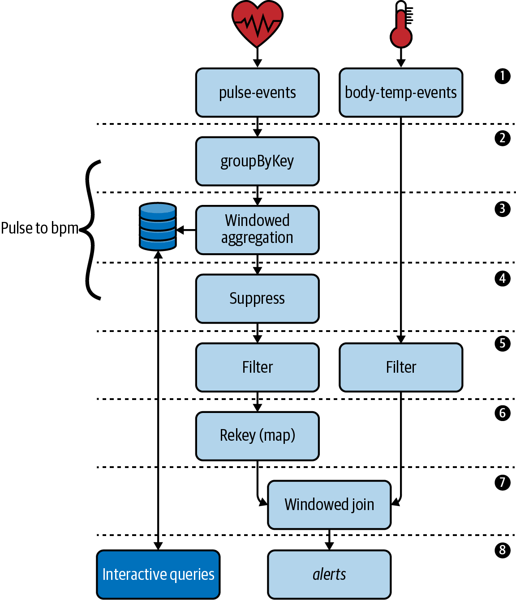
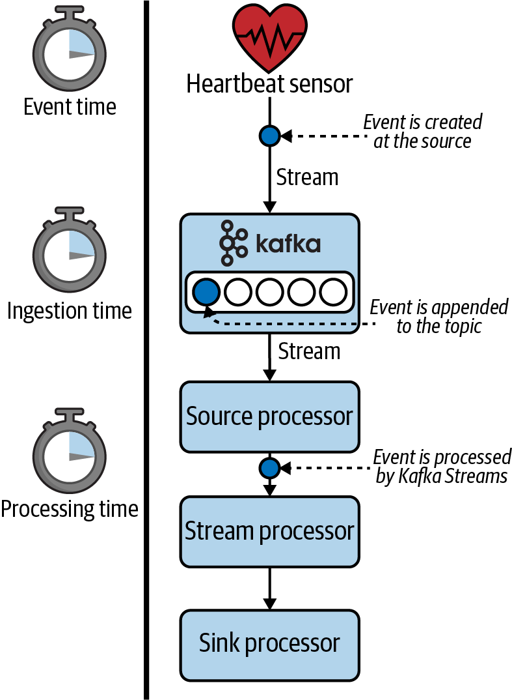

# Chapter 5. Windows and Time
 In order to unlock the full power of Kafka Streams, we must understand the relationship between events and time. This chapter explores this relationship in detail, and will give us hands-on experience with something called windows. Windows allow us to group events into explicit time buckets, and can be used for creating more advanced joins and aggregations (which we first explored in the previous chapter).

By the end of this chapter, you will understand the following:

* The differences between event time, ingestion time, and processing time
* How to build a custom timestamp extractor for associating events with a particular timestamp and time semantic
* How time controls the flow of data through Kafka Streams
* What types of windows are supported in Kafka Streams
* How to perform windowed joins
* How to perform windowed aggregations
* What strategies are available for dealing with late and out-of-order events
* How to use the suppress operator to process the final results of windows
* How to query windowed key-value stores

# Introducing Our Tutorial: Patient Monitoring Application
Some of the most important use cases for ``time-centric stream processing`` are in the `medical` field. Patient monitoring systems are capable of producing hundreds of measurements per second, and processing/responding to this data quickly is important for treating certain types of medical conditions. This is why Children’s Healthcare of Atlanta uses Kafka Streams and ksqlDB to make real-time predictions about whether or not children with head trauma will need surgical intervention in the near future.[1](#reference)

Inspired by this use case, we will demonstrate several time-centric streaming concepts by building an application to monitor patient vitals. Instead of monitoring for head trauma, we will try to detect the presence of a medical condition called ``systemic inflammatory response syndrome``, or SIRS. According to Bridgette Kadri, a physician’s assistant at the Medical University of South Carolina, there are several vital signs, including body temperature, blood pressure, and heart rate, that can be used as indicators of SIRS. In this tutorial, we will look at two of these measurements: body temperature and heart rate. When both of these vitals reach predefined thresholds (heart rate >= 100 beats per minute, body temperature >= 100.4°F), we will send a record to an **alerts** topic to notify the appropriate medical personnel.[2](#reference)

Let’s look at the architecture of our patient monitoring application. Figure 5-1 shows the topology design we’ll be implementing in this chapter. Additional information about each step is included after the diagram.

1. Our Kafka cluster contains two topics that capture patient vitals measurements:
    * The pulse-events topic is populated by a heartbeat sensor. Every time the sensor picks up a patient’s heartbeat, it appends a record to this topic. Records are keyed by patient ID.
    * The body-temp-events topic is populated by a wireless body temperature sensor. Every time the patient’s core body temperature is taken, a record is appended to this topic. These records are also keyed by patient ID.
2. In order to detect elevated heart rates, we need to convert the raw pulse events into a heart rate (measured using ``beats per minute``, or bpm). As we learned in the previous chapter, we must first group the records to satisfy Kafka Streams’ prerequisite for performing aggregations.
3. We will use a windowed aggregation to convert the pulse events into a heart rate. Since our unit of measurement is beats per minute, our window size will be 60 seconds.
4. We will use the suppress operator to only emit the final computation of the bpm window. We’ll see why this is needed once we discuss this operator later in the chapter.
5. In order to detect an infection, we will filter all vitals measurements that breach a set of predefined thresholds (heart rate >= 100 beats per minute, body temperature >= 100.4°F).
6. As we’ll see shortly, windowed aggregations change the record key. Therefore, we’ll need to rekey the heart rate records by patient ID to meet the co-partitioning requirements for joining records.
7. We will perform a windowed join to combine the two vitals streams. Since we are performing the join after filtering for elevated bpm and body temperature measures, each joined record will indicate an alerting condition for SIRS.
8. Finally, we will expose the results of our heart rate aggregation via interactive queries. We will also write the output of our joined stream to a topic called alerts.

Let’s now quickly run through the project setup so you can follow along with this tutorial.

  
Figure 5-1. The topology that we will be implementing for our patient monitoring application

# Patient Monitoring Application
This code corresponds with Chapter 5 in the upcoming O'Reilly book: [Mastering Kafka Streams and ksqlDB][book] by Mitch Seymour. This tutorial covers **Windows and Time** in Kafka Streams. Here, we demonstrate many time-centric operations in Kafka Streams' high-level DSL (including windowed joins and windowed aggregations) by building a patient monitoring system.

This tutorial was inspired by a use case at Children's Healthcare of Atlanta (CHOA). Special thanks to Ramesh Sringeri for helping me understand the use case at CHOA.

[book]: https://www.kafka-streams-book.com/

# Running Locally
The only dependency for running these examples is [Docker Compose][docker].

[docker]: https://docs.docker.com/compose/install/

Once Docker Compose is installed, you can start the local Kafka cluster using the following command:

```sh
$ docker-compose up
```
Runs a [Confluent Control Center](https://docs.confluent.io/platform/current/control-center/index.html) that exposes a UI at `http://localhost:9021/` .

We can follow the startup by monitoring the output :
```shell
docker-compose logs -f
```
Now, to run the Kafka Streams application, simply run:

```
./gradlew run --info
```
# Data Models
As usual, we’ll start by defining our data models. Since each vitals measurement is associated with a timestamp, we will first create a simple interface for each data class to implement. This interface allows us to extract the timestamp from a given record in a consistent manner, and will come in handy when we implement a timestamp extractor later in this chapter. The following code block shows the interface each data class will implement:
```java
public interface Vital {
 public String getTimestamp();
}
```
Here are the data classes we’ll be working with. Note: the accessor methods (including the interface method, ``getTimestamp``) have been omitted for brevity:
<table>
    <tr>
        <td>Kafka topic</td>
        <td>Example record</td>
        <td>Data class</td>
    </tr>
    <tr>
        <td>pulse-events</td>
        <td><pre>{
      "timestamp": "2020-11-05T09:02:00.000Z"
}</pre></td>
        <td><pre>public class Pulse implements Vital {
      private String timestamp;
}</pre></td>
    </tr>
    <tr>
        <td>body-temp-events</td>
        <td><pre>{
    "timestamp": "2020-11-04T09:02:06.500Z",
    "temperature": 101.2,
    "unit": "F"
}</pre></td>
        <td><pre>public class BodyTemp implements Vital {
      private String timestamp;
      private Double temperature;
      private String unit;
}</pre></td>
    </tr>
</table>
Now that we have a good understanding of what the source data looks like, we’re almost ready to register the input streams. However, this application requires special attention to time, and so far in this book, we haven’t put much thought into how records are associated with timestamps. So, before we register the input streams, let’s look at the various time semantics in Kafka Streams.

# Time Semantics
There are several different notions of time in Kafka Streams, and choosing the correct semantic is important when performing time-based operations, including windowed joins and aggregations. In this section, we will take some time to understand the different notions of time in Kafka Streams, starting with some simple definitions:

## Event time
When an event was created at the source. This timestamp can be embedded in the payload of an event, or set directly using the Kafka producer client as of version 0.10.0.

## Ingestion time
When the event is appended to a topic on a Kafka broker. This always occurs after event time.

## Processing time
When the event is processed by your Kafka Streams application. This always occurs after event time and ingestion time. It is less static than event time, and reprocessing the same data (i.e., for bug fixes) will lead to new processing timestamps, and therefore nondeterministic windowing behavior.

To illustrate where these notions of time are physically manifested in an event stream, see Figure 5-2.

  
Figure 5-2. The different time semantics in Kafka Streams, as shown through a heartbeat sensor

Event time is probably the most intuitive notion of time since it describes when the event actually occurred. For example, if a heartbeat sensor records a pulse at 9:02 a.m., then the event time is 9:02 a.m.

The event time is typically embedded in the payload, as shown in the following code example:
```json
{
 "timestamp": "2020-11-12T09:02:00.000Z", 1
 "sensor": "smart-pulse"
}
```
1. An embedded event timestamp that must be extracted.

Alternatively, Kafka producers allow the default timestamp that gets set for each record to be overridden, which can also be used to achieve event-time semantics. However, for systems that use this method for associating timestamps with events, it’s important to be aware of two Kafka configurations (one at the broker level and one at the topic level) to ensure you don’t accidentally end up with ingestion-time semantics. The relevant configurations are:

* log.message.timestamp.type (broker level)
* message.timestamp.type (topic level)

There are two possible values for these configs: ``CreateTime`` or ``LogAppendTime``. Furthermore, the topic-level config takes precedence over the broker-level config. If the topic is configured with the LogAppendTime timestamp type,3 the timestamp that the producer appends to the message will be overwritten with the local system time of the broker whenever a record is appended to the topic (therefore, you’ll be working with ingestion-time semantics, even if that wasn’t your intent). If you want to achieve event-time semantics and you’re relying on the producer timestamp, be sure that you are using CreateTime as the message timestamp type.

The benefit of using event-time semantics is that this timestamp is more meaningful to the event itself, and is therefore more intuitive for users. Event time also allows time-dependent operations to be deterministic (e.g., when reprocessing data). This is not the case when using processing time. Processing time is usually used if you aren’t leveraging time-based operations, if the time at which the event is processed is more meaningful to the semantics of the application than when the event initially occurred, or if you can’t associate an event with a timestamp for some reason. Interestingly enough, the latter issue, which occurs when an event time can’t be associated with a record, is sometimes addressed by using ingestion time. In systems where there isn’t a lot of lag between the time an event is created and when the event is subsequently appended to a topic, ingestion time can be used to approximate event time, so it can be a viable alternative when event time can’t be used.[4](#reference)

Now that we’ve learned about the different notions of time in Kafka Streams, how do we actually leverage the time semantic of our choice? We’ll learn about this in the next section.

# Timestamp Extractors
In Kafka Streams, timestamp extractors are responsible for associating a given record with a timestamp, and these timestamps are used in time-dependent operations like windowed joins and windowed aggregations. Each timestamp extractor implementation must adhere to the following interface:

public interface TimestampExtractor {
   long extract(
       ConsumerRecord<Object, Object> record, 1
       long partitionTime 2
   );
}
1
The current consumer record being processed.

2
Kafka Streams keeps track of the most recent timestamp it has seen for each partition it consumes from, and passes this timestamp to the extract method using the partitionTime parameter.

The second parameter, partitionTime, is particularly interesting since it can be used as a fallback if a timestamp cannot be extracted. We’ll dig into that shortly, but first, let’s look at the timestamp extractors that are included in Kafka Streams.

Included Timestamp Extractors
FailOnInvalidTimestamp, which is the default timestamp extractor in Kafka Streams, extracts the timestamp from the consumer record, which is either the event time (when message.timestamp.type is set to CreateTime) or ingestion time (when message.timestamp.type is set to LogAppendTime). This extractor will throw a StreamsException if the timestamp is invalid. A timestamp is considered invalid if it is negative (which can happen if the record was produced using a message format older than 0.10.0). At the time of this writing, it’s been over four years since version 0.10.0 was released, so negative/invalid timestamps are becoming more of a corner case at this point.

The LogAndSkipOnInvalidTimestamp extractor can also be used to achieve event-time semantics, but unlike the FailOnInvalidTimestamp extractor, it simply logs a warning when an invalid timestamp is encountered. This will result in the record being skipped, allowing Kafka Streams to continue processing when it encounters invalid timestamps.

There is another built-in extractor that we can use if we want processing-time semantics. As you can see in the code that follows, the WallclockTimestampExtractor simply returns the local system time of your stream processing application:

public class WallclockTimestampExtractor implements TimestampExtractor {

   @Override
   public long extract(
     final ConsumerRecord<Object, Object> record,
     final long partitionTime
   ) {
       return System.currentTimeMillis(); 1
   }
}
1
The WallclockTimestampExtractor, which is one of the included timestamp extractors in Kafka Streams, simply returns the current system time.

Regardless of which timestamp extractor you use, you can override the default timestamp extractor by setting the DEFAULT_TIMESTAMP_EXTRACTOR_CLASS_CONFIG property as shown in Example 5-1.

Example 5-1. An example of how to override the default timestamp extractor in Kafka Streams
Properties props = new Properties();
props.put( 1
  StreamsConfig.DEFAULT_TIMESTAMP_EXTRACTOR_CLASS_CONFIG,
  WallclockTimestampExtractor.class
);

// ... other configs

KafkaStreams streams = new KafkaStreams(builder.build(), props);
1
Override the default timestamp extractor.

When your Kafka Streams application leverages windows, as our patient monitoring application does, using processing-time semantics can have unintended side effects. For example, we want to capture the number of heartbeats within a one-minute window. If we use processing-time semantics (e.g., via WallclockTimestampExtractor) for our windowed aggregation, then our window boundaries won’t represent the pulse time at all, but will instead represent the time our Kafka Streams application observed the pulse event. If our application experiences even a few seconds of lag, an event may fall outside of the intended window and therefore could impact our expectations in certain ways (i.e., our ability to detect an elevated heart rate).

> **⚠ NOTE:**   When a timestamp is extracted and subsequently associated with a record, the record is said to be stamped.

After reviewing the built-in timestamp extractors, it’s clear that we need a custom timestamp extractor since the event time is embedded in the payloads of each of our vitals data (pulse and body temperature events). We’ll discuss how to build a custom timestamp extractor in the next section.

### Custom Timestamp Extractors
It’s very common to build a custom timestamp extractor whenever you need event-time semantics and the event timestamp is embedded in the record payload. The following code block shows a custom timestamp extractor that we will use to extract the timestamp of a patient vitals measurement. As mentioned before, our custom timestamp extractor implements the TimestampExtractor interface included in Kafka Streams:
```java
public class VitalTimestampExtractor implements TimestampExtractor {

 @Override
 public long extract(ConsumerRecord<Object, Object> record, long partitionTime) {
   Vital measurement = (Vital) record.value(); 1
   if (measurement != null && measurement.getTimestamp() != null) { 2
     String timestamp = measurement.getTimestamp(); 3
     return Instant.parse(timestamp).toEpochMilli(); 4
   }
   return partitionTime; 5
 }
}
```
1. Cast the record value to a Vital object. This is where our interface comes in handy, since it allows us to extract the timestamp from Pulse and BodyTemp records in a consistent way.
2. Make sure the record contains a timestamp before we attempt to parse it.
3. Extract the timestamp from the record.
4. The TimestampExtractor.extract method expects us to return the record’s timestamp in milliseconds. So we perform the timestamp-to-milliseconds conversion here.
5. If we cannot extract a timestamp for some reason, we can fall back to the partition time in order to approximate when the event occurred.

One thing you should consider when using timestamp extractors is how records without valid timestamps should be handled. The three most common options are to:

  * Throw an exception and stop processing (giving the developers an opportunity to resolve the bug)
  * Fallback to the partition time
  * Return a negative timestamp, which will allow Kafka Streams to skip over the record and continue processing

In our implementation of the VitalTimestampExtractor we’ve decided to fallback to the partition time, which will resolve to the highest timestamp that has already been observed for the current partition.

Now that we have created our timestamp extractor, let’s register our input streams.

### Registering Streams with a Timestamp Extractor
Registering a set of input streams should be familiar by now, but this time, we’ll pass in an extra Consumed parameter that will explicitly set the timestamp extractor to our custom timestamp extractor implementation (VitalTimestampExtractor). Example 5-2 shows how to register our two source streams using a custom timestamp extractor, which is the first step of our processor topology (see Figure 5-1).

Example 5-2. An example of how to override the timestamp extractor for source streams
```java
StreamsBuilder builder = new StreamsBuilder(); 1

Consumed<String, Pulse> pulseConsumerOptions =
   Consumed.with(Serdes.String(), JsonSerdes.Pulse())
       .withTimestampExtractor(new VitalTimestampExtractor()); 2

KStream<String, Pulse> pulseEvents =
    builder.stream("pulse-events", pulseConsumerOptions); 3

Consumed<String, BodyTemp> bodyTempConsumerOptions =
   Consumed.with(Serdes.String(), JsonSerdes.BodyTemp())
       .withTimestampExtractor(new VitalTimestampExtractor()); 4

KStream<String, BodyTemp> tempEvents =
        builder.stream("body-temp-events", bodyTempConsumerOptions); 5
```
1. As always with the DSL, use a StreamsBuilder to construct our processor topology.
2. Use Consumed.withTimestampExtractor to tell Kafka Streams to use our custom timestamp extractor (VitalTimestampExtractor) for extracting vitals timestamps.
3. Register the stream for capturing pulse events.
4. Use our custom timestamp extractor in the body temperature options as well.
5. Register the stream for capturing body temperature events.

Alternatively, we could override the default timestamp extractor using the method shown in Example 5-1. Either method is fine, but for now, we’ll stick with setting the extractor for each input stream directly. Now that we’ve registered our source streams, let’s move on to the second and third steps of our processor topology (see Figure 5-1): grouping and windowing the pulse-events stream.


# Producing Test Data
Once your application is running, you can produce some test data to see it in action. Since our patient monitoring application reads from multiple topics (`pulse-events`, `body-temp-events`), we have saved example records for each topic in the `data/` directory. To produce data into each of these topics, open a new tab in your shell and run the following commands.

```sh
# log into the broker, which is where the kafka console scripts live
$ docker-compose exec kafka bash

# produce test data to pulse-events topic
$ kafka-console-producer \
  --bootstrap-server kafka:9092 \
  --topic pulse-events \
  --property 'parse.key=true' \
  --property 'key.separator=|' < pulse-events.json

# produce test data to body-temp-events topic
$ kafka-console-producer \
  --bootstrap-server kafka:9092 \
  --topic body-temp-events \
  --property 'parse.key=true' \
  --property 'key.separator=|' < body-temp-events.json
```

# Consuming the alerts
This Kafka Streams application writes to an `alerts` topic whenever a patient experiences a combination of symptoms that could indicate an infection (high heart rate and body temperature). After producing the test data, you can view the alerts that were generated by consuming from the `alerts` topic. The following command shows how to do that.

```sh
# log into the broker, which is where the kafka console scripts live
$ docker-compose exec kafka bash

# consume from the beginning of the alerts topic
$ kafka-console-consumer \
  --bootstrap-server kafka:9092 \
  --topic alerts \
  --from-beginning
```

You should see an alert similar to the following (prettified for readability):

```json
{
  "heart_rate": 120,
  "body_temp": {
    "timestamp": "2020-11-23T09:03:06.500Z",
    "temperature": 101.2,
    "unit": "F"
  }
}
```


# Query the API
Our patient monitoring application also exposes patient heart rates using Kafka Streams' interactive queries feature. The API is listening on port `7000`. Note the following examples use `jq` to prettify the output. If you don't have `jq` installed, either [install it][jq] or remove that part of the command.

[jq]: https://stedolan.github.io/jq/download/

### Get the heart rate for all patients, grouped by window
```bash
curl localhost:7000/bpm/all
```

You should see some output like the following:
```json
{
  "[1@1606122120000/1606122180000]": 120
}
```

The cryptic looking format is actually a compound key, made up of the patient ID and the timerange that the patient's BPM was calculated over. More specifically, the above output translates to:

```json
{
  "[patient_id@time_start/time_end]": bpm
}
```

You could of course massage the output format a bit, but we'll leave that as an exercise to the reader :)

### Get the heart rate for a single patient, within a specific time range
The following query will execute a windowed range scan under the hood. You can replace `1/1606122180000/1606122240000` with any valid value included in the output of the `curl localhost:7000/bpm/all` query we executed above.

```bash
curl localhost:7000/bpm/range/1/1606122120000/1606122180000
```

You should see output similar to the following:

```json
[
  {
    "count": 120,
    "timestamp": "2020-11-23T09:02:00Z"
  }
]
```
# Reference