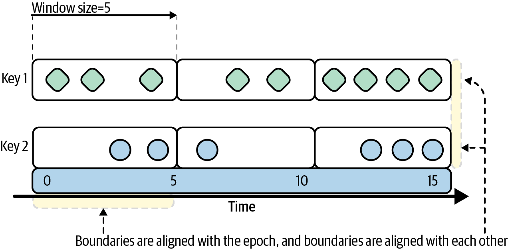
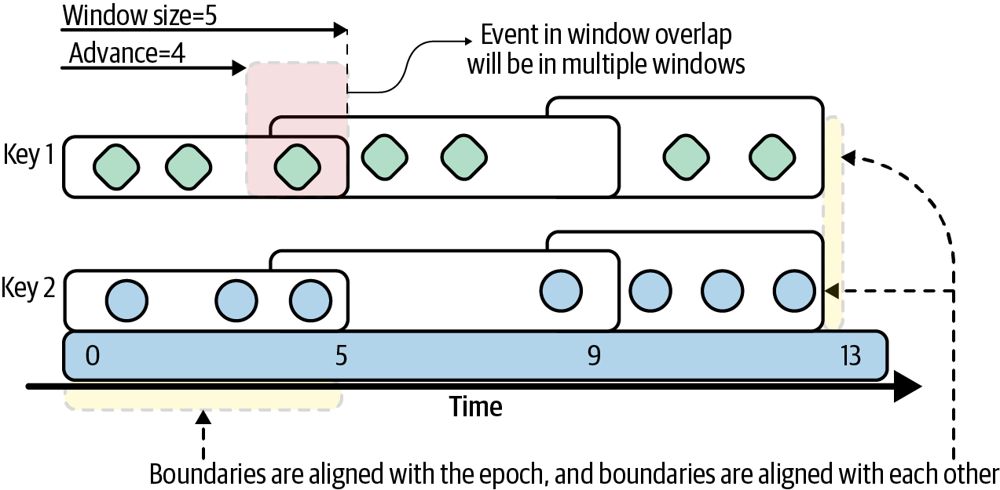
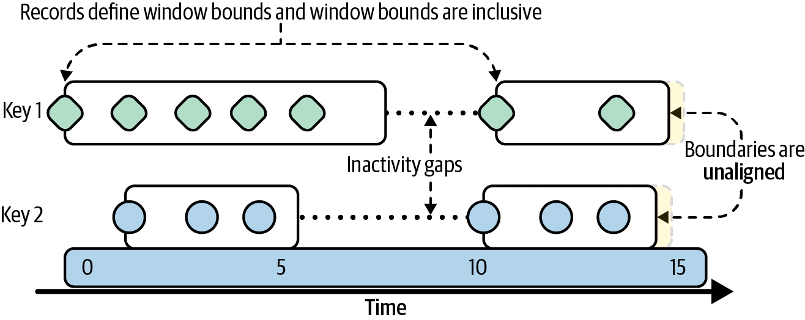
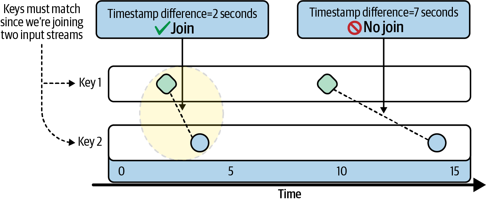
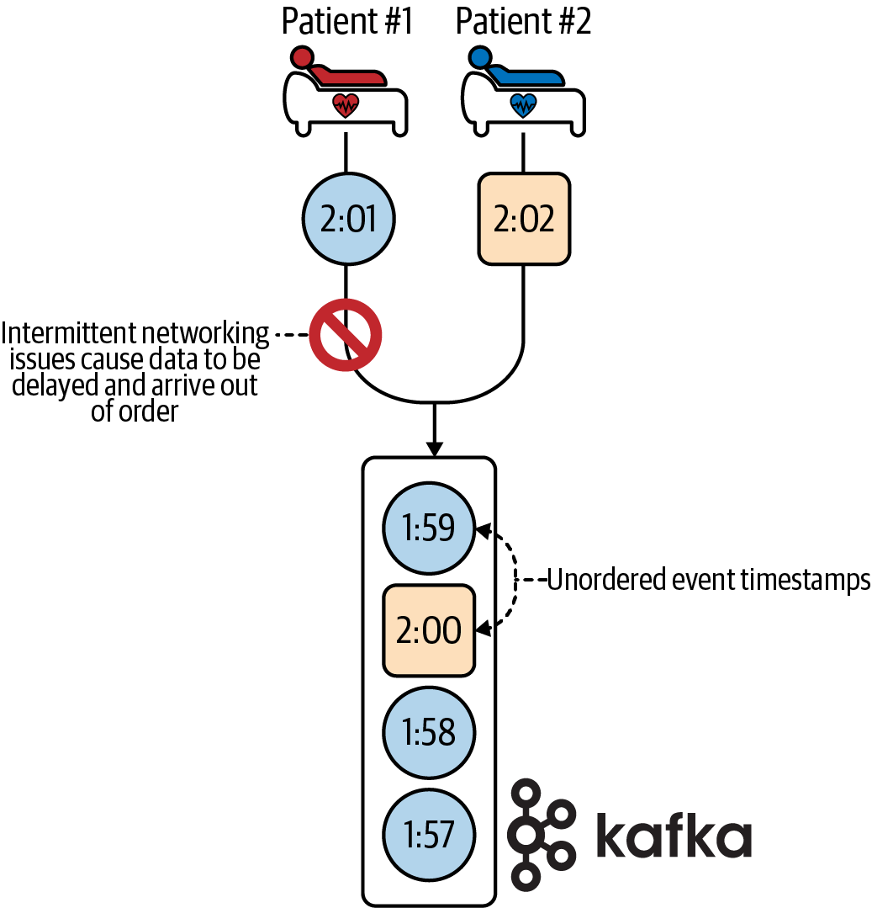
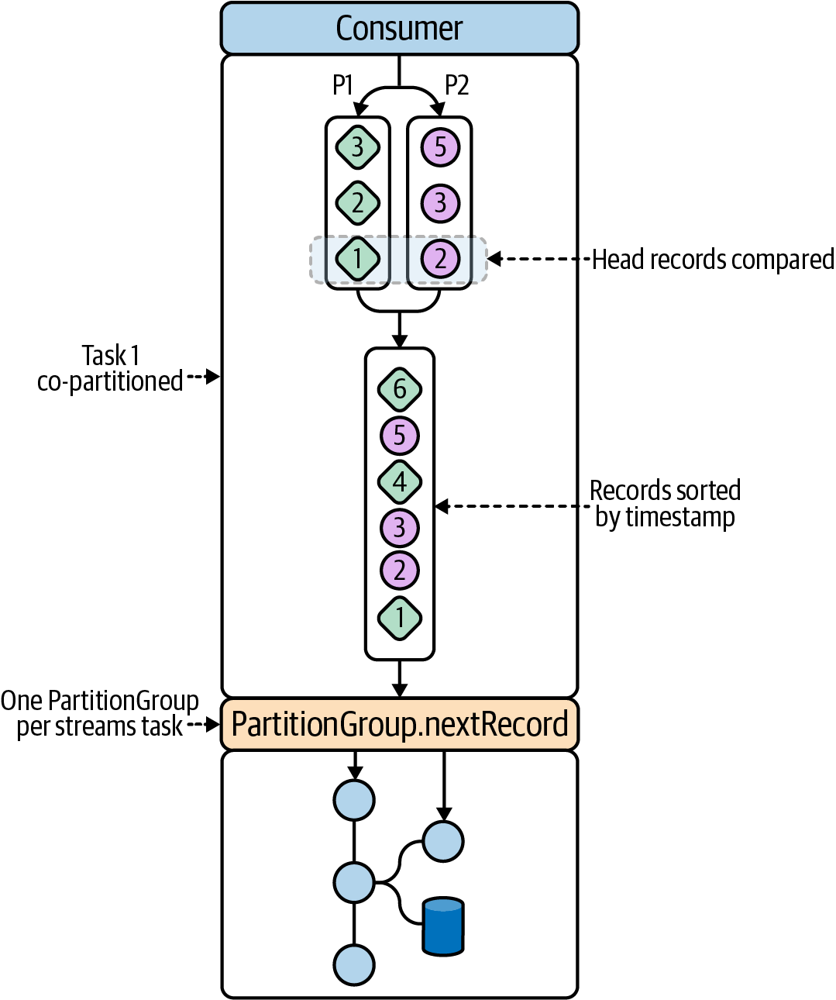

# Chapter 5. Windows and Time
 In order to unlock the full power of Kafka Streams, we must understand the relationship between events and time. This chapter explores this relationship in detail, and will give us hands-on experience with something called windows. Windows allow us to group events into explicit time buckets, and can be used for creating more advanced joins and aggregations (which we first explored in the previous chapter).

By the end of this chapter, you will understand the following:

* The differences between event time, ingestion time, and processing time
* How to build a custom timestamp extractor for associating events with a particular timestamp and time semantic
* How time controls the flow of data through Kafka Streams
* What types of windows are supported in Kafka Streams
* How to perform windowed joins
* How to perform windowed aggregations
* What strategies are available for dealing with late and out-of-order events
* How to use the suppress operator to process the final results of windows
* How to query windowed key-value stores

# Introducing Our Tutorial: Patient Monitoring Application
Some of the most important use cases for ``time-centric stream processing`` are in the `medical` field. Patient monitoring systems are capable of producing hundreds of measurements per second, and processing/responding to this data quickly is important for treating certain types of medical conditions. This is why Children’s Healthcare of Atlanta uses Kafka Streams and ksqlDB to make real-time predictions about whether or not children with head trauma will need surgical intervention in the near future.[1](#reference)

Inspired by this use case, we will demonstrate several time-centric streaming concepts by building an application to monitor patient vitals. Instead of monitoring for head trauma, we will try to detect the presence of a medical condition called ``systemic inflammatory response syndrome``, or SIRS. According to Bridgette Kadri, a physician’s assistant at the Medical University of South Carolina, there are several vital signs, including body temperature, blood pressure, and heart rate, that can be used as indicators of SIRS. In this tutorial, we will look at two of these measurements: body temperature and heart rate. When both of these vitals reach predefined thresholds (heart rate >= 100 beats per minute, body temperature >= 100.4°F), we will send a record to an **alerts** topic to notify the appropriate medical personnel.[2](#reference)

Let’s look at the architecture of our patient monitoring application. Figure 5-1 shows the topology design we’ll be implementing in this chapter. Additional information about each step is included after the diagram.

1. Our Kafka cluster contains two topics that capture patient vitals measurements:
    * The pulse-events topic is populated by a heartbeat sensor. Every time the sensor picks up a patient’s heartbeat, it appends a record to this topic. Records are keyed by patient ID.
    * The body-temp-events topic is populated by a wireless body temperature sensor. Every time the patient’s core body temperature is taken, a record is appended to this topic. These records are also keyed by patient ID.
2. In order to detect elevated heart rates, we need to convert the raw pulse events into a heart rate (measured using ``beats per minute``, or bpm). As we learned in the previous chapter, we must first group the records to satisfy Kafka Streams’ prerequisite for performing aggregations.
3. We will use a windowed aggregation to convert the pulse events into a heart rate. Since our unit of measurement is beats per minute, our window size will be 60 seconds.
4. We will use the suppress operator to only emit the final computation of the bpm window. We’ll see why this is needed once we discuss this operator later in the chapter.
5. In order to detect an infection, we will filter all vitals measurements that breach a set of predefined thresholds (heart rate >= 100 beats per minute, body temperature >= 100.4°F).
6. As we’ll see shortly, windowed aggregations change the record key. Therefore, we’ll need to rekey the heart rate records by patient ID to meet the co-partitioning requirements for joining records.
7. We will perform a windowed join to combine the two vitals streams. Since we are performing the join after filtering for elevated bpm and body temperature measures, each joined record will indicate an alerting condition for SIRS.
8. Finally, we will expose the results of our heart rate aggregation via interactive queries. We will also write the output of our joined stream to a topic called alerts.

Let’s now quickly run through the project setup so you can follow along with this tutorial.

  
Figure 5-1. The topology that we will be implementing for our patient monitoring application

# Patient Monitoring Application
This code corresponds with Chapter 5 in the upcoming O'Reilly book: [Mastering Kafka Streams and ksqlDB][book] by Mitch Seymour. This tutorial covers **Windows and Time** in Kafka Streams. Here, we demonstrate many time-centric operations in Kafka Streams' high-level DSL (including windowed joins and windowed aggregations) by building a patient monitoring system.

This tutorial was inspired by a use case at Children's Healthcare of Atlanta (CHOA). Special thanks to Ramesh Sringeri for helping me understand the use case at CHOA.

[book]: https://www.kafka-streams-book.com/

# Running Locally
The only dependency for running these examples is [Docker Compose][docker].

[docker]: https://docs.docker.com/compose/install/

Once Docker Compose is installed, you can start the local Kafka cluster using the following command:

```sh
$ docker-compose up
```
Runs a [Confluent Control Center](https://docs.confluent.io/platform/current/control-center/index.html) that exposes a UI at `http://localhost:9021/` .

We can follow the startup by monitoring the output :
```shell
docker-compose logs -f
```
Now, to run the Kafka Streams application, simply run:

```
./gradlew run --info
```
# Data Models
As usual, we’ll start by defining our data models. Since each vitals measurement is associated with a timestamp, we will first create a simple interface for each data class to implement. This interface allows us to extract the timestamp from a given record in a consistent manner, and will come in handy when we implement a timestamp extractor later in this chapter. The following code block shows the interface each data class will implement:
```java
public interface Vital {
 public String getTimestamp();
}
```
Here are the data classes we’ll be working with. Note: the accessor methods (including the interface method, ``getTimestamp``) have been omitted for brevity:
<table>
    <tr>
        <td>Kafka topic</td>
        <td>Example record</td>
        <td>Data class</td>
    </tr>
    <tr>
        <td>pulse-events</td>
        <td><pre>{
      "timestamp": "2020-11-05T09:02:00.000Z"
}</pre></td>
        <td><pre>public class Pulse implements Vital {
      private String timestamp;
}</pre></td>
    </tr>
    <tr>
        <td>body-temp-events</td>
        <td><pre>{
    "timestamp": "2020-11-04T09:02:06.500Z",
    "temperature": 101.2,
    "unit": "F"
}</pre></td>
        <td><pre>public class BodyTemp implements Vital {
      private String timestamp;
      private Double temperature;
      private String unit;
}</pre></td>
    </tr>
</table>
Now that we have a good understanding of what the source data looks like, we’re almost ready to register the input streams. However, this application requires special attention to time, and so far in this book, we haven’t put much thought into how records are associated with timestamps. So, before we register the input streams, let’s look at the various time semantics in Kafka Streams.

# Time Semantics
There are several different notions of time in Kafka Streams, and choosing the correct semantic is important when performing time-based operations, including windowed joins and aggregations. In this section, we will take some time to understand the different notions of time in Kafka Streams, starting with some simple definitions:

## Event time
When an event was created at the source. This timestamp can be embedded in the payload of an event, or set directly using the Kafka producer client as of version 0.10.0.

## Ingestion time
When the event is appended to a topic on a Kafka broker. This always occurs after event time.

## Processing time
When the event is processed by your Kafka Streams application. This always occurs after event time and ingestion time. It is less static than event time, and reprocessing the same data (i.e., for bug fixes) will lead to new processing timestamps, and therefore nondeterministic windowing behavior.

To illustrate where these notions of time are physically manifested in an event stream, see Figure 5-2.

  
Figure 5-2. The different time semantics in Kafka Streams, as shown through a heartbeat sensor

Event time is probably the most intuitive notion of time since it describes when the event actually occurred. For example, if a heartbeat sensor records a pulse at 9:02 a.m., then the event time is 9:02 a.m.

The event time is typically embedded in the payload, as shown in the following code example:
```json
{
 "timestamp": "2020-11-12T09:02:00.000Z", 1
 "sensor": "smart-pulse"
}
```
1. An embedded event timestamp that must be extracted.

Alternatively, Kafka producers allow the default timestamp that gets set for each record to be overridden, which can also be used to achieve event-time semantics. However, for systems that use this method for associating timestamps with events, it’s important to be aware of two Kafka configurations (one at the broker level and one at the topic level) to ensure you don’t accidentally end up with ingestion-time semantics. The relevant configurations are:

* log.message.timestamp.type (broker level)
* message.timestamp.type (topic level)

There are two possible values for these configs: ``CreateTime`` or ``LogAppendTime``. Furthermore, the topic-level config takes precedence over the broker-level config. If the topic is configured with the LogAppendTime timestamp type,3 the timestamp that the producer appends to the message will be overwritten with the local system time of the broker whenever a record is appended to the topic (therefore, you’ll be working with ingestion-time semantics, even if that wasn’t your intent). If you want to achieve event-time semantics and you’re relying on the producer timestamp, be sure that you are using CreateTime as the message timestamp type.

The benefit of using event-time semantics is that this timestamp is more meaningful to the event itself, and is therefore more intuitive for users. Event time also allows time-dependent operations to be deterministic (e.g., when reprocessing data). This is not the case when using processing time. Processing time is usually used if you aren’t leveraging time-based operations, if the time at which the event is processed is more meaningful to the semantics of the application than when the event initially occurred, or if you can’t associate an event with a timestamp for some reason. Interestingly enough, the latter issue, which occurs when an event time can’t be associated with a record, is sometimes addressed by using ingestion time. In systems where there isn’t a lot of lag between the time an event is created and when the event is subsequently appended to a topic, ingestion time can be used to approximate event time, so it can be a viable alternative when event time can’t be used.[4](#reference)

Now that we’ve learned about the different notions of time in Kafka Streams, how do we actually leverage the time semantic of our choice? We’ll learn about this in the next section.

# Timestamp Extractors
In Kafka Streams, timestamp extractors are responsible for associating a given record with a timestamp, and these timestamps are used in time-dependent operations like windowed joins and windowed aggregations. Each timestamp extractor implementation must adhere to the following interface:
```java
public interface TimestampExtractor {
   long extract(
       ConsumerRecord<Object, Object> record, 1
       long partitionTime 2
   );
}
```
1. The current consumer record being processed.
2. Kafka Streams keeps track of the most recent timestamp it has seen for each partition it consumes from, and passes this timestamp to the extract method using the partitionTime parameter.

The second parameter, partitionTime, is particularly interesting since it can be used as a fallback if a timestamp cannot be extracted. We’ll dig into that shortly, but first, let’s look at the timestamp extractors that are included in Kafka Streams.

## Included Timestamp Extractors
FailOnInvalidTimestamp, which is the default timestamp extractor in Kafka Streams, extracts the timestamp from the consumer record, which is either the event time (when message.timestamp.type is set to CreateTime) or ingestion time (when message.timestamp.type is set to LogAppendTime). This extractor will throw a StreamsException if the timestamp is invalid. A timestamp is considered invalid if it is negative (which can happen if the record was produced using a message format older than 0.10.0). At the time of this writing, it’s been over four years since version 0.10.0 was released, so negative/invalid timestamps are becoming more of a corner case at this point.

The LogAndSkipOnInvalidTimestamp extractor can also be used to achieve event-time semantics, but unlike the FailOnInvalidTimestamp extractor, it simply logs a warning when an invalid timestamp is encountered. This will result in the record being skipped, allowing Kafka Streams to continue processing when it encounters invalid timestamps.

There is another built-in extractor that we can use if we want processing-time semantics. As you can see in the code that follows, the WallclockTimestampExtractor simply returns the local system time of your stream processing application:

```java
public class WallclockTimestampExtractor implements TimestampExtractor {

   @Override
   public long extract(
     final ConsumerRecord<Object, Object> record,
     final long partitionTime
   ) {
       return System.currentTimeMillis(); 1
   }
}
```
1. The WallclockTimestampExtractor, which is one of the included timestamp extractors in Kafka Streams, simply returns the current system time.

Regardless of which timestamp extractor you use, you can override the default timestamp extractor by setting the DEFAULT_TIMESTAMP_EXTRACTOR_CLASS_CONFIG property as shown in Example 5-1.

Example 5-1. An example of how to override the default timestamp extractor in Kafka Streams
```java
Properties props = new Properties();
props.put( 1
  StreamsConfig.DEFAULT_TIMESTAMP_EXTRACTOR_CLASS_CONFIG,
  WallclockTimestampExtractor.class
);

// ... other configs

KafkaStreams streams = new KafkaStreams(builder.build(), props);
```

1. Override the default timestamp extractor.

When your Kafka Streams application leverages windows, as our patient monitoring application does, using processing-time semantics can have unintended side effects. For example, we want to capture the number of heartbeats within a one-minute window. If we use processing-time semantics (e.g., via **WallclockTimestampExtractor**) for our windowed aggregation, then our window boundaries won’t represent the pulse time at all, but will instead represent the time our Kafka Streams application observed the pulse event. If our application experiences even a few seconds of lag, an event may fall outside of the intended window and therefore could impact our expectations in certain ways (i.e., our ability to detect an elevated heart rate).

> **⚠ NOTE:**   When a timestamp is extracted and subsequently associated with a record, the record is said to be stamped.

After reviewing the built-in timestamp extractors, it’s clear that we need a custom timestamp extractor since the event time is embedded in the payloads of each of our vitals data (pulse and body temperature events). We’ll discuss how to build a custom timestamp extractor in the next section.

### Custom Timestamp Extractors
It’s very common to build a custom timestamp extractor whenever you need event-time semantics and the event timestamp is embedded in the record payload. The following code block shows a custom timestamp extractor that we will use to extract the timestamp of a patient vitals measurement. As mentioned before, our custom timestamp extractor implements the TimestampExtractor interface included in Kafka Streams:
```java
public class VitalTimestampExtractor implements TimestampExtractor {

 @Override
 public long extract(ConsumerRecord<Object, Object> record, long partitionTime) {
   Vital measurement = (Vital) record.value(); 1
   if (measurement != null && measurement.getTimestamp() != null) { 2
     String timestamp = measurement.getTimestamp(); 3
     return Instant.parse(timestamp).toEpochMilli(); 4
   }
   return partitionTime; 5
 }
}
```
1. Cast the record value to a Vital object. This is where our interface comes in handy, since it allows us to extract the timestamp from Pulse and BodyTemp records in a consistent way.
2. Make sure the record contains a timestamp before we attempt to parse it.
3. Extract the timestamp from the record.
4. The TimestampExtractor.extract method expects us to return the record’s timestamp in milliseconds. So we perform the timestamp-to-milliseconds conversion here.
5. If we cannot extract a timestamp for some reason, we can fall back to the partition time in order to approximate when the event occurred.

One thing you should consider when using timestamp extractors is how records without valid timestamps should be handled. The three most common options are to:

  * Throw an exception and stop processing (giving the developers an opportunity to resolve the bug)
  * Fallback to the partition time
  * Return a negative timestamp, which will allow Kafka Streams to skip over the record and continue processing

In our implementation of the VitalTimestampExtractor we’ve decided to fallback to the partition time, which will resolve to the highest timestamp that has already been observed for the current partition.

Now that we have created our timestamp extractor, let’s register our input streams.

### Registering Streams with a Timestamp Extractor
Registering a set of input streams should be familiar by now, but this time, we’ll pass in an extra Consumed parameter that will explicitly set the timestamp extractor to our custom timestamp extractor implementation (VitalTimestampExtractor). Example 5-2 shows how to register our two source streams using a custom timestamp extractor, which is the first step of our processor topology (see Figure 5-1).

Example 5-2. An example of how to override the timestamp extractor for source streams
```java
StreamsBuilder builder = new StreamsBuilder(); 1

Consumed<String, Pulse> pulseConsumerOptions =
   Consumed.with(Serdes.String(), JsonSerdes.Pulse())
       .withTimestampExtractor(new VitalTimestampExtractor()); 2

KStream<String, Pulse> pulseEvents =
    builder.stream("pulse-events", pulseConsumerOptions); 3

Consumed<String, BodyTemp> bodyTempConsumerOptions =
   Consumed.with(Serdes.String(), JsonSerdes.BodyTemp())
       .withTimestampExtractor(new VitalTimestampExtractor()); 4

KStream<String, BodyTemp> tempEvents =
        builder.stream("body-temp-events", bodyTempConsumerOptions); 5
```
1. As always with the DSL, use a StreamsBuilder to construct our processor topology.
2. Use Consumed.withTimestampExtractor to tell Kafka Streams to use our custom timestamp extractor (VitalTimestampExtractor) for extracting vitals timestamps.
3. Register the stream for capturing pulse events.
4. Use our custom timestamp extractor in the body temperature options as well.
5. Register the stream for capturing body temperature events.

Alternatively, we could override the default timestamp extractor using the method shown in Example 5-1. Either method is fine, but for now, we’ll stick with setting the extractor for each input stream directly. Now that we’ve registered our source streams, let’s move on to the second and third steps of our processor topology (see Figure 5-1): grouping and windowing the pulse-events stream.

# Windowing Streams
The **pulse-events** topic receives data whenever a patient’s heartbeat is recorded. However, for our purposes, we’re interested in the patient’s heart rate, which is measured by the number of beats per minute (bpm). We know that the ``count`` operator can be used to count the number of heartbeats, but we need some way of only counting the records that fall within each 60-second window. This is where **windowed aggregations** come into play. Windowing is a method for grouping records into different time-based subgroups for the purpose of aggregating and joining. Kafka Streams supports a few different types of windows, so let’s take a look at each type to determine which implementation we will need for our patient monitoring system.

## Window Types
Windows are used to group records with close ``temporal proximity``. Temporal proximity can mean different things depending on which time semantic you are using. For example, when using event-time semantics, it can mean “records that ``occurred`` around the same time,” whereas with processing-time semantics, it means “records that were **processed** around the same time.” For most cases, “around the same time” is defined by the window size (e.g., five minutes, one hour, etc.), though session windows (which we’ll discuss shortly) utilize an activity period.

There are four different types of windows in Kafka Streams. We will discuss the characteristics of each window type next, and then use these properties to create a decision tree for deciding which window to use in our tutorial (you can also use the resulting decision tree in your own applications).

### Tumbling windows
Tumbling windows are fixed-sized windows that never overlap. They are defined using a single property, the window size (in milliseconds), and have predictable time ranges since they are aligned with the epoch.5 The following code shows how to create a tumbling window in Kafka Streams:
```java
TimeWindows tumblingWindow =
  TimeWindows.of(Duration.ofSeconds(5)); 1
```
1. The size of the window is five seconds.

As you can see in Figure 5-3, a tumbling window is very simple to reason about, visually. You don’t have to worry about overlapping window boundaries or records appearing in more than one time bucket.
  
Figure 5-3. Tumbling window

### Hopping windows
Hopping windows are fixed-sized windows that may overlap.[6](#reference) When configuring a hopping window, you must specify both the **window size** and the **advance interval** (how much the window moves forward). When the advance interval is less than the window size, as shown in Figure 5-4, then windows will overlap, allowing some records to appear in multiple windows. Furthermore, hopping windows have predictable time ranges since they are aligned with the epoch, and the start time is inclusive while the end time is exclusive. The following code depicts how to create a simple hopping window with Kafka Streams:
```java
TimeWindows hoppingWindow =  TimeWindows
 .of(Duration.ofSeconds(5))  1
 .advanceBy(Duration.ofSeconds(4));  2
``` 
1. The size of the window is five seconds.
2. The window has a four-second advance interval (or hop).

A visualization of this hopping window is shown in Figure 5-4.   
  
Figure 5-4. Hopping window

### Session windows
Session windows are variable-sized windows that are determined by periods of activity followed by gaps of inactivity. A single parameter called the inactivity gap is used to define a session window. If the inactivity gap is five seconds, then each record that has a timestamp within five seconds of the previous record with the same key will be merged into the same window. Otherwise, if the timestamp of a new record is greater than the inactivity gap (in this case, five seconds), then a new window will be created. Unlike tumbling and hopping windows, both the lower and upper boundaries are inclusive. The following code snippet shows how to define a session window:
```java
SessionWindows sessionWindow = SessionWindows
 .with(Duration.ofSeconds(5)); 1
```
1. A session window with an inactivity gap of five seconds.

As you can see in Figure 5-5, session windows are unaligned (the range is specific to each key) and variable in length. The range is completely dependent on the record timestamps, with hot keys leading to long window ranges, and less active keys leading to shorter windows.    
  
Figure 5-5. Session window

### Sliding join windows
Sliding join windows are fixed-sized windows that are used for joins and created using the JoinWindows class. Two records fall within the same window if the difference between their timestamps is less than or equal to the window size. Thus, similar to session windows, both the lower and upper window boundaries are inclusive. Here is an example of how to create a join window with a duration of five seconds:
```java
JoinWindows joinWindow = JoinWindows
 .of(Duration.ofSeconds(5)); 1
```
1. Timestamps must be less than or equal to five seconds apart to fall within the same window.

Visually, join windows look a little different than other types of windows since their use in joins allows them to span multiple input streams. Figure 5-6 illustrates this, and shows how a five-second window is used to determine which records are combined in a windowed join.
  
Figure 5-6. Join window

### Sliding aggregation windows
In the previous section, we discussed a special type of sliding window that is used for joins. Since Kafka Streams 2.7.0, sliding windows can also be used with aggregations. Like sliding join windows, the window boundaries in a sliding aggregation window are aligned to the record timestamps (as opposed to the epoch) and the lower and upper window boundaries are both inclusive. Additionally, records will fall within the same window if the difference between their timestamps is within the specified window size. Here is an example of how to create a sliding window with a duration of five seconds and a grace period of zero seconds:[7](#reference)
```java
SlidingWindows slidingWindow =
 SlidingWindows.withTimeDifferenceAndGrace(
   Duration.ofSeconds(5),
   Duration.ofSeconds(0));
```
## Selecting a Window
Now that we’ve learned which window types are supported in Kafka Streams, we need to decide which type is appropriate for converting raw pulse events into a heart rate using a windowed aggregation.

Session windows aren’t a good fit for measuring the heart rate, because the window size could extend indefinitely as long as there is activity on the stream. This doesn’t meet our requirement of having fixed-size windows of 60 seconds. Furthermore, a sliding join window is used for joins only, so we can rule that choice out, as well (though we will use a sliding join window later in this tutorial).

You could arguably use any of the other window types for our aggregation, but to keep things simple, let’s align our window boundaries with the epoch (which rules out sliding aggregation windows) and avoid overlapping windows (which means we don’t need a hopping window). This leaves us with a tumbling window for our heart rate aggregation. With our window type selected, we are ready to perform a windowed aggregation.

## Windowed Aggregation
Since we’ve decided to use a tumbling window for the heart rate aggregation, we can build our windowed aggregation. First, we’ll construct the window using the TimeWindows.of method, and then we’ll window our stream with the windowedBy operator before performing the aggregation. The following code shows how to accomplish both of these steps:
```java
TimeWindows tumblingWindow =
 TimeWindows.of(Duration.ofSeconds(60));

KTable<Windowed<String>, Long> pulseCounts =
 pulseEvents
     .groupByKey() 1
     .windowedBy(tumblingWindow) 2
     .count(Materialized.as("pulse-counts")); 3

pulseCounts
 .toStream() 4
 .print(Printed.<Windowed<String>, Long>toSysOut().withLabel("pulse-counts")); 5
```
1. Grouping records is a prerequisite for performing an aggregation. However, the records in the pulse-events topic are already keyed using the desired scheme (i.e., by patient ID), so we can use the groupByKey operator instead of groupBy to avoid an unnecessary repartition of our data.
2. Window the stream using a 60-second tumbling window. This will allow us to turn the raw pulse events into a heart rate (measured by beats per minute).
3. Materialize the heart rate for interactive queries (this will be needed by step 8 in our processor topology—see Figure 5-1.
4. For debugging purposes only, convert the KTable to a stream so we can print the contents to the console.
5. Print the contents of our windowed stream to the console. Print statements are useful for local development purposes, but should be removed before deploying our application to production.

One interesting thing to highlight in this code example is that the key of the KTable changed from String to ``Windowed<String>``. This is because the ``windowedBy`` operator converts KTables into windowed KTables, which have multidimensional keys that contain not only the original record key, but also the time range of the window. This makes sense because we need some way of grouping keys into subgroups (windows), and simply using the original key would cause all of the pulse events to be included in the same subgroup. We can see this multidimensional key transformation in action by producing some records to the pulse-events topic and viewing the printed output of the windowed stream. The records we will produce are shown here (the record key and value are demarcated by the | character):
```json
1|{"timestamp": "2020-11-12T09:02:00.000Z"}
1|{"timestamp": "2020-11-12T09:02:00.500Z"}
1|{"timestamp": "2020-11-12T09:02:01.000Z"}
```
Producing these records leads to the output in Example 5-3. Note that the old key for each of these records, 1, has been changed to the following format:
```shell
[<oldkey>@<window_start_ms>/<window_end_ms>]
```
Example 5-3. The output of the print operator, which shows the multidimensional keys in our windowed pulseCounts table
```shell
[pulse-counts]: [1@1605171720000/1605171780000], 1 1
[pulse-counts]: [1@1605171720000/1605171780000], 2
[pulse-counts]: [1@1605171720000/1605171780000], 3
```
1. The multidimensional record key, which contains not only the original key, but also the window boundaries.

Apart from the key transformation logic, the preceding output highlights a peculiar behavior of Kafka Streams. The heart rate count, which we compute in our windowed aggregation, gets updated each time a new heartbeat is recorded. We can see this in Example 5-3, since the first heart rate that is emitted is 1, followed by 2, 3, etc. Therefore, downstream operators will see not just the final results of a window (the beats per minute), but also the intermediate results of the window (the number of heartbeats in this 60-second window so far). In applications that are highly tuned for low latency, these intermediate or incomplete window results are useful. However, in our case, we can’t truly know the patient’s heart rate until a window has been closed, so it is misleading at best. Let’s look at why Kafka Streams emits each intermediate result and see if we can tune this behavior.

# Emitting Window Results
The decision of when to emit a window’s computation is a surprisingly complex one for stream processing systems. The complexity is caused by two facts:

* Unbounded event streams may not always be in timestamp order, especially when using event-time semantics.8
> # NOTE
> Kafka does guarantee events will always be in offset order at the partition level. This means that every consumer will always read the events in the same sequence that they were appended to the topic (by ascending offset value).
* Events are sometimes delayed.

The lack of timestamp order means that we can’t just assume that if we’ve seen a record containing a certain timestamp, we’ve seen all records that should have arrived before that timestamp, and therefore can emit what we think is the final window result. Furthermore, delayed and out-of-order data requires us to make a choice: do we wait a certain amount of time for all of the data to arrive, or do we output the window result whenever it is updated (as seen in Example 5-3)? This is a trade-off between completeness and latency. Since waiting for data is more likely to produce a complete result, this approach optimizes for completeness. On the other hand, propagating updates downstream immediately (even though they may be incomplete) reduces latency. It’s up to you and potentially any service-level agreements (SLAs) you’ve established to decide what to optimize for.

Figure 5-7 demonstrates how both of these issues could occur. Patient #1 is attached to a vitals monitoring machine that is having intermittent networking issues. This leads to producer retries, causing some vitals measurements to have a delayed arrival into our Kafka cluster. Furthermore, since we have multiple producers writing to the pulse-events topic (one for each vitals monitoring machine), this also causes some events to be unordered with respect to their event timestamp.

  
Figure 5-7. Data can arrive out of timestamp order for many reasons; one common example is a topic having multiple producers, which introduces a race condition

One important thing to note is that there doesn’t need to be some failure scenario to result in out-of-order data. This could happen even in normal operating conditions, such as when multiple producers are writing to the same topic.

As mentioned previously, to overcome these issues, we need to optimize for either latency or completeness. By default, Kafka Streams optimizes for latency, using an approach called continuous refinement. Continuous refinement means that whenever a new event is added to the window, Kafka Streams will emit the new [computation immediately](https://www.confluent.io/blog/kafka-streams-take-on-watermarks-and-triggers/). This is why we saw each intermediate window result when we produced some records to our patient monitoring application (see Example 5-3). However, with continuous refinement, each result should be seen as potentially incomplete, and an emitted event does not mean we have processed every record that will eventually fall into the window. Furthermore, delayed data can continue causing events to be emitted at unexpected times.

The next two sections discuss how to address each of these issues in our patient monitoring application. First, let’s look at a strategy for handling delayed data in Kafka Streams. After that, we will learn how to suppress intermediate window calculations using Kafka Streams’ ``suppress`` operator.

## Grace Period
One of the biggest challenges faced by stream processing systems is how to handle delayed data. Many frameworks, including those that adhere to the influential [Dataflow model](https://research.google/pubs/pub43864/) (e.g., Apache Flink), leverage **watermarks**. Watermarks are used to estimate when all of the data for a given window should have arrived (usually by configuring the ``window size`` and the ``allowed lateness`` of events). Users can then specify how late events (as determined by the watermark) should be handled, with a popular default (in Dataflow, Flink, and others) being to discard late events.

Similar to the watermark approach, Kafka Streams allows us to configure the allowed lateness of events using a ``grace period``. Setting a grace period will keep the window open for a specific amount of time, in order to admit delayed/unordered events to the window. For example, we initially configured our tumbling window using the following code:
```java
TimeWindows tumblingWindow =
  TimeWindows.of(Duration.ofSeconds(60));
```
However, if we want to be able to tolerate five seconds of lag for pulse events (which we will use to calculate a heart rate), we could define our tumbling window with a grace period as well:
```java
TimeWindows tumblingWindow =
  TimeWindows
    .of(Duration.ofSeconds(60))
    .grace(Duration.ofSeconds(5));
```

We could increase the grace period further, but just remember the trade-off: higher grace periods optimize for completeness, because they keep the window open longer (allowing for data to be delayed), but they do this at the expense of higher latency (windows won’t be closed until the grace period ends).

Now, let’s see how to solve the problem of intermediate results being emitted in our windowed heart rate aggregation.

## Suppression
As we learned in the previous section, Kafka Streams’ strategy of continuous refinement, which involves emitting the results of a window whenever new data arrives, is ideal when we are optimizing for low latency and can tolerate incomplete (i.e., intermediate) results being emitted from the window.9

However, in our patient monitoring application, this is undesirable. We cannot calculate a heart rate using less than 60 seconds of data, so we need to only emit the final result of a window. This is where the suppress operator comes into play. The suppress operator can be used to only emit the final computation of a window, and to suppress (i.e., temporarily hold intermediate computations in memory) all other events. In order to use the suppress operator, we need to decide three things:

* Which suppression strategy should be used for suppressing intermediate window computations
* How much memory should be used for buffering the suppressed events (this is set using a Buffer Config)
* What to do when this memory limit is exceeded (this is controlled using a Buffer Full Strategy)

Let’s first look at the two suppression strategies. Table 5-1 describes each strategy available in Kafka Streams. Note that each strategy is available as a method on the Suppressed class.

Table 5-1. Window suppression strategies
| Strategy                     | Description                                                                                                                                                                                                                                                                                                                           |
|------------------------------|---------------------------------------------------------------------------------------------------------------------------------------------------------------------------------------------------------------------------------------------------------------------------------------------------------------------------------------|
| Suppressed.untilWindowCloses | Only emit the final results of a window.                                                                                                                                                                                                                                                                                              |
| Suppressed.untilTimeLimit    | Emit the results of a window after a configurable amount of time has elapsed since the last event was received. If another event with the same key arrives before the time limit is up, it replaces the first event in the buffer (note, the timer is not restarted when this happens). This has the effect of rate-limiting updates. |

In our patient monitoring application, we only want to emit the results of our heart rate window once a full 60 seconds has elapsed. Therefore, we will use the Suppressed.untilWindowCloses suppression strategy. However, before we can use this strategy in our processor topology, we need to tell Kafka Streams how to buffer the unemitted results in memory. After all, suppressed records aren’t discarded; instead, the latest unemitted record for each key in a given window is kept in memory until it’s time to emit the result. Memory is a limited resource, so Kafka Streams requires us to be explicit with how it is used for this potentially memory-intensive task of suppressing updates.10 In order to define our buffering strategy, we need to use Buffer Configs. Table 5-2 contains a description of each Buffer Config available in Kafka Streams.

Table 5-2. Buffer Configs
| Strategy                  | Description                                                                                                                                                                                                                     |
|---------------------------|---------------------------------------------------------------------------------------------------------------------------------------------------------------------------------------------------------------------------------|
| Buffer Config             | Description                                                                                                                                                                                                                     |
| BufferConfig.maxBytes()   | The in-memory buffer for storing suppressed events will be constrained by a configured number of bytes.                                                                                                                         |
| BufferConfig.maxRecords() | The in-memory buffer for storing suppressed events will be constrained by a configured number of keys.                                                                                                                          |
| BufferConfig.unbounded()  | The in-memory buffer for storing suppressed events will use as much heap space as needed to hold the suppressed records in the window. If the application runs out of heap, an OutOfMemoryError (OOM) exception will be thrown. |

Finally, the last requirement for suppressing records is to tell Kafka Streams what to do when the buffer is full. Kafka Streams exposes a couple of Buffer Full Strategies, each of which is described in Table 5-3.

Table 5-3. Buffer Full Strategies
| Buffer Full Strategy | Description                                                                                                                                                       |
|----------------------|-------------------------------------------------------------------------------------------------------------------------------------------------------------------|
| shutDownWhenFull     | Gracefully shut down the application when the buffer is full. You will never see intermediate window computations when using this strategy.                       |
| emitEarlyWhenFull    | Emit the oldest results when the buffer is full instead of shutting down the application. You may still see intermediate window computations using this strategy. |

Now that we understand which suppression strategies, Buffer Configs, and Buffer Full Strategies are available, let’s make a decision about which combination of the three works for us. We don’t want to rate-limit updates, so we won’t use untilTimeLimit. Instead, we want to only emit the final results of the heart rate window, so untilWindowCloses is a better fit here. Second, we expect our keyspace to be relatively small, so we’ll choose the unbounded Buffer Config. Finally, we never want to emit results early since that would lead to an inaccurate heart rate calculation (e.g., if we were to emit the number of heartbeats after only 20 seconds elapsed). Therefore, we will use shutDownWhenFull as our Buffer Config strategy.

Putting this all together, we can update our patient monitoring topology to use the suppress operator as shown in Example 5-4.

Example 5-4. Use the suppress operator to only emit the final results of the heart rate window (tumblingWindow)
```java
TimeWindows tumblingWindow =
  TimeWindows
    .of(Duration.ofSeconds(60))
    .grace(Duration.ofSeconds(5));

KTable<Windowed<String>, Long> pulseCounts =
  pulseEvents
   .groupByKey()
   .windowedBy(tumblingWindow)
   .count(Materialized.as("pulse-counts"))
   .suppress(
     Suppressed.untilWindowCloses(BufferConfig.unbounded().shutDownWhenFull())); 1
```
1. Suppress the results of the window so that only the final computation is emitted.

Now that we’ve completed step 4 in our processor topology (see Figure 5-1), let’s move on to steps 5 and 6: filtering and rekeying the pulse-events and body-temp-events data.

# Filtering and Rekeying Windowed KTables
If you look closely at the KTable in Example 5-4, you’ll see that windowing caused our key to change from a String type to a Windowed<String>. As mentioned before, this is because windowing causes our records to be grouped by an extra dimension: the window range. So, in order to join the body-temp-events stream, we need to rekey the pulse-events stream. We also need to filter both streams of data since we are only interested in records that exceed our predefined thresholds.

It may seem like we should perform the filter and rekeying operation in any order, and that’s true. However, one piece of advice is to perform filtering as early as you can. We know that rekeying records requires a repartition topic, so if we filter first, then we will reduce the number of reads/writes to this topic, making our application more performant.

Since both filtering and rekeying were discussed in previous chapters, we won’t do another deep dive into these concepts. But you can see the filtering and rekeying code for our patient monitoring application in the following code block:
```java
KStream<String, Long> highPulse =
 pulseCounts
     .toStream() 1
     .filter((key, value) -> value >= 100) 2
     .map(
         (windowedKey, value) -> {
           return KeyValue.pair(windowedKey.key(), value); 3
      });

KStream<String, BodyTemp> highTemp =
     tempEvents.filter((key, value) -> value.getTemperature() > 100.4); 4
```
1. Convert to a stream so we can use the map operator to rekey the records.
2. Filter for only heart rates that exceed our predefined threshold of 100 bpm.
3. Rekey the stream using the original key, which is available in windowedKey.key(). Note that windowedKey is an instance of o⁠r⁠g⁠.⁠a⁠p⁠a⁠c⁠h⁠e⁠.⁠k⁠a⁠f​k⁠a⁠.⁠s⁠t⁠r⁠e⁠a⁠m⁠s⁠.⁠k⁠s⁠t⁠r⁠e⁠a⁠m⁠.⁠W⁠i⁠n⁠d⁠o⁠w⁠e⁠d. This class contains methods for accessing the original key (as we saw with windowedKey.key()) and also the underlying time window (using windowedKey.window()).
4. Filter for only core body temperature readings that exceed our predefined threshold of 100.4°F.

We have completed steps 5 and 6 in our processor topology, so we are ready to perform a windowed join.

# Windowed Joins
As discussed in “Sliding join windows”, windowed joins require a sliding join window. Sliding join windows compare the timestamps of events on both sides of the join to determine which records should be joined together. Windowed joins are required for KStream-KStream joins since streams are unbounded. Therefore, the data needs to be materialized into a local state store for performing quick lookups of related values.

We can build a sliding join window and join the pulse rate and body temperature streams like so:
```java
StreamJoined<String, Long, BodyTemp> joinParams =
    StreamJoined.with(Serdes.String(), Serdes.Long(), JsonSerdes.BodyTemp()); 1

JoinWindows joinWindows =
   JoinWindows
       .of(Duration.ofSeconds(60)) 2
       .grace(Duration.ofSeconds(10)); 3

ValueJoiner<Long, BodyTemp, CombinedVitals> valueJoiner = 4
    (pulseRate, bodyTemp) -> new CombinedVitals(pulseRate.intValue(), bodyTemp);

KStream<String, CombinedVitals> vitalsJoined =
   highPulse.join(highTemp, valueJoiner, joinWindows, joinParams); 5
```
1. Specify the Serdes to be used in the join.
2. Records with timestamps one minute apart or less will fall into the same window, and will therefore be joined.
3. Tolerate a delay of up to 10 seconds.
4. Combine the heart rate and body temp into a CombinedVitals object.
5. Perform the join.

Joins are particularly interesting with regard to time because each side of the join could receive records at different rates, and so some additional synchronization is required to ensure events are joined at the appropriate time. Luckily for us, Kafka Streams is able to handle this scenario by allowing the timestamps on each side of the join to determine how data flows (and is subsequently joined) through our processor topology. We’ll explore these ideas in more detail in the next section.

# Time-Driven Dataflow
We’ve already seen how time can impact the behavior of certain operations, including windowed joins and windowed aggregations. However, time also controls the flow of data through our streams. It’s important for stream processing applications to synchronize the input streams to ensure correctness, especially when processing historical data from multiple sources.

To facilitate this synchronization, Kafka Streams creates a single partition group for each stream task. A partition group buffers the queued records for each partition being handled by the given task using a priority queue, and includes the algorithm for selecting the next record (across all input partitions) for processing. The record with the lowest timestamp is selected for processing.

> # NOTE
> Stream time is the highest timestamp observed for a particular topic-partition. It is initially unknown and can only increase or stay the same. It advances only when new data is seen. This is different from the other notions of time we discussed since it is internal to Kafka Streams itself.

When a single Kafka Streams task consumes data from more than one partition (e.g., in the case of a join), Kafka Streams will compare the timestamps for the next unprocessed records (called head records) in each partition (record queue) and will choose the record with the lowest timestamp for processing. The selected record is forwarded to the appropriate source processor in the topology. Figure 5-8 shows how this works.

  
Figure 5-8. Record timestamps are compared to determine how data flows through your Kafka Streams application

With our join in place, and some reassurances that Kafka Streams will attempt to process our records in timestamp order using time-based flow-control mechanisms,[11](#reference) we are now ready to tackle the final steps of our patient monitoring topology. We’ll briefly recap how to add a sink processor to our topology, and then we’ll learn how to query windowed key-value stores.

## Alerts Sink
In order to make our join results available to downstream consumers, we need to write the enriched data back to Kafka. As we’ve seen in previous chapters, adding a sink is extremely easy in Kafka Streams. The following code shows how to add the alerts sink. This sink will be written to whenever our application determines that a patient is at risk for SIRS, as determined by our thresholds and windowed join:
```javascript
vitalsJoined.to(
  "alerts",
  Produced.with(Serdes.String(), JsonSerdes.CombinedVitals())
);
```

One benefit of using a timestamp extractor when registering our source streams (see Example 5-2) is that our output records will also be associated with the extracted timestamp. For unjoined streams/tables, the timestamp is propagated from the initial timestamp extraction that occurred when you registered the source processors. However, if you perform a join, like we’ve done with our patient monitoring application, then Kafka Streams will look at the timestamps for each record involved in the join and choose the maximum value for the output record.12

Registering the alerts sink exposes our patient monitoring data to real-time consumers of the alerts topic. Now, let’s learn how to query windowed key-value stores by exposing the results of our windowed aggregation (which calculates a patient’s heart rate).

## Querying Windowed Key-Value Stores
In “Querying Nonwindowed Key-Value Stores”, we saw how to query nonwindowed key-value stores. However, windowed key-value stores support a different set of queries because the record keys are multidimensional, and consist of both the original key and the window range, as opposed to just the original record key (which is what we see in nonwindowed key-value stores). We’ll start by looking at key and window range scans.

### Key + window range scans
There are two different types of range scans that can be used for windowed key-value stores. The first type searches for a specific key in a given window range, and therefore requires three parameters:
* The key to search for (in the case of our patient monitoring application, this would correspond to the patient ID, e.g., 1)
* The lower boundary of the window range, represented as milliseconds from the epoch13 (e.g., 1605171720000, which translates to 2020-11-12T09:02:00.00Z)
* The upper boundary of the window range, represented as milliseconds from the epoch (e.g., 1605171780000, which translates to 2020-11-12T09:03:00Z)

An example of how to execute this type of range scan, and how to extract the relevant properties from the result, is shown here:
```java
String key = 1;
Instant fromTime = Instant.parse("2020-11-12T09:02:00.00Z");
Instant toTime = Instant.parse("2020-11-12T09:03:00Z");

WindowStoreIterator<Long> range = getBpmStore().fetch(key, fromTime, toTime); 1
while (range.hasNext()) {
 KeyValue<Long, Long> next = range.next(); 2
 Long timestamp = next.key; 3
 Long count = next.value; 4
  // do something with the extracted values
}

range.close(); 5
```
1. Returns an iterator that can be used for iterating through each key in the selected time range.
2. Get the next element in the iteration.
3. The timestamp of the record is available in the key property.
4. The value can be extracted using the value property.
5. Close the iterator to avoid memory leaks.

### Window range scans
The second type of range scan that can be performed on windowed key-value stores searches for **all keys** within a given time range. This type of query requires two parameters:

* The lower boundary of the window range, represented as milliseconds from the epoch14 (e.g., 1605171720000, which translates to 2020-11-12T09:02:00.00Z)
* The upper boundary of the window range, represented as milliseconds from the epoch (e.g., 1605171780000, which translates to 2020-11-12T09:03:00Z)

The following code block shows how to execute this type of range scan, and how to extract the relevant properties from the result:
```java
Instant fromTime = Instant.parse("2020-11-12T09:02:00.00Z");
Instant toTime = Instant.parse("2020-11-12T09:03:00Z");

KeyValueIterator<Windowed<String>, Long> range =
  getBpmStore().fetchAll(fromTime, toTime);

while (range.hasNext()) {
  KeyValue<Windowed<String>, Long> next = range.next();
  String key = next.key.key();
  Window window = next.key.window();
  Long start = window.start();
  Long end = window.end();
  Long count = next.value;
    // do something with the extracted values
}

range.close();
```
## All entries
Similar to range scan queries, the all() query returns an iterator for all windowed key-value pairs that are available in the local state store.15 The following code snippet shows how to execute an all() query against a local windowed key-value store. Iterating through the results is the same as the range scan query, so we have omitted that logic for brevity:
```java
KeyValueIterator<Windowed<String>, Long> range = getBpmStore().all();
```
> # WARNING
> It’s very important to close the iterator once you are finished with it to avoid memory leaks. For example, looking at the preceding code snippet, we would call range.close() when we are finished with the iterator.

Using these query types, you can build an interactive query service in the same way that we discussed in the previous chapter. We just need to add an RPC service and client to our application, leverage the Kafka Streams instance discovery logic for discovering remote application instances, and wire up the preceding windowed key-value store queries to the RPC or RESTful endpoints (see “Remote Queries” for more information).
# Producing Test Data
Once your application is running, you can produce some test data to see it in action. Since our patient monitoring application reads from multiple topics (`pulse-events`, `body-temp-events`), we have saved example records for each topic in the `data/` directory. To produce data into each of these topics, open a new tab in your shell and run the following commands.

```sh
# log into the broker, which is where the kafka console scripts live
$ docker-compose exec kafka bash

# produce test data to pulse-events topic
$ kafka-console-producer \
  --bootstrap-server kafka:9092 \
  --topic pulse-events \
  --property 'parse.key=true' \
  --property 'key.separator=|' < pulse-events.json

# produce test data to body-temp-events topic
$ kafka-console-producer \
  --bootstrap-server kafka:9092 \
  --topic body-temp-events \
  --property 'parse.key=true' \
  --property 'key.separator=|' < body-temp-events.json
```

# Consuming the alerts
This Kafka Streams application writes to an `alerts` topic whenever a patient experiences a combination of symptoms that could indicate an infection (high heart rate and body temperature). After producing the test data, you can view the alerts that were generated by consuming from the `alerts` topic. The following command shows how to do that.

```sh
# log into the broker, which is where the kafka console scripts live
$ docker-compose exec kafka bash

# consume from the beginning of the alerts topic
$ kafka-console-consumer \
  --bootstrap-server kafka:9092 \
  --topic alerts \
  --from-beginning
```

You should see an alert similar to the following (prettified for readability):

```json
{
  "heart_rate": 120,
  "body_temp": {
    "timestamp": "2020-11-23T09:03:06.500Z",
    "temperature": 101.2,
    "unit": "F"
  }
}
```


# Query the API
Our patient monitoring application also exposes patient heart rates using Kafka Streams' interactive queries feature. The API is listening on port `7000`. Note the following examples use `jq` to prettify the output. If you don't have `jq` installed, either [install it][jq] or remove that part of the command.

[jq]: https://stedolan.github.io/jq/download/

### Get the heart rate for all patients, grouped by window
```bash
curl localhost:7000/bpm/all
```

You should see some output like the following:
```json
{
  "[1@1606122120000/1606122180000]": 120
}
```

The cryptic looking format is actually a compound key, made up of the patient ID and the timerange that the patient's BPM was calculated over. More specifically, the above output translates to:

```json
{
  "[patient_id@time_start/time_end]": bpm
}
```

You could of course massage the output format a bit, but we'll leave that as an exercise to the reader :)

### Get the heart rate for a single patient, within a specific time range
The following query will execute a windowed range scan under the hood. You can replace `1/1606122180000/1606122240000` with any valid value included in the output of the `curl localhost:7000/bpm/all` query we executed above.

```bash
curl localhost:7000/bpm/range/1/1606122120000/1606122180000
```

You should see output similar to the following:

```json
[
  {
    "count": 120,
    "timestamp": "2020-11-23T09:02:00Z"
  }
]
```
# Summary
In this chapter, we learned how time can be used for more advanced stream processing use cases. By being deliberate with the time semantics we use in our topology definitions, we can achieve more deterministic processing in Kafka Streams. Time not only drives the behavior of windowed aggregations, windowed joins, and other time-based operations, but since Kafka Streams tries to synchronize input streams based on time, it even controls how and when data flows through our application.

Windowing data allows us to derive temporal relationships between events. Whether we want to leverage these relationships for aggregating data (as we did by converting raw pulse events into a time-based heart rate aggregation) or joining data (e.g., when we joined the heart rate stream with the body temperature stream), time opens the door for more meaningful data enrichment.

Finally, learning how to query windowed key-value stores taught us something important about windowed state stores: keys are multidimensional (containing both the original key and the time range of the window), and therefore support a different set of queries, including windowed range scans.

In the next chapter, we will wrap up our discussion of stateful Kafka Streams applications by looking at advanced state management tasks.
# Reference
 1. This is accomplished by measuring intracranial pressure, aggregating the measurements, and sending the aggregations to a predictive model. When the model predicts that the pressure will reach dangerous levels in the next 30 minutes, then healthcare professionals will be notified so they can take the appropriate action. All of this is made possible through time-aware stream processing. Check out Tim Berglund’s [interview with Ramesh Sringeri](https://www.buzzsprout.com/186154/1571917) for an in-depth look at this use case.
2. We won’t actually implement the monitoring application in this tutorial since it isn’t necessary to demonstrate the time-centric features of Kafka Streams.
3. Either directly via the topic-level config or indirectly using the broker-level config and no override for the topic-level config.
4. Matthias J. Sax has a [great presentation](https://www.slideshare.net/ConfluentInc/whats-the-time-and-why-mattias-sax-confluent-kafka-summit-sf-2019) that talks about this, as well as some of the other topics discussed in this chapter.
5. Taken from the [Java docs](https://kafka.apache.org/26/javadoc/org/apache/kafka/streams/kstream/TimeWindows.html): “Aligned to the epoch means that the first window starts at timestamp zero.” In other words, a window size of 5,000 would have boundaries of 0–5,000, 5,000–10,000, etc. Note that the start time is inclusive but the end time is exclusive.
6. In some systems, the term “sliding window” is used to refer to hopping windows. However, in Kafka Streams, hopping windows are distinct from sliding windows, which we will discuss shortly.
7. Sliding aggregation windows are the only window type that require us to explicitly set a grace period. We’ll discuss grace periods later in this chapter.
8. Of course, if you use ingestion-time semantics by setting message.timestamp.type to LogAppendTime, then the record timestamps will always appear in order. This is because the timestamp is overwritten at topic append time. However, the ingestion time is somewhat arbitrary in relation to the event itself, and in the best-case scenario is just a close approximation of the event time (assuming the event is written right after it’s created).
9. This is different than how many other streaming systems work, in which processing occurs only when a window is closed.
10. Since Kafka Streams holds the latest record for each key when using the suppress operator, the required amount of memory is a function of your keyspace, with smaller keyspaces for a given input stream requiring less memory than large keyspaces. The grace period can also impact memory usage.
11. It’s important to note that this is best-effort when one of the input streams becomes empty. However, you can use the max.task.idle.ms configuration, which controls how long you are willing to wait for new records to arrive in the drained input stream, to help avoid this. The default value is 0, but increasing this will allow you to improve time synchronization by waiting longer.
12. Prior to version 2.3, the timestamp on the output record was set to the timestamp of whatever record triggered the join. Using the maximum value in newer versions of Kafka Streams is an improvement over the old behavior, since it ensures the result timestamp is the same whether data is out of order or not.
13. 1970-01-01T00:00:00Z (UTC)
14. 1970-01-01T00:00:00Z (UTC)
15. Depending on the number of keys in your state store, this could be a heavyweight call.

