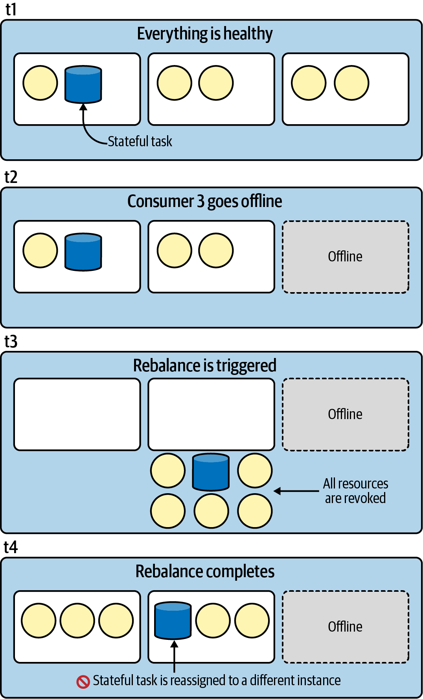
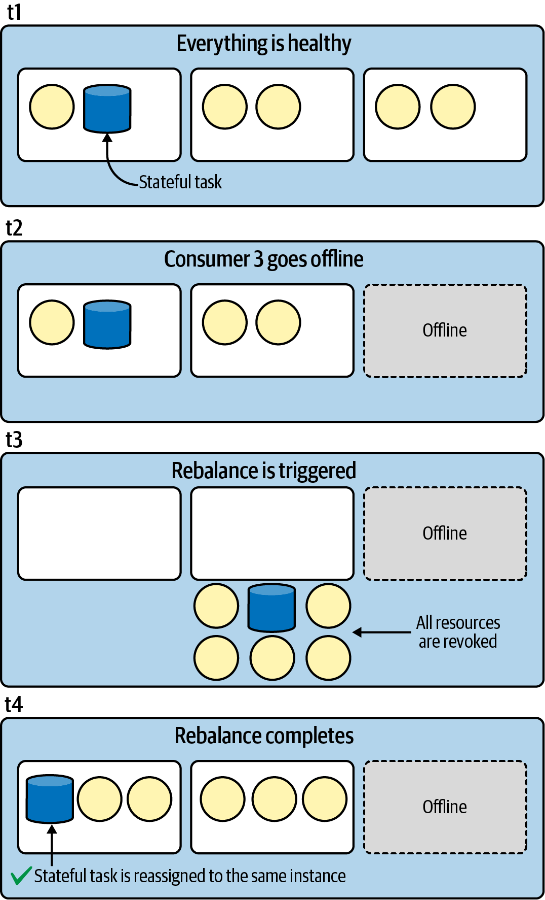
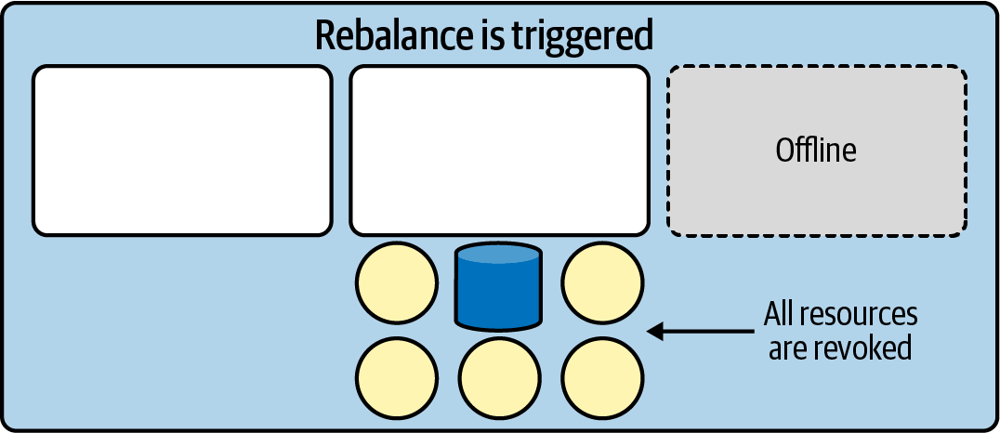
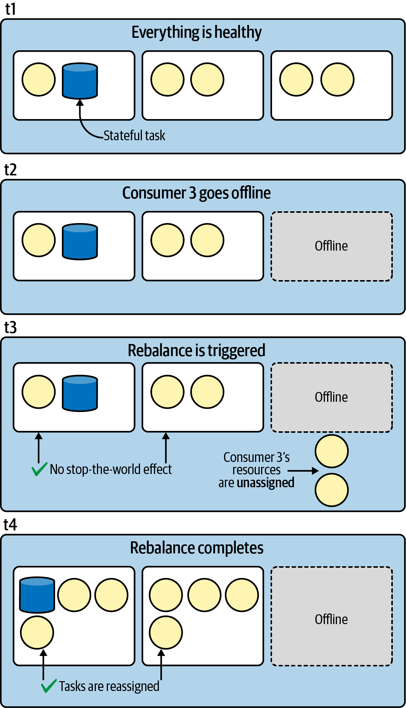
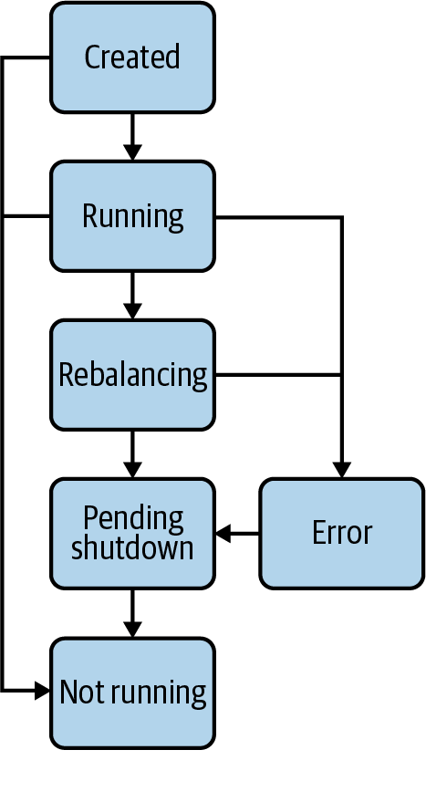

# Chapter 6. Advanced State Management
This code corresponds with Chapter 6 in the upcoming O'Reilly book: [Mastering Kafka Streams and ksqlDB][book] by Mitch Seymour. The code examples here make up a small percentage of the topics we actually cover in this chapter so I highly recommend reading that chapter for a more complete understanding of **advanced state management**.

[book]: https://www.kafka-streams-book.com/


# Running Locally
The only dependency for running these examples is [Docker Compose][docker].

[docker]: https://docs.docker.com/compose/install/

Once Docker Compose is installed, you can start the local Kafka cluster using the following command:

```sh
$ docker-compose up
```

Runs a [Confluent Control Center](https://docs.confluent.io/platform/current/control-center/index.html) that exposes a UI at `http://localhost:9021/` .

We can follow the startup by monitoring the output :
```shell
docker-compose logs -f
```


This tutorial includes a few different topologies. The brief description for each topology, including the command for running the topology, is shown below:

- [An example topology](advanced-state-management/src/main/java/com/magicalpipelines/TopicConfigsExample.java#L14-L40) that applies custom configurations to changelog topics

  ```sh
  ./gradlew runTopicConfigsExample
  ```
  
- [An example topology](advanced-state-management/src/main/java/com/magicalpipelines/LruFixedSizedStoreExample.java#L13-L48) that uses a fixed-size LRU cache as its state store:

  ```sh
  ./gradlew runLruFixedSizedStoreExample
  ```
  
- [An example topology](advanced-state-management/src/main/java/com/magicalpipelines/TombstoneExample.java#L7-L39) that processes tombstones
  
  ```sh
  ./gradlew runTombstoneExample
  ```

# Producing Test Data
Once your application is running, you can produce some test data using the following command:

```sh
./scripts/produce-test-data.sh
```
# Chapter 6. Advanced State Management
In the past two chapters, we discussed stateful processing in Kafka Streams. As we learned how to perform aggregations, joins, and windowed operations, it became apparent that stateful processing is pretty easy to get started with.

However, as I alluded to previously, state stores come with additional operational complexity. As you scale your application, experience failures, and perform routine maintenance, you will learn that stateful processing requires a deeper understanding of the underlying mechanics to ensure your application continues to operate smoothly over time.

The goal of this chapter is to dig deeper into state stores so that you can achieve a higher level of reliability when building stateful stream processing applications. A large portion of this chapter is dedicated to the topic of **rebalancing**, which ``occurs when work needs to be redistributed across your consumer group``. `Rebalancing can be especially impactful for stateful applications`, so we’ll develop our understanding so that you are equipped to deal with this in your own applications.

Some of the questions we will answer include:

* How are persistent state stores represented on disk?
* How do stateful applications achieve fault tolerance?
* How can we configure built-in state stores?
* What kinds of events are the most impactful for stateful applications?
* What measures can be taken to minimize recovery time of stateful tasks?
* How do you ensure that state stores don’t grow indefinitely?
* How can the DSL cache be used to rate limit downstream updates?
* How do you track progress of state restoration using a State Restore Listener?
* How can State Listeners be used to detect rebalances?

Let’s start by looking at the on-disk layout of persistent state stores.
## Persistent Store Disk Layout
Kafka Streams includes both **in-memory** and **persistent** state stores. The latter category of state stores are generally preferred because `they can help reduce the recovery time of an application whenever state needs to be reinitialized` (e.g., in the event of failure or task migration).

By default, persistent state stores live in the ``/tmp/kafka-streams`` directory. You can override this by setting the ``StreamsConfig.STATE_DIR_CONFIG`` property, and given the ephemeral nature of a `/tmp` directory (the contents of this directory are deleted during system reboots/crashes), you should choose another location for persisting your application state.

Since persistent state stores live on disk, we can inspect the files very easily.[^1] Doing so allows us to glean a surprising amount of information from the directory and filenames alone. The file tree in Example 6-1 was taken from the patient monitoring application that we created in the previous chapter. The annotations provide additional detail about the important directories and files.

###### Example 6-1. An example of how a persistent state store is represented on disk
``` shell
.
└── dev-consumer (1)
    ├── 0_0
    │   ├── .lock
    │   └── pulse-counts
    ├── 0_1
    │   ├── .lock
    │   └── pulse-counts
    ├── 0_2
    │   ├── .lock
    │   └── pulse-counts
    ├── 0_3 (2)
    │   ├── .checkpoint (3)
    │   ├── .lock (4)
    │   └── pulse-counts (5)
    │       └── ...
    ├── 1_0
    │   ├── ...
```
1. The top-level directory contains the `application ID`. This is helpful to understand which applications are running on the server, especially in a shared environment where workloads can be scheduled on any number of nodes (e.g., in a Kubernetes cluster).
2. Each of the second-level directories corresponds to a single Kafka Streams task. The directory name is formatted as a ``task ID``. Task IDs are composed of two parts: ``<sub-topology-id>_<partition>``. Note that, as we discussed in “[Sub-Topologies](../chapter-02/README.md#sub-topologies)”, a sub-topology might process data from one or multiple topics, depending on the logic of your program.
3. Checkpoint files store offsets from changelog topics (see “[Changelog Topics](#changelog-topics)”). They indicate to Kafka Streams what data has been read into the local state store and, as you’ll see shortly, play an important role in state store recovery.
4. The lock file is used by Kafka Streams to acquire a lock on the state directory. This helps prevent concurrency issues.
5. The actual data is stored in named state directories. Here, ``pulse-counts`` corresponds to an explicit name that we set when materializing the state store.

The main benefit of knowing what state stores look like on disk is **to simply remove some of the mystery around how they work**. Furthermore, the lock file and checkpoint files are especially important, and are referenced in **certain error logs** (for example, ``permissions issues could surface as a failure to write to a checkpoint file, while a concurrency issue could lead to an error about Kafka Streams failing to acquire a lock``), so understanding their location and utility is helpful.

The checkpoint file plays an important role in state store recovery. Let’s dig into this further by first looking at the fault-tolerant features of stateful applications, and then seeing how offset checkpoints are used to reduce recovery time.

## Fault Tolerance
Kafka Streams owes much of its fault-tolerant characteristics to Kafka’s storage layer and group management protocol. For example, data replication at the partition level means if a broker goes offline, data can still be consumed from one of the replicated partitions on another broker. Furthermore, by using consumer groups, if a single instance of your application goes down, work will be redistributed to one of the healthy instances.

However, when it comes to stateful applications, Kafka Streams takes additional measures to ensure applications are resilient to failure. This includes using changelog topics to back state stores, and standby replicas to minimize reinitialization time in the event that state is lost. We’ll discuss these Kafka Streams–specific fault-tolerant features in further detail in the following sections.

### Changelog Topics
Unless explicitly disabled, state stores are backed by changelog topics, which are created and managed by Kafka Streams. These topics capture state updates for every key in the store, and can be replayed in the event of failure to rebuild the application state.[^2] In the event of a total state loss (or when spinning up a new instance), the changelog topic is replayed from the beginning. However, if a checkpoint file exists (see [Example 6-1](#example-6-1-an-example-of-how-a-persistent-state-store-is-represented-on-disk)), then the state can be replayed from the checkpointed offset found in that file, since this offset indicates what data has already been read into the state store. The latter is much quicker because recovering only part of the state takes less time than recovering the full state.

Changelog topics are configurable using the [Materialized class](../chapter-05/patient-monitoring/src/main/java/com/magicalpipelines/PatientMonitoringTopology.java#L76) in the DSL. For example, in the previous chapter, we materialized a state store named pulse-counts using the following code:
```java
pulseEvents
  .groupByKey()
  .windowedBy(tumblingWindow)
  .count(Materialized.as("pulse-counts"));
```

There are some additional methods on the [Materialized class](../chapter-05/patient-monitoring/src/main/java/com/magicalpipelines/PatientMonitoringTopology.java#L76) that allow us to customize the changelog topics even further. For example, to disable change logging completely, we could use the following code to create what is sometimes called an ephemeral store (i.e., state stores that cannot be restored on failure):
```java
Materialized.as("pulse-counts").withLoggingDisabled();
```

However, disabling change logging isn’t usually a good idea since it means your state store will no longer be fault tolerant, and it prevents you from using standby replicas. When it comes to configuring changelog topics, you will more commonly either override the retention of windowed or session stores using the ``withRetention`` method (this is covered a little later in “[Window retention](#window-retention)”) or pass in certain topic configs for the changelog topic. For example, if we wanted to bump the number of insync replicas to two, we could use the following code:
```java
Map<String, String> topicConfigs =
  Collections.singletonMap("min.insync.replicas", "2"); 1

KTable<Windowed<String>, Long> pulseCounts =
    pulseEvents
      .groupByKey()
      .windowedBy(tumblingWindow)
      .count(
          Materialized.<String, Long, WindowStore<Bytes, byte[]>>
              as("pulse-counts")
              .withValueSerde(Serdes.Long())
              .withLoggingEnabled(topicConfigs)); 2
```
1. Create a map for saving our topic configs. The entries can include any valid [topic config](https://kafka.apache.org/documentation/#topicconfigs) and value.
2. Configure the changelog topic by passing the topic configs to the Materialized.withLoggingEnabled method.

Now, if you describe the topic, you’ll see the topic was configured accordingly:

```shell
$ kafka-topics \
  --bootstrap-server localhost:9092 \
  --topic dev-consumer-pulse-counts-changelog \ 1
  --describe

# output
Topic: dev-consumer-pulse-counts-changelog
PartitionCount: 4
ReplicationFactor:1
Configs: min.insync.replicas=2
...
```

1.Note that changelog topics have the following naming scheme: 
``<⁠a⁠p⁠p⁠l⁠i​c⁠a⁠t⁠i⁠o⁠n⁠_⁠i⁠d⁠>⁠-⁠<⁠i⁠n⁠t⁠e⁠r⁠n⁠a⁠l⁠_⁠s⁠t⁠o⁠r⁠e⁠_⁠n⁠a⁠m⁠e⁠>⁠-⁠c⁠h⁠a⁠n⁠g⁠e⁠l⁠o⁠g``.

One thing to note is that, at the time of this writing, you cannot reconfigure a changelog topic using this method after it has been created.[^3] If you need to update a topic configuration on an existing changelog topic, then you’ll need to do so using the Kafka console scripts. An example of how to manually update a changelog topic after it has been created is shown here:
```shell
$ kafka-configs \ (1)
  --bootstrap-server localhost:9092 \
  --entity-type topics \
  --entity-name dev-consumer-pulse-counts-changelog \
  --alter \
  --add-config min.insync.replicas=1 (2)

# output
Completed updating config for topic dev-consumer-pulse-counts-changelog
```

1. You can also use the **kafka-topic**s console script. Remember to append the file extension (.sh) if you are running vanilla Kafka outside of Confluent Platform.
2. Update the topic configurations.

Now that we understand the purpose of the state store–backing changelog topics, as well as how to override the default topic configurations, let’s take a look at a feature that makes Kafka Streams highly available: standby replicas.

### Standby Replicas
One method for reducing the downtime of stateful application failure is to create and maintain copies of task state across multiple application instances.

Kafka Streams handles this automatically, as long as we set a positive value for the NUM_STANDBY_REPLICAS_CONFIG property. For example, to create two standby replicas, we can configure our application like so:
```java
props.put(StreamsConfig.NUM_STANDBY_REPLICAS_CONFIG, 2);
```

When standby replicas are configured, Kafka Streams will attempt to reassign any failed stateful tasks to an instance with a hot standby. This will drastically reduce downtime for applications with large state by removing the need to reinitialize the underlying state store from scratch.

Furthermore, as we’ll see toward the end of the chapter, newer versions of Kafka Streams allow us to fall back to standby replicas when querying state stores during a rebalance. But before we get to that, let’s discuss what rebalancing is, and why it is the biggest enemy of stateful Kafka Streams applications.


## Rebalancing: Enemy of the State (Store)
We’ve learned that changelog topics and standby replicas help reduce the impact of stateful application failure. The former allows Kafka Streams to reconstruct state whenever it’s lost, and the latter allows us to minimize the time it takes to reinitialize state stores.

However, while Kafka Streams handles failure transparently, it doesn’t change the fact that losing a state store, even temporarily, can be incredibly disruptive (especially for heavily stateful applications). Why? Because the change-logging technique for backing up state still requires us to replay each message in the underlying topic, and if that topic is huge, then rereading each record could take several minutes or, in extreme cases, even hours.

The biggest culprit that leads to reinitializing state is **rebalancing**. We first encountered this term when we discussed consumer groups in “Consumer Groups”. A simplified explanation is that Kafka automatically distributes work across the active members of a consumer group, but occasionally the work needs to be redistributed in response to certain events—most notably group membership changes.[^4] We won’t cover the entire rebalance protocol in depth, but the level of detail we will cover requires a quick vocabulary review:

* The ``group coordinator`` is a designated broker that is responsible for maintaining the membership of a consumer group (e.g., by receiving heartbeats and triggering a rebalance when a membership change is detected).
* The ``group leader`` is a designated consumer in each consumer group that is responsible for determining the partition assignments.

We will encounter these terms as we discuss rebalancing more in the following sections. But for now, the important takeaway is that rebalances are expensive when they cause a stateful task to be migrated to another instance that does not have a standby replica. There are a couple of strategies for dealing with the issues that rebalancing can introduce:

* Prevent state from being moved when possible
* If state does need to be moved or replayed, make recovery time as quick as possible

With both strategies, there are measures that Kafka Streams takes automatically, as well as actions we can take ourselves, to minimize the impact of rebalances. We’ll explore this in more detail, starting with the first strategy: preventing state migration.

## Preventing State Migration
When stateful tasks are reassigned to another running instance, the underlying state is migrated as well. For applications with large state, it could take a long time to rebuild the state store on the destination node, and therefore should be avoided if possible.

Since the group leader (one of the consumers) is responsible for determining how work is distributed among the active consumers, there is some onus on the Kafka Streams library (which implements the load balancing logic) to prevent unnecessary state store migration. One way it achieves this is through something called a sticky assignor, and it’s something we get for free when we use Kafka Streams. We’ll explore this in the next section.

### Sticky Assignment
To help prevent stateful tasks from being reassigned, Kafka Streams uses a custom partition assignment strategy[^5] that attempts to reassign tasks to instances that previously owned the task (and therefore, should still have a copy of the underlying state store). This strategy is called sticky assignment.

To understand the problem Kafka Streams is solving with its sticky assignor, consider the default rebalancing strategy for other types of Kafka clients. Figure 6-1 shows that when a rebalance occurs, a stateful task could potentially be migrated to another application instance, which would be extremely expensive.

The sticky partition assignor that is included in Kafka Streams addresses this issue by keeping track of which task owned each partition (and the associated state stores) and reassigning the stateful task to its previous owner. As you can see in Figure 6-2, this drastically improves the availability of our application since it helps us avoid unnecessary reinitialization of potentially large state stores.

While the sticky assignor helps reassign tasks to their previous owners, state stores can still be migrated if Kafka Streams clients are temporarily offline. Now, let’s discuss something we, as Kafka Streams developers, can enable to help avoid rebalances during transient downtime.

  
Figure 6-1. Nonsticky partition assignment


  
Figure 6-2. Sticky partition assignment using Kafka Streams’ built-in partition assignor

### Static Membership
One of the issues that can cause state to be moved around is unnecessary rebalances. Sometimes, even a healthy event, like a rolling bounce, can lead to several rebalances. If the group coordinator detects membership changes during these brief periods of unavailability, it will trigger a rebalance and immediately reassign the work to the remaining application instances.

When an instance comes back online after a brief period of being down, the coordinator won’t recognize it because its member ID (a unique identifier assigned by the coordinator whenever a consumer is registered) is erased, so the instance is treated as a new member and work may be reassigned.

To prevent this, you can use static membership. Static membership aims to reduce the number of rebalances due to transient downtime. It achieves this by using a hardcoded instance ID for identifying each unique application instance. The following configuration property allows you to set the ID:
```properties
group.instance.id = app-1 1
```
1. In this case, we set the ID to app-1. If we spin up another instance, we would assign it a unique ID as well (e.g., app-2). This ID must be unique across the entire cluster (even among different Kafka Streams applications, independent of application.id, and other consumers, independent of group.id).

The hardcoded instance ID is typically used in conjunction with higher session timeouts,[^6] which buys the application even more time for restarting so that the coordinator doesn’t think the consumer instance is dead when it goes offline for a short period of time.

Static membership is only available for Kafka versions >= 2.3, so if your client or brokers are on an older version, you’ll need to upgrade first. Be aware that increasing the session timeout is a double-edged sword. While it can prevent the coordinator from assuming an instance is dead during a brief period of downtime, the trade-off is that it can lead to slower detection of actual failure.

Now that we’ve learned how we can use static membership to help avoid unnecessary rebalances, let’s look at how to reduce the impact of rebalances when they do happen. Once again, there are measures that Kafka Streams takes for us and actions we can take ourselves to reduce this impact. We will discuss both in the upcoming sections.

## Reducing the Impact of Rebalances
While static membership can be used to avoid unnecessary rebalances, sometimes a rebalance cannot be avoided. After all, failure is expected in distributed systems. Historically, rebalancing has been very costly. This is because at the start of each rebalancing round, each client gives up all of its resources. We saw this in Figure 6-2, and a detailed view of this rebalancing step is shown in Figure 6-3.

  
Figure 6-3. Revoking all resources during an eager rebalance is extremely inefficient
This rebalancing strategy is called eager rebalancing, and is impactful for two reasons:

* A so-called stop-the-world effect occurs when all clients give up their resources, which means an application can fall behind on its work very quickly since processing is halted.
* If a stateful task gets reassigned to a new instance, then the state will need to be replayed/rebuilt before processing starts. This leads to additional downtime.

Remember, Kafka Streams tries to mitigate the second issue (stateful task migration) for us by using a custom sticky partition assignor. However, it has historically relied on its own implementation to achieve task stickiness instead of the rebalance protocol itself. As of version 2.4, however, an update to the rebalance protocol introduces additional measures that help reduce the impact of rebalances. We will discuss this new protocol, called incremental cooperative rebalancing, in the next section.

### Incremental Cooperative Rebalancing
Incremental cooperative rebalancing is a more efficient rebalancing protocol than eager rebalancing, and is enabled by default in versions >= 2.4. If you are using an older Kafka Streams version, you will want to upgrade in order to take advantage of this feature, since it provides the following advantages over the older eager rebalancing protocol:

* One global round of rebalancing is replaced with several smaller rounds (incremental).
* Clients hold on to resources (tasks) that do not need to change ownership, and they only stop processing the tasks that are being migrated (cooperative).

Figure 6-4 shows how incremental cooperative rebalancing works at a high level when an application instance goes offline for a long period of time (i.e., any period of time that exceeds the session.timeout.ms config, which is the timeout that the coordinator uses to detect consumer failures).

As you can see, the healthy application instances (including the one with the stateful task) did not need to give up their resources when a rebalance was initiated. This is a huge improvement over the eager rebalancing strategy since it allows the application to continue processing during a rebalance.

There’s a lot of detailed information about incremental cooperative rebalancing that we won’t cover here, but it’s important to know that newer versions of Kafka Streams implement this protocol under the hood, so we just need to make sure we’re running with a supported version of Kafka Streams.[^7]

We’ve seen how incremental cooperative rebalancing can help reduce the impact of rebalances, so let’s look at a more active role application developers can take to ensure rebalances are less painful.

  
Figure 6-4. The stop-the-world effect is avoided in incremental cooperative rebalancing

### Controlling State Size
If you’re not careful, your state stores could grow unbounded and cause operational issues. For example, imagine the keyspace in your compacted changelog topic is very large (let’s say one billion keys), and the application state is evenly distributed across 10 physical nodes.[^8] If one of the nodes goes offline, then you’ll need to replay a minimum of 100 million records to rebuild the state. This takes a lot of time and could lead to availability issues. It’s also not a great use of computational or storage resources to retain more data than you need.

Depending on your use case, you may not need to retain the entire application state indefinitely. Perhaps the value of each record has a fixed lifetime. For example, at Mailchimp, we track the number of active email messages that haven’t yet been delivered, and perform per-key aggregations to expose various stats about these messages. Eventually, however, these email messages become inactive (i.e., they are delivered, or they bounce), and we no longer need to track them. Use cases like these necessitate active cleanup of our state stores. Removing unneeded data to keep your state store small greatly reduces the impact of rebalancing. If a stateful task needs to be migrated, it’s a lot easier to rebuild a small state store than an unnecessarily large one. So how do we remove unneeded state in Kafka Streams? We use tombstones.

#### Tombstones
Tombstones are special records that indicate that some state needs to be deleted. They are sometimes referred to as delete markers, and they always have a key and a null value. As mentioned previously, state stores are key-based, so the key in a tombstone record indicates which record from the state store needs to be deleted.

An example of how to generate a tombstone is shown in the following code block. In this hypothetical scenario, we are performing some aggregation for a hospital patient, but once we see a patient checkout event, we no longer expect any additional events for this patient, so we remove their data from the underlying state store:

```java
StreamsBuilder builder = new StreamsBuilder();
KStream<byte[], String> stream = builder.stream("patient-events");

stream
    .groupByKey()
    .reduce(
        (value1, value2) -> {
          if (value2.equals(PATIENT_CHECKED_OUT)) {
            // create a tombstone
            return null; 1
          }
          return doSomething(value1, value2); 2
        });
```
1. Return null to generate a tombstone (i.e., a delete marker) whenever a patient checks out. This will cause the related key to be removed from the underlying state store.
2. If a patient has not checked out, then perform the aggregation logic.

While tombstones are useful for keeping key-value stores small, there is another method we can use to remove unneeded data from windowed key-value stores. We’ll discuss this in the next section.

#### Window retention
Windowed stores have a configurable retention period to keep the state stores small. For example, in the previous chapter, we created a windowed store in our patient monitoring application to convert raw pulse events into a heart rate. The relevant code is shown here:
```java
TimeWindows tumblingWindow =
  TimeWindows.of(Duration.ofSeconds(60)).grace(Duration.ofSeconds(5));

KTable<Windowed<String>, Long> pulseCounts =
  pulseEvents
    .groupByKey()
    .windowedBy(tumblingWindow)
    .count(Materialized.<String, Long, WindowStore<Bytes, byte[]>>
      as("pulse-counts")) 1
    .suppress(
      Suppressed.untilWindowCloses(BufferConfig.unbounded().shutDownWhenFull()));
```
1. Materialize a windowed store with the default retention period (one day) since this value is not explicitly overridden.

However, the Materialized class has an additional method, called withRetention, that we can use to specify how long Kafka Streams should keep records in a windowed store. The following code demonstrates how to specify the retention of a windowed store:
```java
TimeWindows tumblingWindow =
  TimeWindows.of(Duration.ofSeconds(60)).grace(Duration.ofSeconds(5));

KTable<Windowed<String>, Long> pulseCounts =
  pulseEvents
    .groupByKey()
    .windowedBy(tumblingWindow)
    .count(
      Materialized.<String, Long, WindowStore<Bytes, byte[]>>
          as("pulse-counts")
          .withRetention(Duration.ofHours(6))) 1
    .suppress(
      Suppressed.untilWindowCloses(BufferConfig.unbounded().shutDownWhenFull()));
```

1
Materialize a windowed store with a retention period of six hours.


Note that the retention period should always be larger than the window size and the grace period combined. In the preceding example, the retention period must be larger than 65 seconds (60 seconds for the tumbling window size + 5 seconds for the grace period). The default window retention period is one day, so lowering this value can reduce the size of your windowed state stores (and their underlying changelog topics) and therefore speed up recovery time.

So far, we’ve discussed two methods we can employ in our application code for keeping our state stores small (namely, generating tombstones and setting the retention period for windowed stores). Let’s look at another method for keeping the underlying changelog topics small: aggressive topic compaction.

### Aggressive topic compaction
By default, changelog topics are compacted. This means that only the latest value for each key is retained and, when tombstones are used, the value for the related key is deleted entirely. However, while the state store will reflect the compacted or deleted value immediately, the underlying topic may remain larger than it needs to be, by retaining the uncompacted/deleted values for a longer period of time.

The reason for this behavior is related to how Kafka represents topics on disk. We’ve already talked about how topics are split into partitions, and these partitions translate to a single unit of work in Kafka Streams. However, while partitions are the lowest-level topic abstraction we typically deal with on the application side (we generally think about partitions when we consider how many threads we need, and also when figuring out how data should be routed or co-partitioned with related data), there is an even lower-level abstraction on the Kafka broker side: segments.

Segments are files that contain a subset of messages for a given topic partition. At any given point in time, there is always an active segment, which is the file that is currently being written to for the underlying partition. Over time, the active segments will reach their size threshold and become inactive. Only once a segment is inactive will it be eligible for cleaning.


> # NOTE
> Uncompacted records are sometimes referred to as **dirty**. The log cleaner is a process that performs compaction on dirty logs, which benefits both the brokers, by increasing available disk space, and the Kafka Streams clients, by reducing the number of records that need to be replayed in order to rebuild a state store.

Since the active segment isn’t eligible for cleaning, and could therefore include a large number of uncompacted records and tombstones that would need to be replayed when initializing a state store, it is sometimes beneficial to reduce the segment size in order to enable more aggressive topic compaction.[^9] Furthermore, the log cleaner will also avoid cleaning a log if more than 50% of the log has already been cleaned/compacted. This is also configurable and can be adjusted to increase the frequency at which log cleaning occurs.

The topic configurations listed in Table 6-1 are useful for enabling more aggressive compaction, leading to fewer records that need to be replayed in the event of a state store needing to be reinitialized.[^10]

Table 6-1. Topic configurations that can be used for triggering more frequent log cleaning/compaction
| Configuration             | Default            | Definition                                                                                                                                                                                                                                                                                                                                                                                                                                                                                                                                                                                                                                                                                                                                                                                                                                                                                                              |
|---------------------------|--------------------|-------------------------------------------------------------------------------------------------------------------------------------------------------------------------------------------------------------------------------------------------------------------------------------------------------------------------------------------------------------------------------------------------------------------------------------------------------------------------------------------------------------------------------------------------------------------------------------------------------------------------------------------------------------------------------------------------------------------------------------------------------------------------------------------------------------------------------------------------------------------------------------------------------------------------|
| segment.bytes             | 1073741824 (1 GB)  | This configuration controls the segment file size for the log. Cleaning is always done a file at a time, so a larger segment size means fewer files but less granular control over retention.                                                                                                                                                                                                                                                                                                                                                                                                                                                                                                                                                                                                                                                                                                                           |
| segment.ms                | 604800000 (7 days) | This configuration controls the period of time after which Kafka will force the log to roll, even if the segment file isn’t full, to ensure older data can be compacted or deleted.                                                                                                                                                                                                                                                                                                                                                                                                                                                                                                                                                                                                                                                                                                                                     |
| min.cleanable.dirty.ratio | 0.5 | This configuration controls how frequently the log compactor will attempt to clean the log (assuming log compaction is enabled). By default we will avoid cleaning a log where more than 50% of the log has been compacted. This ratio bounds the maximum space wasted in the log by duplicates (with the default setting, at most, 50% of the log could contain duplicates). A higher ratio will mean fewer, more efficient cleanings but will mean more wasted space in the log. If the max.compaction.lag.ms or the min.compaction.lag.ms configurations are also specified, then the log compactor considers the log to be eligible for compaction as soon as either: (i) the dirty ratio threshold has been met and the log has had dirty (uncompacted) records for at least the min.compaction.lag.ms duration, or (ii) the log has had dirty (uncompacted) records for at most the max.compaction.lag.ms period. |
| max.compaction.lag.ms     | Long.MAX_VALUE - 1 | The maximum time a message will remain ineligible for compaction in the log. Only applicable for logs that are being compacted.                                                                                                                                                                                                                                                                                                                                                                                                                                                                                                                                                                                                                                                                                                                                                                                         |
| min.compaction.lag.ms     |                    | The minimum time a message will remain uncompacted in the log. Only applicable for logs that are being compacted.                                                                                                                                                                                                                                                                                                                                                                                                                                                                                                                                                                                                                                                                                                                                                                                                       |
An example of how to change two of these configs in a materialized store is shown in the following code. These topic configurations could help trigger more frequent log cleaning by reducing the segment size and also the minimum cleanable dirty ratio:
```java
Map<String, String> topicConfigs = new HashMap<>();
topicConfigs.put("segment.bytes", "536870912"); 1
topicConfigs.put("min.cleanable.dirty.ratio", "0.3"); 2

StreamsBuilder builder = new StreamsBuilder();
KStream<byte[], String> stream = builder.stream("patient-events");

KTable<byte[], Long> counts =
    stream
        .groupByKey()
        .count(
            Materialized.<byte[], Long, KeyValueStore<Bytes, byte[]>>as("counts")
                .withKeySerde(Serdes.ByteArray())
                .withValueSerde(Serdes.Long())
                .withLoggingEnabled(topicConfigs));
```
1. Reduce the segment size to 512 MB.
2. Reduce the minimum cleanable dirty ratio to 30%.

Now, topic compaction is needed because the underlying storage medium is theoretically unbounded. Another approach to the problem of minimizing state store size is to instead use a fixed-size data structure. While there are some drawbacks to this approach, Kafka Streams does include a state store that tackles the problem from this angle. We’ll discuss this next.

#### Fixed-size LRU cache
A less common method for ensuring state stores don’t grow indefinitely is to use an in-memory LRU cache. This is a simple key-value store that has a configurable, fixed capacity (specified by the max number of entries) that automatically deletes the least-recently used entry when the state exceeds the configured size. Furthermore, whenever an entry is removed from the in-memory store, a tombstone is automatically sent to the underlying changelog topic as well.

An example of how to use an in-memory LRU map is shown here:
```java
KeyValueBytesStoreSupplier storeSupplier = Stores.lruMap("counts", 10); 1

StreamsBuilder builder = new StreamsBuilder();
KStream<String, String> stream = builder.stream("patient-events");

stream
    .groupByKey()
    .count(
        Materialized.<String, Long>as(storeSupplier) 2
            .withKeySerde(Serdes.String())
            .withValueSerde(Serdes.Long()));

return builder.build();
```

1. Create an in-memory LRU store named counts with a max size of 10 entries.
2. Materialize the in-memory LRU store using a store supplier.

To achieve this in the Processor API, you could use a store builder as follows:
```java
StreamsBuilder builder = new StreamsBuilder();

KeyValueBytesStoreSupplier storeSupplier = Stores.lruMap("counts", 10);

StoreBuilder<KeyValueStore<String, Long>> lruStoreBuilder =
  Stores.keyValueStoreBuilder(storeSupplier, Serdes.String(), Serdes.Long());

builder.addStateStore(lruStoreBuilder);
```

As mentioned in “Aggressive topic compaction”, compaction and deletion will not happen immediately in the underlying changelog topic that backs the LRU cache, so in the event of failure, the restore time could be higher than a persistent state store since the entire topic will need to be replayed in order to reinitialize the state store (even if it resolves to only 10 records in the LRU map!). This is a major downside to using in-memory stores that we initially discussed in “Persistent Versus In-Memory Stores”, so this option should be used with a full understanding of the trade-offs.

This wraps up our discussion for keeping state stores and their underlying changelog topics free of unneeded records. Now, let’s look at a strategy you can pursue if it appears that your state stores are bottlenecked by either read latency or write volume.

### Deduplicating Writes with Record Caches
As we discussed in “[Suppression](../chapter-05/README.md#suppression)”, there are some DSL methods (namely, suppress, in combination with a buffer config; see Table 5-2) for rate-limiting updates in a windowed store. We also have an operational parameter[^11] for controlling the frequency with which state updates are written to both the underlying state stores and downstream processors. These parameters are shown in Table 6-2.

Table 6-2. Topic configurations that can be used to reduce writes to state stores and downstream processors
| Raw config                | StreamsConfig property                                          | Default            | Definition                                                                          |
|---------------------------|-----------------------------------------------------------------|--------------------|-------------------------------------------------------------------------------------|
| cache.max.bytes.buffering | C⁠A⁠C⁠H⁠E⁠_⁠M⁠A⁠X⁠_⁠B⁠Y⁠T⁠E⁠S⁠_⁠B⁠U⁠F⁠F⁠E⁠R⁠I⁠N⁠G​_⁠C⁠O⁠N⁠F⁠I⁠G | 1048576 (10 MB)    | The maximum amount of memory, in bytes, to be used for buffering across all threads |
| commit.interval.ms        | COMMIT_INTERVAL_MS_CONFIG                                       | 30000 (30 seconds) | The frequency with which to save the position of the processor                      |

A larger cache size and higher commit interval can help deduplicate consecutive updates to the same key. This has a few benefits, including:
* Reducing read latency
* Reducing write volume to:
    * State stores
    * Their underlying changelog topics (if enabled)
    * Downstream stream processors

Therefore, if your bottleneck appears to be with reading/writing to the state store, or with network I/O (which can be a byproduct of frequent updates to the changelog topic), you should consider adjusting these parameters. Of course, larger record caches do come with a couple of trade-offs:

* Higher memory usage
* Higher latency (records are emitted less frequently)

Regarding the first point, the total memory that is allocated for the record caches (controlled by the cache.max.bytes.buffering parameter) is shared across all of the streaming threads. The memory pool will be subdivided evenly, so threads that are processing “hot partitions” (i.e., partitions with relatively high data volume compared to others) will flush their cache more frequently. Regardless of the cache size or commit interval, the final stateful computation will be the same.

There is also a trade-off with using larger commit intervals. Namely, the amount of work that needs to be redone after a failure will increase as you increase the value of this configuration.

Finally, sometimes it may be desirable to see each intermediate state change without any caching at all. In fact, sometimes people who are new to Kafka Streams will observe the deduplication or the delay in flushing the cache and think something is wrong with their topology, because they produced a certain number of records to their source topic and only saw a subset of the state changes get flushed (possibly after a delay of several seconds, instead of immediately). Therefore, sometimes people will disable the cache entirely and have a smaller commit interval in their development environments. Just be careful of doing this in production because it could impact performance.

### State Store Monitoring
Before deploying your application to production, it’s important to ensure you have sufficient visibility into your application to properly support it. In this section, we will discuss the common approaches for monitoring stateful applications so that you can reduce operational toil and have enough info to debug it when an error occurs.

##### Adding State Listeners
A Kafka Streams application can be in one of many states (not to be confused with state stores). Figure 6-5 shows each of these states and their valid transitions.

As mentioned before, the rebalancing state can be especially impactful for stateful Kafka Streams applications, so being able to track when your applications transition to a rebalancing state, and how often this happens, can be useful for monitoring purposes. Luckily for us, Kafka Streams makes it extremely easy to monitor when the application state changes, using something called a State Listener. A State Listener is simply a callback method that is invoked whenever the application state changes.

Depending on your application, you may want to take a certain action when a rebalance occurs. For example, at Mailchimp, we create a special metric in our Kafka Streams applications that gets incremented whenever a rebalance is triggered. The metric is sent to our monitoring system (Prometheus), where it can be queried or even used for creating alerts.


  
Figure 6-5. Application states and their valid transitions in Kafka Streams

The following code shows an example of how to add a State Listener to a Kafka Streams topology, which listens specifically for transitions to the rebalancing state:
```java
KafkaStreams streams = new KafkaStreams(...);

streams.setStateListener( 1
    (oldState, newState) -> { 2
      if (newState.equals(State.REBALANCING)) {3
        // do something
      }
    });
```
1. Use the KafkaStreams.setStateListener method to invoke a method whenever the application state changes.
2. The method signature for the StateListener class includes both the old state and new state.
3. Conditionally perform some action whenever the application enters a rebalancing state.

While State Listeners are very useful, they are not the only listeners we can leverage in our Kafka Streams applications. The next section will discuss another method that can be used for improving visibility of our stateful applications.

### Adding State Restore Listeners
In the previous section, we learned how to listen to rebalance triggers in our Kafka Streams application. However, rebalances are primarily of interest when they cause a state store to be reinitialized. Kafka Streams includes another listener, called a State Restore Listener, that can be invoked whenever a state store is reinitialized. The following code shows how to add a State Restore Listener to your Kafka Streams application:
```java
KafkaStreams streams = new KafkaStreams(...);

streams.setGlobalStateRestoreListener(new MyRestoreListener());
```

The class MyRestoreListener is an instance of a StateRestoreListener, which we have implemented in the following code block. Unlike the State Listener we built in the previous section, a State Restore Listener requires us to implement three methods, each of which is hooked into part of the life cycle of the state restoration process. The annotations of the following code describe what each method is used for:
```java
class MyRestoreListener implements StateRestoreListener {

  private static final Logger log =
      LoggerFactory.getLogger(MyRestoreListener.class);

  @Override
  public void onRestoreStart(  1
      TopicPartition topicPartition,
      String storeName,
      long startingOffset,
      long endingOffset) {

    log.info("The following state store is being restored: {}", storeName);

  }

  @Override
  public void onRestoreEnd(  2
      TopicPartition topicPartition,
      String storeName,
      long totalRestored) {

    log.info("Restore complete for the following state store: {}", storeName);

  }

  @Override
  public void onBatchRestored(  3
      TopicPartition topicPartition,
      String storeName,
      long batchEndOffset,
      long numRestored) {

    // this is very noisy. don't log anything

  }
}
```
1. The onRestoreStart method is invoked at the beginning of a state reinitialization. The startingOffset parameter is of particular interest, since it indicates whether or not the entire state needs to be replayed (this is the most impactful type of reinitialization, and occurs when using in-memory stores, or when using persistent stores and the previous state is lost). If the startingOffset is set to 0, a full reinitialization is required. If it is set to a value greater than 0, then only a partial restore is necessary.
2. The onRestoreEnd method is invoked whenever a restore is completed.
3. The onBatchRestored method is invoked whenever a single batch of records is restored. The maximum size of a batch is the same as the MAX_POLL_RECORDS config. This method could potentially be called a lot of times, so be careful when doing any synchronous processing in this method because it can slow down the restore process. I typically don’t do anything in this method (even logging can be extremely noisy).

## Built-in Metrics
We’ll defer most of our discussion of monitoring Kafka Streams applications to [Chapter 12](../chapter-12/) (see “Monitoring”). However, it’s important to note that Kafka Streams includes a set of built-in JMX metrics, many of which relate to state stores.

For example, you can access the rate of certain state store operations and queries (e.g., get, put, delete, all, range), the average and maximum execution time for these operations, and the size of the suppression buffer. There are a number of metrics for RocksDB-backed stores as well, with bytes-written-rate and bytes-read-rate being especially useful when looking at I/O traffic at the byte level.

A detailed breakdown of these metrics can be found in Confluent’s monitoring documentation. In practice, I typically use higher-level measures of the application’s health (e.g., consumer lag) for alerting purposes, but it’s nice to have these detailed state store metrics for certain troubleshooting scenarios.

## Interactive Queries
Prior to Kafka Streams 2.5, rebalances were especially painful for applications that exposed their state using interactive queries. In these older versions of the library, offline or rebalancing partitions would cause interactive queries to your state stores to fail. Since even healthy rebalances (e.g., a rolling update) could introduce an availability issue, it was a deal breaker for microservices that require high availability.

However, starting in [Kafka Streams 2.5](https://cwiki.apache.org/confluence/display/KAFKA/KIP-535:+Allow+state+stores+to+serve+stale+reads+during+rebalance), standby replicas can be used to serve stale results while the newly migrated state store is being initialized. This keeps your API highly available even when your application enters a rebalancing state. Recall that in Example 4-11, we learned how to retrieve the metadata for a given key in our state store. In our initial example, we extracted the ``active Kafka Streams`` instance:
```java
KeyQueryMetadata metadata =
  streams.queryMetadataForKey(storeName, key, Serdes.String().serializer());  1

String remoteHost = metadata.activeHost().host(); 2
int remotePort = metadata.activeHost().port(); 3
```
1. Get the metadata for the specified key, which includes the host and port pair that a specific key should live on if it exists.
2. Extract the hostname of the active Kafka Streams instance.
3. Extract the port of the active Kafka Streams instance.

As of version 2.5, we can retrieve the standby hosts using the following code:
```java
KeyQueryMetadata metadata =
    streams.queryMetadataForKey(storeName, key, Serdes.String().serializer()); 1

if (isAlive(metadata.activeHost())) { 2
  // route the query to the active host
} else {
  // route the query to the standby hosts
  Set<HostInfo> standbys = metadata.standbyHosts(); 3
}
```
1. Use the KafkaStreams.queryMetadataForKey method to get both the active and standby hosts for a given key.
2. Check to see if the active host is alive. You will need to implement this yourself, but you could potentially add a State Listener (see “[Adding State Listeners](#adding-state-listeners)”) and a corresponding API endpoint in your RPC server to surface the current state of your application. isAlive should resolve to true whenever your application is in the Running state.
3. If the active host is not alive, retrieve the standby hosts so you can query one of the replicated state stores. Note: if no standbys are configured, then this method will return an empty set.

As you can see, this ability to query standby replicas ensures our application is highly available, even when the active instance is down or unable to serve queries. This wraps up our discussion of how to mitigate the impact of rebalances. Next, we’ll discuss custom state stores.

## Custom State Stores
It’s also possible to implement your own state store. In order to do this, you need to implement the StateStore interface. You can either implement this directly or, more likely, use one of the higher-level interfaces like KeyValueStore, WindowStore, or SessionStore, which add additional interface methods specific to how the store is intended to be used.[^12]

In addition to the StateStore interface, you will also want to implement the StoreSupplier interface, which will contain the logic for creating new instances of your custom state store. Since the performance characteristics of the built-in RocksDB-based state stores are hard to match, it’s typically not necessary to go through the very tedious and error-prone task of implementing your own custom store. For this reason, and given the sheer amount of code that would be needed just to implement a very basic custom store, we will instead point you to one of the few examples of a custom store on [GitHub](https://github.com/confluentinc/kafka-streams-examples/blob/5.4.1-post/src/main/scala/io/confluent/examples/streams/algebird/CMSStore.scala).

Finally, if you do decide to implement a custom store, be aware that any storage solution that requires a network call could potentially greatly impact performance. One of the reasons RocksDB or a local, in-memory store is a good choice is because they are colocated with the streams task. Of course, your mileage will vary based on your project’s requirements, so ultimately, just be sure to define your performance targets up front and choose your state store accordingly.

# Summary
You should now have a deeper understanding of how state stores are internally managed by Kafka Streams, and what options are available to you, as the developer, for ensuring your stateful applications run smoothly over time. This includes using tombstones, aggressive topic compaction, and other techniques for removing old data from state stores (and therefore reducing state reinitialization time). Also, by using standby replicas, you can reduce failover time for stateful tasks and also keep your application highly available when a rebalance occurs. Finally, rebalancing, while impactful, can be avoided to some extent using static membership, and the impact can be minimized by using a version of Kafka Streams that supports an improved rebalance protocol called incremental cooperative rebalancing.


[^1]: Note: you should never attempt to modify the files.
[^2]: A dedicated consumer called the restore consumer is used to replay the changelog topic when a state store needs to be reinitialized.
[^3]: There is a ticket for allowing internal topics to be reconfigured, which you can track at https://oreil.ly/OoKBV.
[^4]: Adding or removing partitions from the source topics could also trigger a rebalance.
[^5]: The internal class is called StickyTaskAssignor. Note that it is not possible to override the default partitioner in Kafka Streams.
[^6]: See the session.timeout.ms consumer configuration.
[^7]: Versions >= 2.4 use the improved rebalancing strategy. More information about incremental cooperative rebalancing can be found at https://oreil.ly/P3iVG.
[^8]: It’s unlikely the keyspace would be exactly evenly split in a real-world scenario, but it’s convenient for this discussion and the point remains the same.
[^9]: For more on this, see “[Achieving High Availability with Stateful Kafka Streams Applications](https://medium.com/transferwise-engineering/achieving-high-availability-with-stateful-kafka-streams-applications-cba429ca7238)” by Levani Kokhreidze.
[^10]: Configuration definitions come from the official Kafka documentation.
[^11]: The distinction between this operational parameter and a business logic type of approach that suppress offers is discussed in “Watermarks, Tables, Event Time, and the Dataflow Model” by Eno Thereska et al. on the [Confluent blog](https://www.confluent.io/blog/watermarks-tables-event-time-dataflow-model/).
[^12]: For example, the KeyValueStore interface adds the void put(K key, V value) method, among others, since it knows the underlying store will need to write key-value pairs to the underlying storage engine.


  - Class diagram
   ```mermaid
   classDiagram
       class Duck{
        -weight
         +swim()
         +quack()
       }
   ```