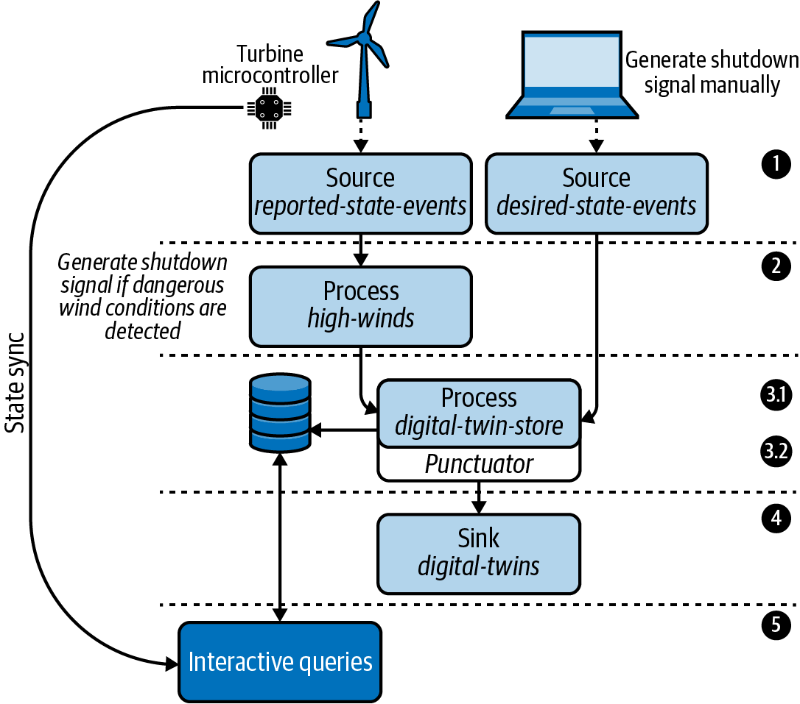

# Chapter 7. Processor API
We will explore a **lower-level API** that is available in Kafka Streams: the Processor API (sometimes called **PAPI**). The Processor API has fewer abstractions than the high-level DSL and uses an imperative style of programming. While the code is generally more verbose, it is also more powerful, giving us fine-grained control over the following: how data flows through our topologies, how stream processors relate to each other, how state is created and maintained, and even the timing of certain operations.

* Some of the questions we will answer in this chapter include:
* When should you use the Processor API?
* How do you add source, sink, and stream processors using the Processor API?
* How can you schedule periodic functions?
* Is it possible to mix the Processor API with the higher-level DSL?
* What is the difference between processors and transformers?

As usual, we will demonstrate the fundamentals of the API through a tutorial, answering the preceding questions along the way. However, before we show you how to use the Processor API, let’s first discuss when to use it.

## When to Use the Processor API
Deciding which abstraction level to use for your stream processing application is important. In general, whenever you introduce complexity into a project, you should have a good reason for doing so. While the Processor API isn’t unnecessarily complex, its low-level nature (compared to the DSL and ksqlDB) and fewer abstractions can lead to more code and, if you’re not careful, more mistakes.

In general, you may want to utilize the Processor API if you need to take advantage of any of the following:

* Access to record metadata (topic, partition, offset information, record headers, and so on)
* Ability to schedule periodic functions
* More fine-grained control over when records get forwarded to downstream processors
* More granular access to state stores
* Ability to circumvent any limitations you come across in the DSL (we’ll see an example of this later)

On the other hand, using the Processor API can come with some disadvantages, including:

* More verbose code, which can lead to higher maintenance costs and impair readability
* A higher barrier to entry for other project maintainers
* More footguns, including accidental reinvention of DSL features or abstractions, exotic problem-framing,[^1] and performance traps[^2]

Fortunately, Kafka Streams allows us to mix both the DSL and Processor API in an application, so you don’t need to go all in on either choice. You can use the DSL for simpler and more standard operations, and the Processor API for more complex or unique functions that require lower-level access to the processing context, state, or record metadata. We will discuss how to combine the DSL and Processor API at the end of this chapter, but initially, we will see how to implement an application using only the Processor API. So without further ado, let’s take a look at the application we’ll be building in this chapter.

### Introducing Our Tutorial: IoT Digital Twin Service
In this tutorial, we will use the Processor API to build a **digital twin** service for an offshore wind farm. Digital twins (sometimes called device shadows) are popular in both IoT (Internet of Things) and IIoT (industrial IoT) use cases,[^3] in which the state of a physical object is mirrored in a digital copy. This is a great use case for Kafka Streams, which can easily ingest and process high-volume sensor data, capture the state of a physical object using state stores, and subsequently expose this state using interactive queries.

To give you a quick example of what a digital twin is (this will make our tutorial a little clearer), consider the following. We have a wind farm with 40 wind turbines. Whenever one of the turbines reports its current state (wind speed, temperature, power status, etc.), we save that information in a key-value store. An example of a reported state record value is shown here:
```json
{
  "timestamp": "2020-11-23T09:02:00.000Z",
  "wind_speed_mph": 40,
  "temperature_fahrenheit": 60,
  "power": "ON"
}
```
Note that a device ID is communicated via the record key (e.g., the preceding value may correspond to a device with an ID of **abc123**). This will allow us to distinguish the reported/desired state events of one device from another.

Now, if we want to interact with a particular wind turbine,[^4] we don’t do so directly. IoT devices can and do frequently go offline, so we can achieve higher availability and reduce errors if we instead only interact with the digital copy (twin) of a physical device.

For example, if we want to set the power state from ON to OFF, instead of sending that signal to the turbine directly, we would set the so-called desired state on the digital copy. The physical turbine would subsequently synchronize its state (i.e., disable power to the blades) whenever it comes online, and usually at set intervals, thereafter. Therefore, a digital twin record will include both a reported and desired state, and we will create and expose digital twin records like the following using Kafka Streams’ Processor API:
```json
{
  "desired": {
    "timestamp": "2020-11-23T09:02:01.000Z",
    "power": "OFF"
  },
  "reported": {
    "timestamp": "2020-11-23T09:00:01.000Z",
    "windSpeedMph": 68,
    "power": "ON"
  }
}
```

With this in mind, our application needs to ingest a stream of sensor data from a set of wind turbines,[^5] perform some minor processing on the data, and maintain the latest state of each wind turbine in a persistent key-value state store. We will then expose the data via Kafka Streams’ interactive queries feature.

Though we will avoid much of the technical detail around interactive queries since this has already been covered in previous chapters, we will present some additional value statements of interactive queries that IoT use cases afford.

[Figure 7-1](#figure-7-1-the-topology-that-we-will-be-implementing-for-our-iot-digital-twin-service) shows the topology we will be building in this chapter. Each step is detailed after the diagram.

###### Figure 7-1. The topology that we will be implementing for our IoT digital twin service
  


1. Our Kafka cluster contains two topics, and therefore we need to learn how to add source processors using the Processor API. Here is a description of these topics:
  * Each wind turbine (edge node) is outfitted with a set of environmental sensors, and this data (e.g., wind speed), along with some metadata about the turbine itself (e.g., power state), is sent to the ``reported-state-events`` topic periodically.
  * The ``desired-state-events`` topic is written to whenever a user or process wants to change the power state of a turbine (i.e., turn it off or on).
2. Since the environmental sensor data is reported in the reported-state-events topic, we will add a stream processor that determines whether or not the reported wind speed for a given turbine exceeds safe operating levels,[^6] and if it does, we will automatically generate a shutdown signal. This will teach you how to add a stateless stream processor using the Processor API.
3. The third step is broken into two parts:
  * First, both types of events (reported and desired) will be combined into a so-called digital twin record. These records will be processed and then written to a persistent key-value store called digital-twin-store. In this step, you will learn how to connect to and interact with state stores using the Processor API, and also how to access certain record metadata that isn’t accessible via the DSL.
  * The second part of this step involves scheduling a periodic function, called a ``punctuator``, to clean out old digital twin records that haven’t seen an update in more than seven days. This will introduce you to the Processor API’s punctuation interface, and also demonstrate an alternative method for removing keys from state stores.7
4. Each digital twin record will be written to an output topic called digital-twins for analytical purposes. In this step, you will learn how to add sink processors using the Processor API.
5. We will expose the digital twin records via Kafka Streams’ interactive queries feature. Every few seconds, the microcontroller on the wind turbine will attempt to synchronize its own state with the desired state exposed by Kafka Streams. For example, if we generate a shutdown signal in step 2 (which would set the desired power state to OFF), then the turbine would see this desired state when it queries our Kafka Streams app, and kill power to the blades.

Now that we understand what we’ll be building (and what we’ll learn at each step), let’s set up our project.

# Digital Twin Application
This code corresponds with Chapter 7 in the upcoming O'Reilly book: [Mastering Kafka Streams and ksqlDB][book] by Mitch Seymour. This tutorial covers **the Processor API** (sometimes called _PAPI_). Here, we build a digital twin service for IoT applications (in this case, an offshore wind farm) in order to demonstrate how to:

- Add source, sink, and stream processors
- Add and connect state stores
- Schedule periodic functions called punctuators
- Use alternative methods for cleaning up state
- Combine the high-level DSL with the Processor API
- Use processors and transformers

The goal of this Kafka Streams application is to stream sensor data from wind turbines and generate a shutdown signal whenever high windspeeds are detected. This code could easily be repurposed for other types of automations, or to even build a full blown service comparable to [Amazon's device shadow service][amazon-service] (_device shadow_ is another name for _digital twin_).

[book]: https://www.kafka-streams-book.com/
[amazon-service]: https://docs.aws.amazon.com/iot/latest/developerguide/iot-device-shadows.html

# Running Locally
The only dependency for running these examples is [Docker Compose][docker].

[docker]: https://docs.docker.com/compose/install/

Once Docker Compose is installed, you can start the local Kafka cluster using the following command:

```sh
$ docker-compose up
```

Runs a [Confluent Control Center](https://docs.confluent.io/platform/current/control-center/index.html) that exposes a UI at `http://localhost:9021/` .

We can follow the startup by monitoring the output :
```shell
docker-compose logs -f
```

Now, to run the Kafka Streams application, simply run:

```
$ ./gradlew run --info
```
## Data Models
As usual, before we start creating our topology, we’ll first define our data models. The example records and class definition shown in [Table 7-1](#table-7-1-example-records-and-data-classes-for-each-source-topic) correspond to the data in our input topics (see step 1 in our processor topology: [Figure 7-1](#figure-7-1-the-topology-that-we-will-be-implementing-for-our-iot-digital-twin-service)).

Note that the data coming through both of the input topics is formatted as JSON for simplicity, and both types of records are represented using a common class: ``TurbineState``. We have omitted the accessor functions in the TurbineState class for brevity’s sake.

###### Table 7-1. Example records and data classes for each source topic
<table>
    <tr>
        <td>Kafka topic</td>
        <td>Example record</td>
        <td>Data class</td>
    </tr>
    <tr>
        <td>reported-state-events</td>
        <td><pre>{
  "timestamp": "...",
  "wind_speed_mph": 40,
  "power": "ON"
}</pre></td>
        <td><pre>public class TurbineState {
  private String timestamp;
  private Double windSpeedMph;
  public enum Power { ON, OFF }
  public enum Type { DESIRED, REPORTED }
  private Power power;
  private Type type;
}</pre></td>
    </tr>
    <tr>
        <td>desired-state-events</td>
        <td><pre>{
  "timestamp": "...",
  "power": "OFF"
}</pre></td>
        <td>Same as the data class for&nbsp;reported-state</td>
    </tr>
</table>

As mentioned in the tutorial overview, we need to combine the reported and desired state records to create a digital twin record. Therefore, we also need a data class for the combined record. The following table shows the JSON structure of the combined digital twin record, as well as the corresponding data class:
<table>
    <tr>
        <td>Example record</td>
        <td>Data class</td>
    </tr>
    <tr>
        <td><pre>{
  "desired": {
    "timestamp": "2020-11-23T09:02:01.000Z",
    "power": "OFF"
  },
  "reported": {
    "timestamp": "2020-11-23T09:00:01.000Z",
    "windSpeedMph": 68,
    "power": "ON"
  }
}</pre></td>
        <td><pre>public class DigitalTwin {
  private TurbineState desired;
  private TurbineState reported;
  // getters and setters omitted for
  // brevity
}</pre></td>
    </tr>
</table>
As you can see from the example record, the desired state shows the turbine powered off, but the last reported state shows that the power is on. The turbine will eventually synchronize its state with the digital twin and power the blades off.

Now, at this point, you may be wondering how record serialization and deserialization work in the Processor API compared to the high-level DSL. In other words, how do we actually convert the raw record bytes in our Kafka topics into the data classes shown in [Table 7-1](#table-7-1-example-records-and-data-classes-for-each-source-topic)? In “[Serialization/Deserialization](../chapter-03/README.md)”, we talked about using Serdes classes in the DSL, which are wrapper classes that contain both a serializer and deserializer. Many DSL operators, like **stream**, **table**, **join**, etc., allow you to specify a Serdes instance, so they are commonplace in applications that use the DSL.

In the Processor API, the various API methods only require the underlying serializer or deserializer that a Serdes instance would typically contain. However, it is still often convenient to define a Serdes for your data classes, since 1) you can always extract the underlying serializer/deserializer to satisfy a Processor API method signature, and 2) Serdes are often useful for testing purposes.

With that said, for this tutorial, we will leverage the [Serdes classes](./digital-twin/src/main/java/com/magicalpipelines/serialization/json/JsonSerdes.java#L10-L20) shown in [Example 7-1](#example-7-1-serdes-for-our-digital-twin-and-turbine-state-records).

###### Example 7-1. Serdes for our digital twin and turbine state records
```java
public class JsonSerdes {

  public static Serde<DigitalTwin> DigitalTwin() { (1)
    JsonSerializer<DigitalTwin> serializer = new JsonSerializer<>();
    JsonDeserializer<DigitalTwin> deserializer =
      new JsonDeserializer<>(DigitalTwin.class);

    return Serdes.serdeFrom(serializer, deserializer);
  }

  public static Serde<TurbineState> TurbineState() { (2)
    JsonSerializer<TurbineState> serializer = new JsonSerializer<>();
    JsonDeserializer<TurbineState> deserializer =
      new JsonDeserializer<>(TurbineState.class);

    return Serdes.serdeFrom(serializer, deserializer); (3)
  }
}
```
1. A method for retrieving a **DigitalTwin** Serdes.
2. A method for retrieving a **TurbineState** Serdes.
3. In previous tutorials, we implemented the Serde interface directly (see “[Building the Tweet Serdes](/chapter-03/README.md)” for an example). This shows an alternative approach, which is to use the **Serdes.serdeFrom** method in Kafka Streams to construct a Serdes from a serializer and deserializer instance.

In the next section, we’ll learn how to add source processors and deserialize input records using the Processor API.
## Adding Source Processors
Now that we have defined our data classes, we are ready to tackle step 1 of our processor topology (see [Figure 7-1](#figure-7-1-the-topology-that-we-will-be-implementing-for-our-iot-digital-twin-service)). This involves adding two source processors, which will allow us to stream data from our input topics into our Kafka Streams application. [Example 7-2](#example-7-2-the-initial-topology-with-both-of-our-source-processors-added) shows how we can accomplish this using the Processor API.

###### Example 7-2. The initial topology with both of our source processors added
```java
Topology builder = new Topology(); 1

builder.addSource(2
    "Desired State Events", 3
    Serdes.String().deserializer(), 4
    JsonSerdes.TurbineState().deserializer(), 5
    "desired-state-events"); 6

builder.addSource(7
    "Reported State Events",
    Serdes.String().deserializer(),
    JsonSerdes.TurbineState().deserializer(),
    "reported-state-events");
```
1. Instantiate a Topology instance directly. This is what we will use to add and connect source, sink, and stream processors. Note: instantiating a Topology directly is different than how we work with the DSL, which requires us to instantiate a StreamsBuilder object, add our DSL operators (e.g., map, flatMap, merge, branch, etc.) to the StreamsBuilder instance, and ultimately build a Topology instance using the StreamsBuilder#build method.
2. Use the addSource method to create a source processor. There are many overloaded versions of this method, including variations that support offset reset strategies, topic patterns, and more. So check out the Kafka Streams Javadocs or navigate to the Topology class using your IDE and choose the addSource variation that best fits your needs.
3. The name of the source processor. Each processor must have a unique name, since under the hood, Kafka Streams stores these names in a topologically sorted map (and therefore, each key must be unique). As we’ll see shortly, names are important in the Processor API since they are used to connect child processors. Again, this is very different from how the DSL makes connections, which doesn’t need an explicit name to define the relationship between processors (by default, the DSL generates an internal name for you). It’s advisable to use a descriptive name here to improve the readability of your code.
4. The key deserializer. Here, we use the built-in String deserializer since our keys are formatted as strings. This is another difference between the Processor API and the DSL. The latter requires us to pass in a Serdes (an object that contains both a record serializer and deserializer), while the Processor API only requires the underlying deserializer (which can be extracted directly from the Serdes, as we have done here).
5. The value deserializer. Here, we use a custom Serdes (found in the source code of this tutorial) to convert the record values into a TurbineState object. The additional notes about the key deserializer also apply here.
6. The name of the topic this source processor consumes from.
7. Add a second source processor for the reported-state-events topic. We won’t go through each parameter again since the parameter types match the previous source processor.

One thing to note about the preceding example is that you will see no mention of a stream or table. These abstractions do not exist in the Processor API. However, conceptually speaking, both source processors we have added in the preceding code represent a stream. This is because the processors are not stateful (i.e., they are not connected to a state store) and therefore have no way of remembering the latest state/representation of a given key.

We will see a table-like representation of our stream when we get to step 3 of our processor topology, but this section completes step 1 of our topology. Now, let’s see how to add a stream processor for generating shutdown signals when our wind turbine is reporting dangerous wind speeds.

## Adding Stateless Stream Processors
The next step in our processor topology requires us to automatically generate a shutdown signal whenever the wind speed recorded by a given turbine exceeds safe operating levels (65 mph). In order to do this, we need to learn how to add a stream processor using the Processor API. The API method we can use for this purpose is called addProcessor, and an example of how to use this method is shown here:
```java
builder.addProcessor(
    "High Winds Flatmap Processor", 1
    HighWindsFlatmapProcessor::new, 2
    "Reported State Events"); 3
```
1. The name of this stream processor.
2. The second argument expects us to provide a **ProcessSupplier**, which is a functional interface that returns a Processor instance. **Processor** instances contain all of the data processing/transformation logic for a given stream processor. In the next section, we will define a class called HighWindsFlatmapProcessor, which will implement the Processor interface. Therefore, we can simply use a method reference for that class’s constructor.
3. Names of the parent processors. In this case, we only have one parent processor, which is the Reported State Events processor that we created in [Example 7-2](#example-7-2-the-initial-topology-with-both-of-our-source-processors-added). Stream processors can be connected to one or more parent nodes.

Whenever you add a stream processor, you need to implement the Processor interface. This isn’t a functional interface (unlike ProcessSupplier, which we just discussed), so you can’t just pass in a lambda expression to the addProcessor method, like we often do with DSL operators. It’s a little more involved and requires more code than we may be accustomed to, but we’ll walk through how to do this in the next section.

## Creating Stateless Processors
Whenever we use the addProcessor method in the Processor API, we need to implement the Processor interface, which will contain the logic for processing and transforming records in a stream. The interface has three methods, as shown here:
```java
public interface Processor<K, V> { (1)

    void init(ProcessorContext context); (2)

    void process(K key, V value); (3)

    void close(); (4)
}
```
1. Notice that the Processor interface specifies two generics: one for the key type (K) and one for the value type (V). We will see how to leverage these generics when we implement our own processor later in this section.
2. The init method is called when the Processor is first instantiated. If your processor needs to perform any initialization tasks, you can specify the initialization logic in this method. The ProcessorContext that is passed to the init method is extremely useful, and contains many methods that we will explore in this chapter.
3. The process method is called whenever this processor receives a new record. It contains the per-record data transformation/processing logic. In our example, this is where we will add the logic for detecting whether or not wind speeds exceed safe operating levels for our turbine.
4. The close method is invoked by Kafka Streams whenever it is finished with this operator (e.g., during shutdown). This method typically encapsulates any clean up logic you need for your processor and its local resources. However, you should not attempt to cleanup any Kafka Streams–managed resources, like state stores, in this method, since that is handled by the library itself.

With this interface in mind, let’s implement a Processor that will generate a shutdown signal when wind speeds reach dangerous levels. The code in [Example 7-3](#example-7-3-a-processor-implementation-that-detects-dangerous-wind-speeds) shows what our high winds processor looks like.

###### Example 7-3. A Processor implementation that detects dangerous wind speeds
```java
public class HighWindsFlatmapProcessor
    implements Processor<String, TurbineState, String, TurbineState> { (1)
  private ProcessorContext<String, TurbineState> context;

  @Override
  public void init(ProcessorContext<String, TurbineState> context) { (2)
    this.context = context; (3)
  }

  @Override
  public void process(Record<String, TurbineState> record) {
    TurbineState reported = record.value();
    context.forward(record); (4)

    if (reported.getWindSpeedMph() > 65 && reported.getPower() == Power.ON) { (5)
      TurbineState desired = TurbineState.clone(reported); (6)
      desired.setPower(Power.OFF);
      desired.setType(Type.DESIRED);

      Record<String, TurbineState> newRecord = (7)
        new Record<>(record.key(), desired, record.timestamp());
      context.forward(newRecord); (8)
    }
  }

  @Override
  public void close() {
    // nothing to do (9)
  }
}
```
1. Recall that the Processor interface is parameterized with four generics. The first two generics (in this case, Processor<String, TurbineState, ..., ...>) refer to the input key and value types. The last two generics (in this case, Processor<..., ..., String, TurbineState>) refer to the output key and value types.
2. The generics in the ProcessorContext interface refer to the output key and value types (in this case, ProcessorContext<String, TurbineState>).
3. It is typical to save the processor context as an instance property, as we do here, so that we can access it later (e.g., from the process and/or close methods).
4. Whenever you want to send a record to downstream processors, you can call the forward method on the ProcessorContext instance (we have saved this in the context property). This method accepts the record that you would like to forward. In our processor implementation, we always want to forward the reported state records, which is why we call context.forward using an unmodified record in this line.
5. Check to see if our turbine meets the conditions for sending a shutdown signal. In this case, we check that wind speeds exceed a safe threshold (65 mph), and that our turbine is currently powered on.
6. If the previous conditions are met, generate a new record containing a desired power state of OFF. Since we have already sent the original reported state record downstream, and we are now generating a desired state record, this is effectively a type of flatMap operation (our processor has created two output records from one input record).
7. Create an output record that includes the desired state that we saved to the state store. The record key and timestamp are inherited from the input record.
8. Call the context.forward method in order to send the new record (the shutdown signal) to downstream processors.
9. In this processor, there’s no special logic that we need to execute when our processor is closed.

As you can see, implementing a Processor is pretty straightforward. One interesting thing to call out is that when you build processors like this, you usually don’t need to concern yourself with where the output records will be forwarded to from the Processor implementation itself (you can define the dataflow by setting the parent name of a downstream processor). The exception to this is if you use a variation of ProcessorContext#forward that accepts a list of downstream processor names, which tells Kafka Streams which child processors to forward the output to. An example of this is shown here:
```java
context.forward(newRecord, "some-child-node");
```
Whether or not you use this variation of the forward method depends on if you want to broadcast the output to all of the downstream processors or to a specific downstream processor. For example, the DSL’s branch method uses the above variation since it only needs to broadcast its output to a subset of the available downstream processors.

This completes step 2 of our processor topology (see [Figure 7-1](#figure-7-1-the-topology-that-we-will-be-implementing-for-our-iot-digital-twin-service)). Next, we need to implement a stateful stream processor that creates and saves digital twin records in a key-value store.

## Creating Stateful Processors
In “[State Stores](../chapter-04/README.md#state-stores)”, we learned that stateful operations in Kafka Streams require so-called state stores for maintaining some memory of previously seen data. In order to create our digital twin records, we need to combine desired state and recorded state events into a single record. Since these records will arrive at different times for a given wind turbine, we have a stateful requirement of remembering the last recorded and desired state record for each turbine.

So far in this book, we have mostly focused on using state stores in the DSL. Furthermore, the DSL gives us a couple of different options for using state stores. We can use a default internal state store by simply using a stateful operator without specifying a state store, like so:

```java
grouped.aggregate(initializer, adder);
```

Or we can use the Stores factory class to create a **store supplier**, and materialize the state store using the **Materialized** class in conjunction with a stateful operator, as shown in the following code:
```java
KeyValueBytesStoreSupplier storeSupplier =
    Stores.persistentTimestampedKeyValueStore("my-store");

grouped.aggregate(
    initializer,
    adder,
    Materialized.<String, String>as(storeSupplier));
```
Using state stores in the Processor API is a little different. Unlike the DSL, the Processor API won’t create an internal state store for you. Therefore, you must always create and connect state stores to the appropriate stream processors yourself when you need to perform stateful operations. Furthermore, while we can still use the Stores factory class, we will use a different set of methods that are available in this class for creating state stores. Instead of using one of the methods that returns a **store supplier**, we will use the methods for creating **store builders**.

For example, to store the digital twin records, we need a simple key-value store. The factory method for retrieving a key-value store builder is called **keyValueStoreBuilder**, and the following code demonstrates how we can use this method for creating our digital twin store:
```java
StoreBuilder<KeyValueStore<String, DigitalTwin>> storeBuilder =
    Stores.keyValueStoreBuilder(
        Stores.persistentKeyValueStore("digital-twin-store"),
        Serdes.String(), 1
        JsonSerdes.DigitalTwin()); 2
```

1. We’ll use the built-in String Serdes for serializing/deserializing keys.
2. Use the Serdes we defined in [Example 7-1](#example-7-1-serdes-for-our-digital-twin-and-turbine-state-records) for serializing/deserializing values.

Once you’ve created a store builder for your stateful processor, it’s time to implement the Processor interface. This process is very similar to what we saw when we added a stateless processor in “[Creating Stateless Processors](#creating-stateless-processors)”. We simply need to use the addProcessor method in the Processor API, as shown in the following code:
```java
builder.addProcessor(
  "Digital Twin Processor", 1
  DigitalTwinProcessor::new, 2
  "High Winds Flatmap Processor", "Desired State Events"); 3
```
1. The name of this stream processor.
2. A ProcessSupplier, which is a method that can be used to retrieve a Processor instance. We will implement the DigitalTwinProcessor referenced in this line shortly.
3. Names of the parent processors. By specifying multiple parents, we are effectively performing what would be a merge operation in the DSL.

Before we implement the DigitalTwinProcessor, let’s go ahead and add our new state store to the topology. We can do this using the Topology#addStateStore method, and a demonstration of its usage is shown in [Example 7-4](#example-7-4-example-usage-of-the-addstatestore-method).

###### Example 7-4. Example usage of the addStateStore method
```java
builder.addStateStore(
  storeBuilder, 1
  "Digital Twin Processor" 2
);
```
1. A store builder that can be used to obtain the state store.
2. We can optionally pass in the name of the processors that should have access to this store. In this case, the DigitalTwinProcessor that we created in the previous code block should have access. We could also have passed in more processor names here if we had multiple processors with shared state. Finally, if we omit this optional argument, we could instead use the Topology#connectProcessorAndState to connect a state store to a processor after the store was added to the topology (instead of at the same time, which is what we’re doing here).

The last step is to implement our new stateful processor: DigitalTwinProcessor. Like stateless stream processors, we will need to implement the Processor interface. However, this time, our implementation will be slightly more involved since this processor needs to interact with a state store. The code in [Example 7-5](#example-7-5-a-stateful-processor-for-creating-digital-twin-records), and the annotations that follow it, will describe how to implement a stateful processor.

###### Example 7-5. A stateful processor for creating digital twin records
```java
public class DigitalTwinProcessor
    implements Processor<String, TurbineState, String, DigitalTwin> { 1
  private ProcessorContext<String, DigitalTwin> context;
  private KeyValueStore<String, DigitalTwin> kvStore;

  @Override
  public void init(ProcessorContext<String, DigitalTwin> context) { 2
    this.context = context; 3
    this.kvStore = (KeyValueStore) context.getStateStore("digital-twin-store"); 4
  }

  @Override
  public void process(Record<String, TurbineState> record) {
    String key = record.key(); 5
    TurbineState value = record.value();
    DigitalTwin digitalTwin = kvStore.get(key); 6
    if (digitalTwin == null) { 7
      digitalTwin = new DigitalTwin();
    }

    if (value.getType() == Type.DESIRED) { 8
      digitalTwin.setDesired(value);
    } else if (value.getType() == Type.REPORTED) {
      digitalTwin.setReported(value);
    }

    kvStore.put(key, digitalTwin); 9

    Record<String, DigitalTwin> newRecord =
      new Record<>(record.key(), digitalTwin, record.timestamp()); 10
    context.forward(newRecord); 11
  }

  @Override
  public void close() {
    // nothing to do
  }
}
```
1. The first two generics in the Processor interface (in this case, Processor<String, TurbineState, ..., ...>) refer to the input key and value types, and the last two generics (Processor<..., ..., String, DigitalTwin>) refer to the output key and value types.
2. The generics in the ProcessorContext interface (ProcessorContext<String, DigitalTwin>) refer to the output key and value types
3. We’ll save the ProcessorContext (referenced by the context property) so that we can access it later on.
4. The getStateStore method on the ProcessorContext allows us to retrieve the state store we previously attached to our stream processor. We will interact with this state store directly whenever a record is processed, so we will save it to an instance property named kvStore.
5. This line and the one that follows it show how to extract the key and value of the input record
6. Use our key-value store to perform a point lookup for the current record’s key. If we have seen this key before, then this will return the previously saved digital twin record.
7. If the point lookup didn’t return any results, then we will create a new digital twin record.
8. In this code block, we set the appropriate value in the digital twin record depending on the current record’s type (reported state or desired state).
9. Store the digital twin record in the state store directly, using the key-value store’s put method.
10. Create an output record that includes the digital twin instance that we saved to the state store. The record key and timestamp are inherited from the input record.
11. Forward the output record to downstream processors.

We’ve now implemented the first part of step 3 in our processor topology. The next step (step 3.2 in [Figure 7-1](#figure-7-1-the-topology-that-we-will-be-implementing-for-our-iot-digital-twin-service)) will introduce you to a very important feature in the Processor API that has no DSL equivalent. Let’s take a look at how to schedule periodic functions in the DSL.

## Periodic Functions with Punctuate
Depending on your use case, you may need to perform some periodic task in your Kafka Streams application. This is one area where the Processor API really shines, since it allows you to easily schedule a task using the ``ProcessorContext#schedule`` method. Recall that in “[Tombstones](../chapter-06/README.md#tombstones)”, we discussed how to keep our state store size to a minimum by removing unneeded records. In this tutorial, we will present another method for cleaning out state stores that leverages this task scheduling capability. Here, we will remove all digital twin records that haven’t seen any state updates in the last seven days. We will assume these turbines are no longer active or are under long-term maintenance, and therefore we’ll delete these records from our key-value store.

In [Chapter 5](../chapter-05/README.md), we showed that when it comes to stream processing, time is a complex subject. When we think about when a periodic function will execute in Kafka Streams, we are reminded of this complexity. There are two **punctuation types** (i.e., timing strategies) that you can select from, as shown in [Table 7-2]().

###### Table 7-2. The types of punctuations that are available in Kafka Streams
| Punctuation type | Enum                            | Description                                                                                                                                                                                                                                                                                                                                                                                                                                                         |
|------------------|---------------------------------|---------------------------------------------------------------------------------------------------------------------------------------------------------------------------------------------------------------------------------------------------------------------------------------------------------------------------------------------------------------------------------------------------------------------------------------------------------------------|
| Stream time      | PunctuationType.STREAM_TIME     | Stream time is the highest timestamp observed for a particular topic-partition. It is initially unknown and can only increase or stay the same. It advances only when new data is seen, so if you use this punctuation type, then your function will not execute unless data arrives on a continuous basis.                                                                                                                                                         |
| Wall clock time  | PunctuationType.WALL_CLOCK_TIME | The local system time, which is advanced during each iteration of the consumer poll method. The upper bound for how often this gets updated is defined by the S⁠t⁠r⁠e⁠a⁠m⁠s​C⁠o⁠n⁠f⁠i⁠g⁠#⁠P⁠O⁠L⁠L⁠_⁠M⁠S⁠_⁠C⁠O⁠N⁠F⁠I⁠G configuration, which is the maximum amount of time (in milliseconds) the underlying poll method will block as it waits for new data. This means periodic functions will continue to execute regardless of whether or not new messages arrive. |

Since we don’t want our periodic function to be tied to new data arriving (in fact, the very presence of this TTL (“time to live”) function is based on the assumption that data may stop arriving), then we will use wall clock time as our punctuation type. Now that we’ve decided which abstraction to use, the rest of the work is simply a matter of scheduling and implementing our TTL function.

The following code shows our implementation:

```java
public class DigitalTwinProcessor
    implements Processor<String, TurbineState, String, DigitalTwin> {

  private Cancellable punctuator; (1

  // other omitted for brevity

  @Override
  public void init(ProcessorContext<String, DigitalTwin> context) {

    punctuator = this.context.schedule(
        Duration.ofMinutes(5),
        PunctuationType.WALL_CLOCK_TIME, this::enforceTtl); (2

    // ...
  }

  @Override
  public void close() {
    punctuator.cancel(); (3
  }

  public void enforceTtl(Long timestamp) {
    try (KeyValueIterator<String, DigitalTwin> iter = kvStore.all()) { (4

      while (iter.hasNext()) {
        KeyValue<String, DigitalTwin> entry = iter.next();
        TurbineState lastReportedState = entry.value.getReported(); (5
        if (lastReportedState == null) {
          continue;
        }

        Instant lastUpdated = Instant.parse(lastReportedState.getTimestamp());
        long daysSinceLastUpdate =
          Duration.between(lastUpdated, Instant.now()).toDays(); (6
        if (daysSinceLastUpdate >= 7) {
          kvStore.delete(entry.key); (7
        }
      }
    }
  }

  // ...
}
```
1. When we schedule the punctuator function, it will return a Cancellable object that we can use to stop the scheduled function later on. We’ll use an object variable named punctuator to keep track of this object.
2. Schedule our periodic function to execute every five minutes based on wall clock time, and save the returned Cancellable under the punctuator property (see the preceding callout).
3. Cancel the punctuator when our processor is closed (e.g., during a clean shutdown of our Kafka Streams application).
4. During each invocation of our function, retrieve each value in our state store. Note that we use a try-with-resources statement to ensure the iterator is closed properly, which will prevent resource leaks.
5. Extract the last reported state of the current record (which corresponds to a physical wind turbine).
6. Determine how long it’s been (in days) since this turbine last reported its state.
7. Delete the record from the state store if it’s stale (hasn’t been updated in at least seven days).

> ## NOTE
> The process function and any punctuations we schedule will be executed in the same thread (i.e., there’s no background thread for punctuations) so you don’t need to worry about concurrency issues.

As you can see, scheduling periodic functions is extremely easy. Next, let’s look at another area where the Processor API shines: accessing record metadata.

## Accessing Record Metadata
When we use the DSL, we typically only have access to a record’s key and value. However, there’s a lot of additional information associated with a given record that is not exposed by the DSL, but that we can access using the Processor API. Some of the more prominent examples of record metadata that you might want to access are shown in [Table 7-3](#table-7-3-methods-for-accessing-additional-record-metadata). Note that the context variable in the following table refers to an instance of ProcessorContext, which is made available in the init method, as we first showed in Example 7-3.

###### Table 7-3. Methods for accessing additional record metadata
| Metadata       | Example             |
|----------------|---------------------|
| Record headers | context.headers()   |
| Offset         | context.offset()    |
| Partition      | context.partition() |
| Timestamp      | context.timestamp() |
| Topic          | context.topic()     |

> ## TIP
> The methods shown in [Table 7-3](#table-7-3-methods-for-accessing-additional-record-metadata) pull metadata about the current record, and can be used within the ``process()`` function. However, there isn’t a current record when the ``init()`` or ``close()`` functions are invoked or when a punctuation is executing, so there’s no metadata to extract.

So what could you do with this metadata? One use case is to decorate the record values with additional context before they are written to some downstream system. You can also decorate application logs with this information to help with debugging purposes. For example, if you encounter a malformed record, you could log an error containing the partition and offset of the record in question, and use that as a basis for further troubleshooting.

Record headers are also interesting, because they can be used to inject additional metadata (for example, tracing context that can be used for [distributed tracing](https://cwiki.apache.org/confluence/display/KAFKA/KIP-244:+Add+Record+Header+support+to+Kafka+Streams+Processor+API)). Some examples of how to interact with record headers are shown here:

```java
Headers headers = context.headers();
headers.add("hello", "world".getBytes(StandardCharsets.UTF_8)); 1
headers.remove("goodbye"); 2
headers.toArray(); 3
```
1. Add a header named hello. This header will be propagated to downstream processors.
2. Remove a header named goodbye.
3. Get an array of all of the available headers. You could iterate over this and do something with each.

Finally, if you’d like to trace the origin of a record, the topic() method could be useful for this purpose. In this tutorial, we don’t need to do this, or really access any metadata at all, but you should now have a good understanding of how to access additional metadata in case you encounter a use case that requires it in the future.

We’re ready to move to the next step of our processor topology and learn how to add a sink processor using the Processor API.

## Adding Sink Processors
Tackling step 4 of our processor topology (see [Figure 7-1](#figure-7-1-the-topology-that-we-will-be-implementing-for-our-iot-digital-twin-service)). involves adding a sink processor that will write all digital twin records to an output topic called digital-twins. This is very simple with the Processor API, so this section will be short. We simply need to use the addSink method and specify a few additional parameters, which are detailed in the following code:
```java
builder.addSink(
  "Digital Twin Sink", 1
  "digital-twins", 2
  Serdes.String().serializer(), 3
  JsonSerdes.DigitalTwin().serializer(), 4
  "Digital Twin Processor"); 5
```
1. The name of this sink node.
2. The name of the output topic.
3. The key serializer.
4. The value serializer.
5. The name of one or more parent nodes to connect to this sink.

That’s all there is to adding a sink processor. Of course, as with most methods in Kafka Streams, there are some additional variations of this method you may want to utilize. For example, one variation allows you to specify a custom StreamPartitioner to map the output record to a partition number. Another variation allows you to exclude the key and value serializers and, instead, use the default serializers that are derived from the DEFAULT_KEY_SERDE_CLASS_CONFIG property. But no matter which overloaded method you use, adding a sink processor is a pretty simple operation.

Let’s move on to the final step of exposing digital twin records to external services (including the wind turbines themselves, which will synchronize their state to the digital twin records in our state store).

## Interactive Queries
We’ve completed steps 1–4 of our topology (see [Figure 7-1](#figure-7-1-the-topology-that-we-will-be-implementing-for-our-iot-digital-twin-service)). The fifth step simply involves exposing the digital twin records using Kafka Streams’ interactive queries feature. We already covered this topic in detail in “[Interactive Queries](../chapter-04/README.md)”, so we won’t go into too much detail or show the entire implementation. However, [Example 7-6](#example-7-6-an-example-rest-service-to-expose-digital-twin-records) shows a very simple REST service that uses interactive queries to pull the latest digital twin record. Note that in this example, remote queries aren’t shown, but you can view this example’s source code for a more complete example.

The important thing to note is that from an interactive query perspective, using the Processor API is exactly the same as using the DSL.

###### Example 7-6. An example REST service to expose digital twin records
```java
class RestService {
  private final HostInfo hostInfo;
  private final KafkaStreams streams;

  RestService(HostInfo hostInfo, KafkaStreams streams) {
    this.hostInfo = hostInfo;
    this.streams = streams;
  }

  ReadOnlyKeyValueStore<String, DigitalTwin> getStore() {
    return streams.store(
        StoreQueryParameters.fromNameAndType(
            "digital-twin-store", QueryableStoreTypes.keyValueStore()));
  }

  void start() {
    Javalin app = Javalin.create().start(hostInfo.port());
    app.get("/devices/:id", this::getDevice);
  }

  void getDevice(Context ctx) {
    String deviceId = ctx.pathParam("id");
    DigitalTwin latestState = getStore().get(deviceId);
    ctx.json(latestState);
  }
}
```

This completes step 5 of our processor topology (see [Figure 7-1](#figure-7-1-the-topology-that-we-will-be-implementing-for-our-iot-digital-twin-service)). Let’s put the various pieces that we’ve constructed together.

## Putting It All Together
The following code block shows what our full processor topology looks like at this point:
```java
Topology builder = new Topology();

builder.addSource( 1
    "Desired State Events",
    Serdes.String().deserializer(),
    JsonSerdes.TurbineState().deserializer(),
    "desired-state-events");

builder.addSource( 2
    "Reported State Events",
    Serdes.String().deserializer(),
    JsonSerdes.TurbineState().deserializer(),
    "reported-state-events");

builder.addProcessor( 3
    "High Winds Flatmap Processor",
    HighWindsFlatmapProcessor::new,
    "Reported State Events");

builder.addProcessor( 4
    "Digital Twin Processor",
    DigitalTwinProcessor::new,
    "High Winds Flatmap Processor",
    "Desired State Events");

StoreBuilder<KeyValueStore<String, DigitalTwin>> storeBuilder =
    Stores.keyValueStoreBuilder( 5
        Stores.persistentKeyValueStore("digital-twin-store"),
        Serdes.String(),
        JsonSerdes.DigitalTwin());

builder.addStateStore(storeBuilder, "Digital Twin Processor"); 6

builder.addSink( 7
    "Digital Twin Sink",
    "digital-twins",
    Serdes.String().serializer(),
    JsonSerdes.DigitalTwin().serializer(),
    "Digital Twin Processor");
```
1. Create a ``source processor`` named Desired State Events that consumes data from the ``desired-state-events`` topic. This is the equivalent of a ``stream`` in the DSL.
2. Create a ``source processor`` named Reported State Events that consumes data from the ``reported-state-events`` topic. This is also the equivalent of a ``stream`` in the DSL.
3. Add a ``stream processor`` named High ``Winds Flatmap Processor`` that generates a shutdown signal if high winds are detected. This processor receives events from the **Reported State Events** processor. This would be a flatMap operation in the DSL since there is a 1:N relationship between the number of input and output records for this stream processor. [Example 7-3](#example-7-3-a-processor-implementation-that-detects-dangerous-wind-speeds) shows the implementation of this processor.
4. Add a ``stream processor`` named Digital Twin Processor that creates digital twin records using data emitted from both the High Winds Flatmap Processor and Desired State Events. This would be a merge operation in the DSL since multiple sources are involved. Furthermore, since this is a stateful processor, this would be the equivalent of an aggregated table in the DSL. [Example 7-5](#example-7-5-a-stateful-processor-for-creating-digital-twin-records) shows the implementation of this processor.
5. Use the ``Stores factory`` class to create a store builder, which can be used by Kafka Streams to build persistent key-value stores that are accessible from the Digital Twin Processor node.
6. Add the state store to the topology and connect it to the ``Digital Twin Processor`` node.
7. Create a ``sink processor`` named ``Digital Twin Sink`` that writes all digital twin records that get emitted from the Digital Twin Processor node to an output topic named digital-twins.

We can now run our application, write some test data to our Kafka cluster, and query our digital twin service. Running our application is no different than what we’ve seen in previous chapters, as you can see from the following code block:
```java
Properties props = new Properties();
props.put(StreamsConfig.APPLICATION_ID_CONFIG, "dev-consumer"); 1
// ...

KafkaStreams streams = new KafkaStreams(builder, props); 2
streams.start(); 3

Runtime.getRuntime().addShutdownHook(new Thread(streams::close)); 4

RestService service = new RestService(hostInfo, streams); 5
service.start();
```
1. Configure the Kafka Streams application. This works the same way as we saw when building applications with the DSL. Most of the configs are omitted for brevity’s sake.
2. Instantiate a new KafkaStreams instance that can be used to execute our topology.
3. Start the Kafka Streams application.
4. Add a shutdown hook to gracefully stop the Kafka Streams application when a global shutdown signal is received.
5. Instantiate and (on the following line) start the REST service, which we implemented in [Example 7-6](#example-7-6-an-example-rest-service-to-expose-digital-twin-records).

Our application now reads from multiple source topics, but we will only produce test data to the ``reported-state-events`` topic in this book (see the source code for a more complete example). To test that our application generates a shutdown signal, we will include one record that contains a wind speed that exceeds our safe operating threshold of 65 mph. The following code shows the test data we will produce, with record keys and values separated by | and timestamps omitted for brevity:

```shell
1|{"timestamp": "...", "wind_speed_mph": 40, "power": "ON", "type": "REPORTED"}
1|{"timestamp": "...", "wind_speed_mph": 42, "power": "ON", "type": "REPORTED"}
1|{"timestamp": "...", "wind_speed_mph": 44, "power": "ON", "type": "REPORTED"}
1|{"timestamp": "...", "wind_speed_mph": 68, "power": "ON", "type": "REPORTED"} 1
```
1. This sensor data shows a wind speed of 68 mph. When our application sees this record, it should generate a shutdown signal by creating a new TurbineState record, with a desired power state of OFF.

If we produce this test data into the reported-state-events topic and then query our digital twin service, we will see that our Kafka Streams application not only processed the reported states of our windmill, but also produced a desired state record where the power is set to OFF. The following code block shows an example request and response to our REST service:
```shell
$ curl localhost:7000/devices/1 | jq '.'

{
  "desired": {
    "timestamp": "2020-11-23T09:02:01.000Z",
    "windSpeedMph": 68,
    "power": "OFF",
    "type": "DESIRED"
  },
  "reported": {
    "timestamp": "2020-11-23T09:02:01.000Z",
    "windSpeedMph": 68,
    "power": "ON",
    "type": "REPORTED"
  }
```
Now, our wind turbines can query our REST service and synchronize their own state with the desired state that was either captured (via the desired-state-events topic) or enforced (using the high winds processor to send a shutdown signal) by Kafka Streams.
## Combining the Processor API with the DSL
We’ve verified that our application works. However, if you look closely at our code, you’ll see that only one of the topology steps requires the low-level access that the Processor API offers. The step I’m referring to is the Digital Twin Processor step (see step 3 in [Figure 7-1](#figure-7-1-the-topology-that-we-will-be-implementing-for-our-iot-digital-twin-service)), which leverages an important feature of the Processor API: the ability to schedule periodic functions.

Since Kafka Streams allows us to combine the Processor API and the DSL, we can easily refactor our application to only use the Processor API for the Digital Twin Processor step, and to use the DSL for everything else. The biggest benefit of performing this kind of refactoring is that other stream processing steps can be simplified. In this tutorial, the High Winds Flatmap Processor offers the biggest opportunity of simplification, but in larger applications, this kind of refactoring reduces complexity on an even greater scale.

The first two steps in our processor topology (registering the source processors and generating a shutdown signal using a flatMap-like operation) can be refactored using operators we’ve already discussed in this book. Specifically, we can make the following changes:
<table>
    <tr>
        <td>Processor API</td>
        <td>DSL</td>
    </tr>
    <tr>
        <td><pre>Topology builder = new Topology();
builder.addSource(
  "Desired State Events",
  Serdes.String().deserializer(),
  JsonSerdes.TurbineState().deserializer(),
  "desired-state-events");
builder.addSource(
  "Reported State Events",
  Serdes.String().deserializer(),
  JsonSerdes.TurbineState().deserializer(),
  "reported-state-events");
builder.addProcessor(
  "High Winds Flatmap Processor",
  HighWindsFlatmapProcessor::new,
  "Reported State Events");
  </pre></td>
        <td><pre>StreamsBuilder builder = new StreamsBuilder();
KStream String, TurbineState ; desiredStateEvents =
  builder.stream("desired-state-events",
    Consumed.with(
      Serdes.String(),
      JsonSerdes.TurbineState()));
KStream <String, TurbineState>  highWinds =
  builder.stream("reported-state-events",
    Consumed.with(
      Serdes.String(),
      JsonSerdes.TurbineState()))
  .flatMapValues((key, reported) -> ... )
  .merge(desiredStateEvents);</pre></td>
    </tr>
</table>
As you can see, these changes are pretty straightforward. However, step 3 in our topology actually does require the Processor API, so how do we go about combining the DSL and Processor API in this step? The answer lies in a special set of DSL operators, which we will explore next.

## Processors and Transformers
The DSL includes a special set of operators that allow us to use the Processor API whenever we need lower-level access to state stores, record metadata, and processor context (which can be used for scheduling periodic functions, among other things). These special operators are broken into two categories: processors and transformers. The following outlines the distinction between these two groups:

* A processor is a terminal operation (meaning it returns void and downstream operators cannot be chained), and the computational logic must be implemented using the Processor interface (which we first discussed in “Adding Stateless Stream Processors”). Processors should be used whenever you need to leverage the Processor API from the DSL, but don’t need to chain any downstream operators. There is currently only one variation of this type of operator, as shown in the following table:

    | DSL operator | Interface to implement | Description                                |
    |--------------|------------------------|--------------------------------------------|
    | process      | Processor              | Apply a Processor to each record at a time |
* Transformers are a more diverse set of operators and can return one or more records (depending on which variation you use), and are therefore more optimal if you need to chain a downstream operator. The variations of the transform operator are shown in Table 7-4.

###### Table 7-4. Various transform operators that are available in Kafka Streams
<table>
    <tr>
        <td>DSL operator</td>
        <td>Interface to implement</td>
        <td>Description</td>
        <td>Input/output ratio</td>
    </tr>
    <tr>
        <td>transform</td>
        <td>Transformer</td>
        <td>Apply a&nbsp;Transformer&nbsp;to each record, generating one or more output records. Single records can be returned from the&nbsp;Transformer#transformmethod, and multiple values can be emitted using&nbsp;ProcessorContext#forward.[^a]&nbsp;The transformer has access to the record key, value, metadata, processor context (which can be used for scheduling periodic functions), and connected state stores.</td>
        <td>1:N</td>
    </tr>
    <tr>
        <td>transformValues</td>
        <td>ValueTransformer</td>
        <td>Similar to&nbsp;transform, but&nbsp;does not&nbsp;have access to the record key and&nbsp;cannotforward multiple records using&nbsp;ProcessorContext#forward&nbsp;(if you try to forward multiple records, you will get a&nbsp;StreamsException).&nbsp;Since state store operations are key-based, this operator is not ideal if you need to perform lookups against a state store. Furthermore, output records will have the same key as the input records, and downstream auto-repartitioning will not be triggered since the key cannot be modified (which is advantageous since it can help avoid network trips).</td>
        <td>1:1</td>
    </tr>
    <tr>
        <td>transformValues</td>
        <td>ValueTransformerWithKey</td>
        <td>Similar to&nbsp;transform, but the record key is&nbsp;read-only&nbsp;and&nbsp;should not be modified.&nbsp;Also, you&nbsp;cannot forward multiple records using&nbsp;ProcessorContext#forward&nbsp;(if you try to forward multiple records, you will get a&nbsp;StreamsException).</td>
        <td>1:1</td>
    </tr>
    <tr>
        <td>flatTransform</td>
        <td>Transformer(with an iterable return value)</td>
        <td>Similar to&nbsp;transform, but instead of relying on&nbsp;ProcessorContext#forward&nbsp;to return multiple records, you can simply return a collection of values.&nbsp;For this reason, it’s recommended to use&nbsp;flatTransform&nbsp;over&nbsp;transform&nbsp;if you need to emit multiple records, since this method is type-safe while the latter is not (since it relies on&nbsp;ProcessorContext#forward).</td>
        <td>1:N</td>
    </tr>
    <tr>
        <td>flatTransformValues</td>
        <td>ValueTransformer&nbsp;(with an iterable return value)</td>
        <td>Apply a&nbsp;Transformer&nbsp;to each record, returning&nbsp;one or more output records directly from the&nbsp;ValueTransformer#transform&nbsp;method.</td>
        <td>1:N</td>
    </tr>
    <tr>
        <td>flatTransformValues</td>
        <td>ValueTransformerWithKey(with an iterable return value)</td>
        <td>A stateful variation of&nbsp;flatTransformValues&nbsp;in which a read-only key is passed to the&nbsp;transform&nbsp;method, which can be used for state lookups. One or more output records are returned directly from the&nbsp;ValueTransformerWithKey#transformmethod.</td>
        <td>1:N</td>
    </tr>
</table>
[^a]: Though 1:N transformations are technically supported, transform is better for 1:1 or 1:0 transformations in which a single record is returned directly, since the ProcessorContext#forward approach is not type-safe. Therefore, if you need to forward multiple records from your transform, flatTransform is recommended instead, since it is type-safe.


No matter which variation you choose, if your operator is stateful, you will need to connect the state store to your topology builder before adding your new operator. Since we are refactoring our stateful Digital Twin Processor step, let’s go ahead and do that:
```java
StoreBuilder<KeyValueStore<String, DigitalTwin>> storeBuilder =
  Stores.keyValueStoreBuilder(
      Stores.persistentKeyValueStore("digital-twin-store"),
      Serdes.String(),
      JsonSerdes.DigitalTwin());

builder.addStateStore(storeBuilder); 1
```
1. In [Example 7-4](#example-7-4-example-usage-of-the-addstatestore-method), we discussed an optional second parameter to the Topology#addStateStore method, which specifies the processor names that should be connected with the state store. Here, we omit the second parameter, so this state store is dangling (though we will connect it in the next code block).

Now, we need to make a decision. Do we use a processor or transformer for refactoring the Digital Twin Processor step? Looking at the definitions in the preceding tables, you may be tempted to use the process operator since we already implemented the Processor interface in the pure Processor API version of our app (see [Example 7-5](#example-7-5-a-stateful-processor-for-creating-digital-twin-records)). If we were to take this approach (which is problematic for reasons we’ll discuss shortly), we’d end up with the following implementation:
```java
highWinds.process(
  DigitalTwinProcessor::new, 1
  "digital-twin-store"); 2
```
1. A ProcessSupplier, which is used to retrieve an instance of our DigitalTwinProcessor.
2. The name of the state store that our processor will interact with.

Unfortunately, this isn’t ideal because we need to connect a sink processor to this node, and the process operator is a terminal operation. Instead, one of the transformer operators would work better here since it allows us to easily connect a sink processor (as we’ll see shortly). Now, looking at [Table 7-4](#table-7-4-various-transform-operators-that-are-available-in-kafka-streams), let’s find an operator that meets our requirements:

* Each input record will always produce one output record (1:1 mapping)
* We need read-only access to the record key since we’re performing point lookups in our state store, but do not need to modify the key in any way

The operator that best fits these requirements is transformValues (the variation that uses a ValueTransformerWithKey). We’ve already implemented the computational logic for this step using a Processor (see [Example 7-5](#example-7-5-a-stateful-processor-for-creating-digital-twin-records)), so we just need to implement the ValueTransformerWithKey interface and copy the logic from the process method in [Example 7-5](#example-7-5-a-stateful-processor-for-creating-digital-twin-records) to the transform method, shown in the following. Most of the code has been omitted because it’s the same as the processor implementation. The changes are highlighted in the annotations following this example:

```java
public class DigitalTwinValueTransformerWithKey
    implements ValueTransformerWithKey<String, TurbineState, DigitalTwin> { 1

  @Override
  public void init(ProcessorContext context) {
    // ...
  }

  @Override
  public DigitalTwin transform(String key, TurbineState value) {
    // ...
    return digitalTwin; 2
  }

  @Override
  public void close() {
    // ...
  }

  public void enforceTtl(Long timestamp) {
    // ...
  }
}
```
1. Implement the ValueTransformerWithKey interface. String refers to the key type, TurbineState refers to the value type of the input record, and DigitalTwin refers to the value type of the output record.
2. Instead of using context.forward to send records to downstream processors, we can return the record directly from the transform method. As you can see, this is already feeling much more DSL-like.

With our transformer implementation in place, we can add the following line to our application:

```java
highWinds
  .transformValues(DigitalTwinValueTransformerWithKey::new, "digital-twin-store")
  .to("digital-twins", Produced.with(Serdes.String(), JsonSerdes.DigitalTwin()));
```

## Putting It All Together: Refactor
Now that we’ve discussed the individual steps in our DSL refactor, let’s take a look at the two implementations of our application side by side, as seen in [Table 7-5](#table-7-5-two-different-implementations-of-our-digital-twin-topology).

###### Table 7-5. Two different implementations of our digital twin topology
<table>
    <tr>
        <td>Processor API only</td>
        <td>DSL + Processor API</td>
    </tr>
    <tr>
        <td><pre>Topology builder = new Topology();
builder.addSource(
  "Desired State Events",
  Serdes.String().deserializer(),
  JsonSerdes.TurbineState().deserializer(),
  "desired-state-events");
builder.addSource(
  "Reported State Events",
  Serdes.String().deserializer(),
  JsonSerdes.TurbineState().deserializer(),
  "reported-state-events");
builder.addProcessor(
  "High Winds Flatmap Processor",
  HighWindsFlatmapProcessor::new,
  "Reported State Events");
builder.addProcessor(
  "Digital Twin Processor",
  DigitalTwinProcessor::new,
  "High Winds Flatmap Processor",
  "Desired State Events");
StoreBuilder&lt;KeyValueStore&lt;String, DigitalTwin&gt;&gt;
  storeBuilder =
    Stores.keyValueStoreBuilder(
        Stores.persistentKeyValueStore(
          "digital-twin-store"),
        Serdes.String(),
        JsonSerdes.DigitalTwin());
builder.addStateStore(storeBuilder,
  "Digital Twin Processor");
builder.addSink(
  "Digital Twin Sink",
  "digital-twins",
  Serdes.String().serializer(),
  JsonSerdes.DigitalTwin().serializer(),
  "Digital Twin Processor");
      </pre></td>
        <td><pre>StreamsBuilder builder = new StreamsBuilder();
KStream&lt;String, TurbineState&gt; desiredStateEvents =
  builder.stream("desired-state-events",
    Consumed.with(
      Serdes.String(),
      JsonSerdes.TurbineState()));
KStream&lt;String, TurbineState&gt; highWinds =
  builder.stream("reported-state-events",
    Consumed.with(
      Serdes.String(),
      JsonSerdes.TurbineState()))
  .flatMapValues((key, reported) -&gt; ... )
  .merge(desiredStateEvents);
  // empty space to align next topology step
StoreBuilder&lt;KeyValueStore&lt;String, DigitalTwin&gt;&gt;
  storeBuilder =
    Stores.keyValueStoreBuilder(
        Stores.persistentKeyValueStore(
          "digital-twin-store"),
        Serdes.String(),
        JsonSerdes.DigitalTwin());
builder.addStateStore(storeBuilder);
highWinds
  .transformValues(
    DigitalTwinValueTransformerWithKey::new,
    "digital-twin-store")
  .to("digital-twins",
    Produced.with(
      Serdes.String(),
      JsonSerdes.DigitalTwin()));</pre></td>
    </tr>
</table>
Either implementation is perfectly fine. But going back to something I mentioned earlier, you don’t want to introduce additional complexity unless you have a good reason for doing so.

The benefits of the hybrid DSL + Processor API implementation are:
* It’s easier to construct a mental map of your dataflow by chaining operators instead of having to define the relationship between processors using node names and parent names.
* The DSL has lambda support for most operators, which can be beneficial for succinct transformations (the Processor API requires you to implement the Processor interface, even for simple operations, which can be tedious).
* Although we didn’t need to rekey any records in this tutorial, the method for doing this in the Processor API is much more tedious. You not only need to implement the Processor interface for a simple rekey operation, but you also have to handle the rewrite to an intermediate repartition topic (this involves adding an additional sink and source processor explicitly, which can lead to unnecessarily complex code).
* The DSL operators give us a standard vocabulary for defining what happens at a given stream processing step. For example, we can infer that a flatMap operator may produce a different number of records than the input, without knowing anything else about the computational logic. On the other hand, the Processor API makes it easy to disguise the nature of a given Processor implementation, which hurts code readability and can have a negative impact on maintenance.
* The DSL also gives us a common vocabulary for different types of streams. These include pure record streams, local aggregated streams (which we usually refer to as tables), and global aggregated streams (which we refer to as global tables).

Therefore, I usually recommend leveraging the DSL’s special set of operators for using the Processor API whenever you need lower-level access, as opposed to implementing an application purely in the Processor API.

## Summary
In this chapter, we learned how to use the Processor API to gain lower-level access to Kafka records and Kafka Streams’ processor context. We also discussed a useful feature of the Processor API that allows us to schedule periodic functions, and the various notions of time that can be used when defining a punctuator for these scheduled functions. Finally, we showed that combining the Processor API and high-level DSL is a great way to leverage the benefits of both APIs. In the next chapter, we will start exploring ksqlDB, which will take us to the opposite side of the spectrum in terms of simplicity (it is the simplest option for building stream processing applications that we will discuss in this book, and arguably the simplest option, period).

# Producing Test Data
Once your application is running, you can produce some test data to see it in action. Since our digital twin application reads from multiple topics (`reported-state-events`, `desired-state-events`), we have saved example records for each topic in the `data/` directory. First, produce some data to the `reported-state-events` topic using the following command:

```sh
$ docker-compose exec kafka bash -c "
  kafka-console-producer \
  --bootstrap-server kafka:9092 \
  --topic reported-state-events \
  --property 'parse.key=true' \
  --property 'key.separator=|' < reported-state-events.json"
```

One of the example records included a windspeed of 68mph, which exceeds our threshold for safe operating conditions (our threshold is 65mph):

```sh
{
  "timestamp": "2020-11-23T09:02:01.000Z",
  "wind_speed_mph": 68,
  "power": "ON",
  "type": "REPORTED"
}
```

Therefore, we should be able to query the Kafka Streams-backed service using `curl` to retrieve the device shadow for this device (which has an ID of 1, as indicated by the record key), and the desired state should show as `OFF` since our Kafka Streams application generated a shutdown signal.

```sh
$ curl localhost:7000/devices/1

# output
{
"desired": {
  "timestamp": "2020-11-23T09:02:01.000Z",
  "windSpeedMph": 68,
  "power": "OFF",
  "type": "DESIRED"
},
"reported": {
  "timestamp": "2020-11-23T09:02:01.000Z",
  "windSpeedMph": 68,
  "power": "ON",
  "type": "REPORTED"
}
```

The idea is that the corresponding device will query Kafka Streams regularly to synchronize it's state. In this case, a wind turbine would see that `desired.power` is set to `OFF`, shutdown power to it's blades, and report back it's actual state, causing `reported.power` to also be set to `OFF`.

We can also manually update the state of this device (i.e. by turning it on) by producing the following record to the `desired-state-events` topic:

```sh
{
  "timestamp": "2020-11-23T09:12:00.000Z",
  "power": "ON",
  "type": "DESIRED"
}
```

You can produce the above record using the following command:

```sh
$ docker-compose exec kafka bash -c "
  kafka-console-producer \
  --bootstrap-server kafka:9092 \
  --topic desired-state-events \
  --property 'parse.key=true' \
  --property 'key.separator=|' < desired-state-events.json"
```

Finally, query the API again and verify that the desired state was overridden from `desired.power` == `OFF` to `desired.power` == `ON`:

```sh
$ curl localhost:7000/devices/1

# output
{
  "desired": {
    "timestamp": "2020-11-23T09:12:00.000Z",
    "windSpeedMph": null,
    "power": "ON",
    "type": "DESIRED"
  },
  "reported": {
    "timestamp": "2020-11-23T09:02:01.000Z",
    "windSpeedMph": 68,
    "power": "ON",
    "type": "REPORTED"
  }
}
```


[^1]: The DSL is expressive and problem-framing is easy when we take advantage of its built-in operators. Losing some of this expressiveness and the operators themselves can make our problem-framing less standardized, and our solutions harder to communicate.
[^2]: For example, committing too aggressively or accessing state stores in a way that could impact performance.
[^3]: In this chapter, we use the broader term IoT, even when we’re talking about use cases that have industrial applications. Also, a notable example of where digital twins are used is Tesla Motors. “Tesla creates a digital twin of every car it sells. Tesla then updates software based on individual vehicles’ sensor data and uploads updates to its products.” See the following link for more information: https://oreil.ly/j6_mj.
[^4]: Usually, an interaction means either getting the latest state of a device, or changing the state of a device by updating one of the mutable state properties, like the power status.
[^5]: In IoT use cases, sensor data is often sent over a protocol called MQTT. One method for getting this data into Kafka would be to use [Confluent’s MQTT Kafka connector](https://www.confluent.io/hub/confluentinc/kafka-connect-mqtt).
[^6]: In practice, the wind speed threshold could be two-sided. While higher wind speeds introduce dangerous operating conditions, low wind speeds may not justify the cost of running the turbine.
[^7]: For another method, see our discussion of tombstones in “[Tombstones](../chapter-06/README.md#tombstones)”.

 
    


